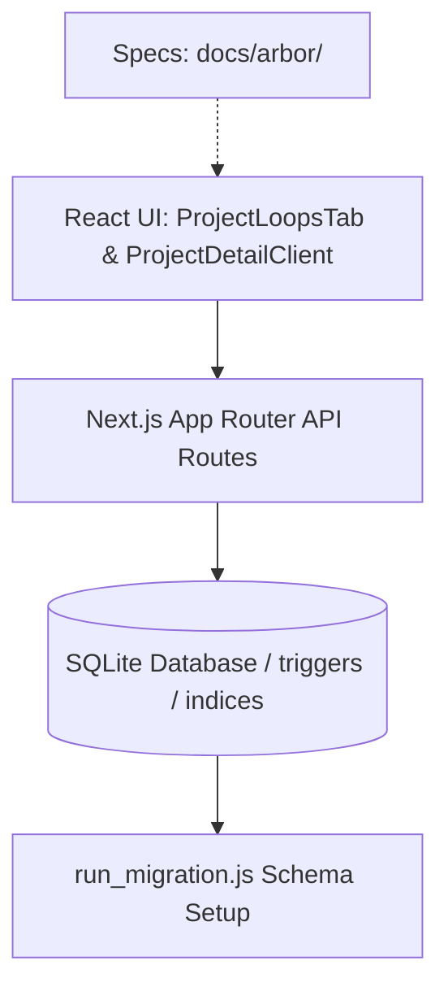

# Arbor Agent-ready Foundation Milestone Summary

*   **Status**: Completed / Milestone Summary
*   **Version**: 1.0.0
*   **Last Updated**: 2026-07-09

---

## 1. Purpose
This document provides a comprehensive milestone summary of the **Arbor Agent-ready Foundation** work completed across tasks **ARBOR-AGENT-001** to **ARBOR-AGENT-005**. It outlines the completed work, commits index, system capabilities, safety models, test coverage, current architectural layers, limitations, and future steps.

---

## 2. Completed Work Summary
The milestone established a robust, safe, and structured context and workflow layer within the WorkOS-Lite ecosystem. It transitions the application from a traditional project layout into an agent-aware workspace.

*   **ARBOR-AGENT-001 (Project Context v1 + Context Tab)**: Added project-level context storage (`project_contexts` & `project_decisions`) and introduced the Context & Decisions tab to store guidelines, standing instructions, and decision records.
*   **ARBOR-AGENT-002 (Arbor Loop Model v1 Spec)**: Documented the foundational loop lifecycle specification, status values, safety gates, risk metrics, and templates.
*   **ARBOR-AGENT-003 (Loops Tab MVP)**: Implemented the database tables, seed templates, API routes, and modular React frontend for creating, updating, and archiving workflow loops.
*   **ARBOR-AGENT-004 (Decision Gate v1)**: Implemented Decision Gate event logging, status mapping checks, Level 3 safety locks, and history logging.
*   **ARBOR-AGENT-005 (Agent Handoff Markdown Export v1 Spec)**: Created the structural specification for exporting loop context, gates, history, and resources into portable handoff files.

---

## 3. Commit Index

| Task ID | Task Name | Commit Hash |
| :--- | :--- | :--- |
| **ARBOR-AGENT-001** | Project Context v1 + Context Tab | `d3c0c8d2d6bc0fcc1a25c1d3982983e99f2750e0` |
| **ARBOR-AGENT-002** | Arbor Loop Model v1 Spec | `10eea6a73fa7e20ff90319aa6fdd95874b7f328d` |
| **ARBOR-AGENT-003** | Loops Tab MVP | `00bae82a91cd1162f20673e804525f9ac34040ac` |
| **ARBOR-AGENT-004** | Decision Gate v1 | `e9ccdfc3d3884d0a071234603b849a2520fe18a3` |
| **ARBOR-AGENT-005** | Agent Handoff Markdown Export v1 Spec | `86541be62746d56b4cc3d9bf0923eb056c4f6e5e` |

---

## 4. System Capabilities Now Available
1.  **Project-level Context Storage**: Structured storage of project guidelines, tone definitions, and source of truth records.
2.  **Context & Decisions Tab**: Human-accessible interface to audit and modify persistent context parameters.
3.  **Loop Model v1**: Clear, stateful workflow unit model that defines task risk levels, steps, and targets.
4.  **Workflows & Loops Tab**: Dynamic sprint layout rendering active workflows, progress statuses, and archive states.
5.  **Loop Templates**: Seeded blueprints for content, code, and review cycles.
6.  **Loop Creation/Edit/Archive**: CRUD interfaces to instantiate and modify loops without physical row deletions (status-driven archiving).
7.  **Decision Gate Event Logging**: Capture of human decisions (`approve`, `request_revision`, `stop`, `note`) with associated reasons.
8.  **Gate History Timeline**: In-context log lists displaying evaluation records chronologically.
9.  **Level 3 Confirmation Model**: Strict client/server validation blocking Level 3 approval logs unless explicitly confirmed.
10. **Agent Handoff Export Spec**: Structured specification ready to build portable Markdown package exports.

---

## 5. Safety Model
*   **No Auto-Commit / Auto-Publish**: All automated write actions, git commits, or external publishing tasks are strictly excluded from runtime execution.
*   **No Hard Deletes**: Loop archiving changes loop status to `'archived'` via `PATCH`, leaving records in place for auditability.
*   **Append-Only Gate Events**: Loop gate decisions cannot be modified (`PATCH`) or deleted (`DELETE`) once registered.
*   **Level 3 Human Confirmation**: The API checks and rejects Level 3 gate approvals unless `confirmed: true` is explicitly sent.
*   **GET Read-only Restraints**: API GET operations for contexts, loops, and gates perform no data writes or row allocations.
*   **Cross-project Isolation**: The API verifies loop and project ownership boundaries, rejecting actions targeting unauthorized resources.

---

## 6. Test Coverage
Quality and security regressions are prevented via:
*   `scripts/test-arbor-agent.js`: Verifies Context non-destructive GETs, Upserts, and Decision log ownership validations.
*   `scripts/test-arbor-loops.js`: Asserts templates seeding, default property copy, enums validations, and archived loops exclusion.
*   `scripts/test-arbor-gates.js`: Asserts gates schema, text validation requirements, Level 3 locks, status updates, and Thai text integrity.
*   `scripts/qa-writing-lab.js`: Evaluates content formatting, database state counts, and links consistency.
*   **Linting Checks**: All modified/created files pass ESLint validation with zero errors.
*   **Build Checkups**: Production compiles executed successfully where product code was altered.

---

## 7. Current Architecture Layers

1.  **Database Layer (SQLite)**: Core tables `project_contexts`, `project_decisions`, `project_loop_templates`, `project_loops`, and `project_loop_gate_events` with AFTER UPDATE triggers.
2.  **API Layer (Next.js App Router)**: Contexts, loops, and gates routes verifying slugs and ownership.
3.  **UI Component Layer (React)**: Modular component structure (`ProjectLoopsTab.tsx`) nested inside the tab controller.
4.  **Specifications Layer**: Documented guides (`loop-model-v1.md`, `agent-handoff-export-v1.md`) ensuring semantic alignment.

---

## 8. Known Limitations
*   **No Real Agent Execution**: Loops and gates operate as tracking frameworks; no external LLM runner is triggered.
*   **No Export UI**: The handoff markdown export does not have download or copy buttons.
*   **No CLAUDE.md / AGENTS.md Generator**: Project-specific rule files are not generated automatically.
*   **No Multi-agent Routing**: There is no support for dispatching subagents.
*   **No Background Automation**: Execution is purely interactive/manual.
*   **No Permission System**: Relies on basic project slug matching without user role restrictions.

---

## 9. Recommended Next Tasks
1.  **ARBOR-AGENT-006 — Agent Handoff Markdown Export MVP**: Implement the export API route and UI buttons to copy/download the handoff document.
2.  **ARBOR-AGENT-007 — Export Formats: CLAUDE.md / AGENTS.md**: Build automated exporters writing local instruction rules.
3.  **ARBOR-AGENT-008 — Loop Template Management UI**: Provide a dashboard for creating and updating workflow templates.
4.  **ARBOR-AGENT-009 — Project Context to Agent Instruction Composer**: Allow combining context parameters into customized prompts.
5.  **ARBOR-AGENT-010 — Foundation QA Hardening Pass**: Expand script testing and verify page speed optimizations.

---

## 10. Out of Scope
*   No product code changes.
*   No database changes or migrations.
*   No API routes alterations.
*   No UI modifications.
*   No testing script changes.

---

## 11. Final Milestone Assessment
The **Agent-ready Foundation** milestone has successfully established a clean, secure, and resilient infrastructure. The data structures, safety validators, and timeline interfaces are in place, tested, and fully aligned with the strategic goal of introducing agentic workflows. The system is structurally ready for downstream export and integration tasks.
