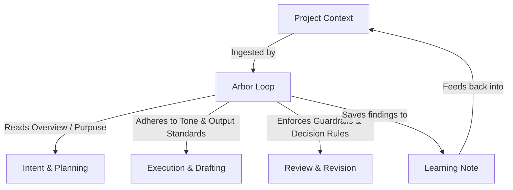

# Arbor Loop Model v1 Specification

*   **Document ID**: ARBOR-AGENT-002-SPEC-V1
*   **Status**: Proposed / Review Ready
*   **Last Updated**: 2026-07-08

---

## 1. Title
**Arbor Loop Model v1: Foundations of Contextual Agent Workflows**

---

## 2. Status
*   **Draft Version**: 1.0.0
*   **Current State**: Proposed (Documentation & Spec Only)
*   **Tracking Task**: `ARBOR-AGENT-002`

---

## 3. Purpose
This document defines the structural specification for the **Arbor Loop Model v1**. It outlines how a "Loop" acts as the primary execution unit in Arbor, bridging user intentions, project-specific parameters, and safety levels. This foundation prepares the system for future multi-agent loops and loops UI integration.

---

## 4. Why Loops Matter
Unlike generic task lists or todo items which represent simple linear checkpoints (e.g., "Write draft", "Send email"), an **Arbor Loop** is a **cyclical, context-rich execution unit**. 

Loops are designed to solve the following strategic problems:
1.  **Context Deficit**: Normal task runners do not know the output constraints, tone specifications, or purpose of a project. Loops ingest the `project_contexts` table directly to guide generation.
2.  **Safety & Gates**: Agent automations need explicit boundaries. Loops define precise "Review Gate Levels" so AI agents know exactly when they are allowed to suggest, modify, or require human-in-the-loop validation before committing.
3.  **Cyclical Refinement**: Production-grade assets require drafting, reviewing, revision, and verification. The Loop lifecycle natively enforces structured iteration instead of single-pass outputs.

---

## 5. Relationship to Project Context
A Loop cannot run in isolation; it operates within the boundaries of the parent project's context:

*   **Overview & Purpose**: Guides the *Intent* and *Plan* steps.
*   **Tone / Voice & Output Standards**: Enforces compliance during *Draft/Execute*.
*   **Guardrails & Decision Rules**: Guides validation rules during *Review* and *Verify* steps.
*   **Source of Truth**: Provides the baseline context used during execution.

---

## 6. Loop Lifecycle
Every Loop moves sequentially or iteratively through these 8 lifecycle stages:

1.  **Intent**: Define what is to be created or resolved (e.g. "Draft an article on Auxin mechanisms").
2.  **Plan**: Draft the steps, structure, or implementation path.
3.  **Draft / Execute**: Perform the core work, generate content, or edit source files.
4.  **Review**: Scan the output against tone standards, risk guardrails, or code compilation.
5.  **Improve**: Iterate based on feedback, revision requests, or test failures.
6.  **Verify**: Assert final checks (e.g., QA DB script run, lint tests, claim validation).
7.  **Save / Publish / Commit**: Finalize the output into target repositories (e.g. SQLite, Git, Staging).
8.  **Learn**: Retain a post-mortem review note to update future templates or project instructions.

---

## 7. Core Loop Fields
These represent the recommended database schema attributes for the `project_loops` table in the future MVP task:

| Field Name | Type | Description |
| :--- | :--- | :--- |
| `id` | TEXT (PK) | Unique Loop identifier (e.g., `LP-XXXXXX`) |
| `project_id` | TEXT (FK) | Reference to the parent project |
| `loop_name` | TEXT | Human-readable name of the loop |
| `loop_type` | TEXT | Categorization (e.g., `content_creation`, `dev_work`) |
| `current_step` | TEXT | Current active step in the loop progression |
| `status` | TEXT | Current state (e.g., `active`, `waiting_review`) |
| `risk_level` | TEXT | Level of risk (`low`, `medium`, `high`, `critical`) |
| `review_gate_level` | INTEGER | Safety level boundaries (`0`, `1`, `2`, `3`) |
| `expected_output` | TEXT | Summary or path of deliverables |
| `save_destination` | TEXT | Target output system (e.g., `database`, `file`, `git`) |
| `learn_note` | TEXT | Post-completion notes or lessons learned |
| `created_at` | TEXT | Timestamp of creation (ISO) |
| `updated_at` | TEXT | Timestamp of last modification (ISO) |
| `completed_at` | TEXT | Timestamp of completion (ISO) |

---

## 8. Loop Types
Loops are classified by their domain types to apply proper execution engines in the future:
*   `content_creation`: Drafting articles, copywriting, generating social assets.
*   `content_review`: Fact-checking, tone/voice alignment, legal/scientific guardrail scans.
*   `dev_work`: Bug fixes, refactoring, manual spec-to-patch pipelines.
*   `research`: Information synthesis, parsing papers, NotebookLM summary generation.
*   `strategy`: Formulating plans, mapping Gantt timelines, marketing outline designs.
*   `qa_review`: Database checking, running test suites, validation runs.
*   `agent_handoff`: Handoff compilation prepared for execution by secondary agents.
*   `manual_process`: Step-by-step checklists executed manually by a human editor.

---

## 9. Status Model
A loop status tracks where the cycle stands:
*   `draft`: The loop is being configured or scoped.
*   `planned`: Ready for execution, scheduled, or waiting.
*   `active`: Under active execution.
*   `waiting_review`: Awaiting human review or gate approval.
*   `needs_revision`: Sent back for refinement after review.
*   `verified`: All tests/checks have passed successfully.
*   `completed`: Final outputs saved, published, or committed.
*   `archived`: Hidden from active workspace views.
*   `stopped`: Cancelled or paused mid-execution.

---

## 10. Risk Levels
To prevent unintended actions, loops are tagged with risk flags:
*   `low`: Educational drafts, local read-only queries, spec drafts.
*   `medium`: Modifying local data, adding draft database records.
*   `high`: Editing critical application files, altering active workflows.
*   `critical`: Overwriting production databases, committing changes, publishing external articles.

---

## 11. Review Gate Mapping
Enforces the safety bounds based on agent permissions:

### Level 0 — Suggest
*   **Behavior**: AI operates in a purely advisory capacity. It reviews user input or current project state and outputs options, outlines, or recommendations.
*   **Agent Scope**: Read-only workspace analysis. No file writes or database inserts allowed.

### Level 1 — Draft
*   **Behavior**: AI may generate content or write draft records.
*   **Agent Scope**: Allowed to write to temporary folders or insert records flagged as `draft`/`planned` status. Cannot alter published assets.

### Level 2 — Modify
*   **Behavior**: AI may modify or update existing records or non-production files. Modifying existing records/files requires clear scope confirmation before execution.
*   **Agent Scope**: Updates existing records or files, but only in non-critical environments. Requires clear boundaries (e.g. modifying project item priority) and explicit scope confirmation before executing modifications.

### Level 3 — Commit / Publish / Destructive
*   **Behavior**: AI performs actions with permanent external impacts.
*   **Agent Scope**: Executing git commits, publishing articles live, deleting records, or running database schema alterations. **Must receive explicit human confirmation before execution**.

---

## 12. Loop Template Model
A loop template defines a reusable sequence of steps, expected output structures, and safety mappings. Every loop instantiated in the future will copy this template model.

---

## 13. First Template: GF Article Loop v1 (Thai Content Standard)
Tailored to enforce the strict Green Fineness Knowledge Articles Standard: research-backed, readable, and system-oriented.

### Steps
1.  **Topic Idea**: Select a subject and outline specific research questions (e.g., Cytokinin effects on root-to-shoot balance).
2.  **Content Brief**: Map out target readers, content layer (core vs supporting), and narrative constraints.
3.  **Knowledge Angle**: Create NotebookLM Research Prompts and compile university extension studies.
4.  **Draft Article**: Write long-form Thai article text focusing on plants, soil, water, and root relationships.
5.  **Claim Risk Review**: Review text for market-sensitive compounds (humic, seaweed, microbes) to avoid guaranteed claims.
6.  **GF Tone Review**: Align style with educational, deep but readable tone (no salesy or opinionated phrases).
7.  **Website Fields**: Define SEO Title, excerpt, and slug suggestion.
8.  **Image Brief**: Write detailed image prompt directives.
9.  **Social Drafts**: Prepare Facebook/line captions matching article insights.
10. **Publish Checklist**: Final compliance checks before publish.
11. **Learn Note**: Record feedback on target vocabulary, user questions, or research sources.

### Expected Outputs
*   Article Draft (Markdown)
*   SEO Title
*   Excerpt
*   Slug Suggestion
*   Facebook Caption
*   Image Prompt
*   Claim Risk Notes
*   Publish Checklist

---

## 14. Second Template: Claim & Tone Review Loop v1
A specialized loop focused on compliance, editing, and safety checkups.

### Steps
1.  **Input Content**: Import raw Thai drafts.
2.  **Claim Scan**: Identify statements containing guarantees of yield, fast growth, or absolute benefits.
3.  **Risk Classification**: Flag claims as Green (Safe), Yellow (Needs Wording Change), or Red (Violates Standard).
4.  **Tone Review**: Identify sentences violating scientific credibility (e.g., hyperbole, emotional claims).
5.  **Safer Wording**: Propose exact alternative Thai phrasings (e.g., "ช่วยส่งเสริม..." instead of "รับประกันการเจริญเติบโต...").
6.  **Final Review**: Compile findings.
7.  **Pass / Partial / Failed**: Mark draft review result.
8.  **Learn Note**: Save a summary of recurrent risk phrases to update project guardrails.

### Expected Outputs
*   Pass / Partial / Failed Status
*   Risk Classification Notes
*   Suggested Safer Wording
*   Final Review Summary

---

## 15. Third Template: WorkOS Dev Loop v1
Models the Pair Programming and QA pipeline used by Antigravity in developers tasks.

### Steps
1.  **Problem**: State the task requirement or bug.
2.  **Scope**: Restate goal, define scope, and non-scope.
3.  **Implementation Plan**: Outline changes across directories and database.
4.  **Patch**: Modify code files incrementally.
5.  **Lint / Build**: Execute ESLint and compile bundle tests.
6.  **QA Evidence**: Run database validator scripts or local integration tests.
7.  **User Review**: Present diffs and reports.
8.  **Commit Readiness**: Perform git status and diff checks.
9.  **Handoff Note**: Record what was changed, behavior preserved, and QA validation logs.

### Expected Outputs
*   Implementation Plan
*   Files Changed List
*   QA Evidence Logs
*   Build / Lint Result Status
*   Git Status Output
*   Commit Message Recommendation

---

## 16. Future Agent-ready Fields
*These fields are documented as future-facing context requirements; they are out-of-scope for the immediate database MVP:*
*   `agent_target`: Name/ID of the target executor LLM (e.g., `gemini-1.5-pro`).
*   `execution_mode`: Execution strategy (`autonomous` vs `interactive`).
*   `handoff_context`: JSON metadata describing the state passed to the agent.
*   `source_files`: File paths target read-writes.
*   `stop_conditions`: Specific error outputs or user inputs that trigger immediate abort.
*   `export_format`: Format specifications (e.g. `CLAUDE.md`, `AGENTS.md`).
*   `verification_requirements`: Custom test commands to run.

---

## 17. Notes for Loops Tab MVP
When designing the UI Loops Tab in subsequent sprints, the following rules should apply:
1.  **Simple Progression**: Render steps as a vertical timeline or progress chevron, enabling the user to click step-by-step.
2.  **Explicit Action Buttons**: Provide clear controls to "Start Loop", "Update Active Step", "Submit for Review", and "Verify".
3.  **Context-Connected Header**: Show the current Loop's relationship to the Project Context (e.g. displaying active Tone, Voice, or Guardrails in a side panel for reference).
4.  **No Automation Bloat**: The UI should first focus on task tracking, status, and notes, leaving execution to be hooked up later.

---

## 18. Out of Scope
*   Creating sqlite database schemas or migrations.
*   Writing backend controllers or API endpoint logic.
*   Designing react components or embedding a loops layout.
*   Executing background tasks or prompts workflows.
*   Exporting loop outputs or context configs.
*   Agent routing, multi-agent execution, and autonomous agent actions.

---

## 19. QA / Review Checklist
*   [ ] Verify `docs/arbor/loop-model-v1.md` contains all 19 required sections.
*   [ ] Assert that no files outside the `docs/` and `scripts/` directories have been modified.
*   [ ] Validate the Loop lifecycle stages exactly match the 8 defined stages.
*   [ ] Verify the 4 Review Gate levels are documented.
