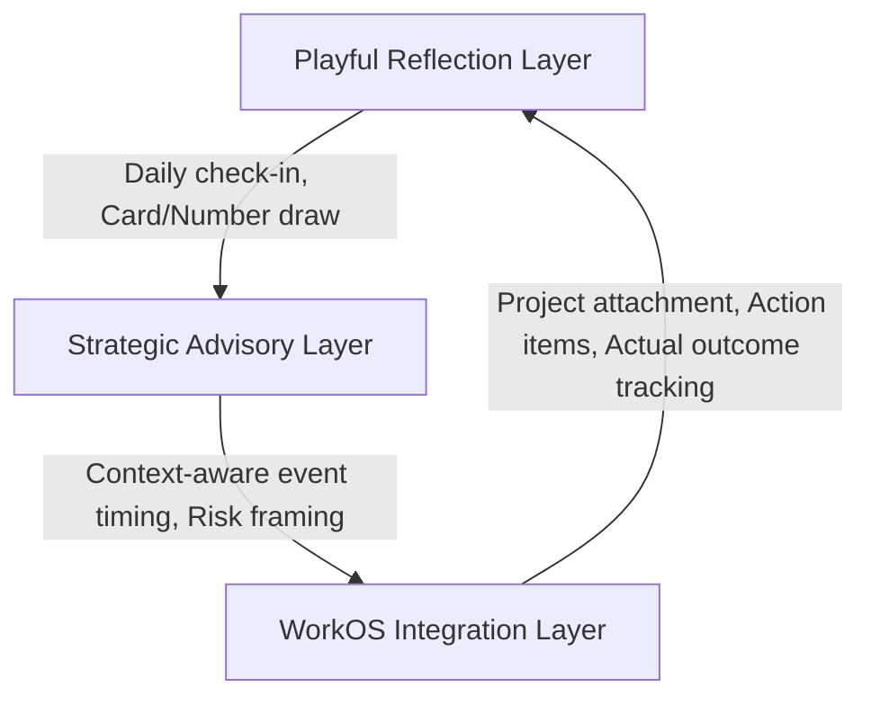

# ASTRO-MARKET-001 — AI Fortune App Market Pattern Review

* **Document Status**: Working Draft — Market Pattern and Strategic Positioning Review
* **Task Identity**: ASTRO-MARKET-001 (AI Fortune App Market Pattern Review)
* **Work Type**: Research Review and Strategic Positioning Documentation
* **Scope**: Docs-only (No code, UI, or database changes)
* **Project Area**: Astro Strategy Lab
* **Date**: July 31, 2026

---

> **Reconciliation Status — Wave 1 Baseline Recovery**
>
> - Recovery Status: Historical artifact recovered into current reconciliation lineage
> - Current Authority: Research input only; not current market authority
> - Original Provenance: feat/project-docs-sqlite-persistence @ 668d5beeccc03edd5157e15ea33e0f215b570936
> - Current-Lineage Review: **TARGETED_FRESHNESS_REVIEW_PERFORMED / CURRENT_MARKET_AUTHORITY_DEFERRED_TO_ADDENDUM** — official-source and user-provided product evidence reviewed on 2026-08-18 confirmed that several historical market patterns remain relevant, while current Thai and international offerings include broader calculation, timing, journaling, professional-workflow, and AI-interpretation capabilities than this historical review captures. Current-lineage findings and positioning implications are recorded separately in ASTRO-MARKET-001A. Historical positioning, white-space, behavioral-risk, monetization, and moat claims remain hypotheses or bounded inferences unless independently validated.
> - Note: Historical body is preserved unchanged. Prior research context does not automatically constitute current market authority.

---

## 1. Executive Summary

This strategic review analyzes the digital landscape of astrology, fortune-telling, tarot, numerology, and AI-driven prediction products. The goal is to frame the positioning of the **Astro Strategy Lab** against recurring market patterns and user needs.

While generic AI-powered apps focus on daily predictions and entertainment-oriented chat, **Astro Strategy Lab** intends to position itself as a **Strategic Timing & Life-Work Decision Support System** (Proposed Category). By partitioning its planned features into a three-layer product model (Playful Reflection, Strategic Advisory, and WorkOS Integration), it addresses the underlying user need for anxiety reduction, risk framing, and deliberate action planning.

Crucially, this analysis provides structural constraints for the downstream review of the existing **ASTRO-NUM-001 (Number Strategy Module Specification v1)**, ensuring future implementations avoid lucky-number clichés in favor of context-aware number role assignment and behavior reflection.

---

## 2. Purpose

The purpose of this document is to establish a conceptual market and product framing for the Astro Strategy Lab before implementing future modules. It details:
* The common product mechanics, monetization patterns, and ethical risks of existing fortune-telling platforms.
* The white-space opportunity for a non-deterministic decision-support tool.
* A strategic differentiation framework to guide roadmap priorities.
* Safety guardrails to protect user agency.

---

## 3. Scope

This document covers:
* Conceptual analysis of digital spiritual, astrological, and numerological product patterns.
* Product patterns (gamification, engagement, monetization models).
* User Jobs-to-be-Done (hypothesized stated demands vs. underlying needs).
* Strategic positioning options for Astro Strategy Lab.
* Actionable constraints for the downstream audit of ASTRO-NUM-001 (Number Strategy).

---

## 4. Out of Scope

* Designing or implementing source code, React components, or stylesheets.
* Modifying database schemas, API routes, or application routing.
* Setting final pricing tables, currency values, or running financial projections.
* Writing calculation logic for astrology, transit, or numerology engines.
* Modifying the existing `ASTRO-NUM-001` document in this pass.

---

## 5. Current Astro Strategy Lab Context

The Astro Strategy Lab baseline is currently defined by:
* **ASTRO-REAL-APP-121** (Timing & Window Definition Plan) - Establishes the 4-level Strategic Timing Windows (Proposed).
* **ASTRO-REAL-APP-122** (Strategic Decision Resolution & Data Contract Plan) - Finalizes the JSON data contracts and the local-first storage boundaries (Proposed).
* **ASTRO-REAL-APP-123** (Static UI and Navigation Shell) - Delivers the client-side tab implementation of the Strategic Timing View with mock assessments (Travel, Meeting, Lending, Project Start), Capacity Previews, and Fixed Appointment checklists (Static UI Shell).
* **Commit Baseline**: `5300991c8b3ff2bb1aaa767cfc5b0590799f6a81` (feat(astro): add strategic timing static preview).

This review acts as the market validation and positioning checkpoint preceding the review of the existing **ASTRO-NUM-001 (Number Strategy Module)**.

---

## 6. Research Method and Evidence Boundary

* **Methodology**: This document is a strategic pattern review based on repository context and generally available product knowledge. It does not constitute a completed live July 2026 competitor audit. Named product examples require direct source validation before being used as verified product facts.
* **Evidence Boundaries**:
  * Evaluated products (Co-Star, Sanctuary, The Pattern, Moonly, Labyrinthos, Nebula, and general GPT-based horoscope bots) serve as orientation examples rather than audited competitive profiles.
  * Pricing features, subscription models, and current product states are unverified in this task and require direct source validation before being treated as verified product facts.
  * No external web audit occurred during this task. No market share, revenue, retention, or conversion numbers are utilized.

---

## 7. Market Category Map

The digital spiritual and decision-support market can be mapped into nine distinct categories based on general market patterns and repository context:

| Category | Typical User Promise | Typical Output | Monetization Pattern | Core Strength | Key Weakness / Threat | Relevance to Astro Strategy Lab |
| :--- | :--- | :--- | :--- | :--- | :--- | :--- |
| **Traditional Astrology Apps** (e.g. TimePassages) | Technical accuracy, natal chart database. | Birth charts, aspect lists, transit reports. | Subscription, one-time report purchase. | Highly respected by serious hobbyists. | Steep learning curve, poor UX for casual users. | Provides baseline calculation guidelines. |
| **Daily Horoscope Apps** (e.g. Co-Star, Nebula) | Social connectivity, daily alignment, aesthetic personality analysis. | Daily advice snippets, transit scores, friend compatibility. | Monthly subscription, chat add-ons. | High visual appeal, social shareability. | barnum-style outputs, deterministic language. | Inspires the playful reflection UI styling. |
| **Tarot Reading Apps** (e.g. Labyrinthos) | Intuitive guidance, card-based answers to personal questions. | Multi-card spreads, card definitions, journal entries. | Ad-free premium tier, physical deck sales. | High user agency, visual symbolism. | Relies on random number generation (RNG). | Models card-of-the-day reflective mechanics. |
| **Numerology Apps** (e.g. Numerology & Astrology) | Unlocking fate and personality via name and birth numbers. | Life path numbers, expression numbers, lucky numbers. | Ad-supported, premium detailed PDF reports. | Simple inputs, immediate outputs. | High repetition of generic texts, low utility. | Counter-example for ASTRO-NUM-001 design. |
| **AI Fortune Chatbots** (e.g. Horoscope AI, custom GPTs) | Instant personalized answers to any life question. | Open-ended AI-generated text advising on future outcomes. | Pay-per-token, weekly subscription. | High flexibility, conversational ease. | Hallucinated facts, high risk of dependency. | Warns against open-ended chat recommendation. |
| **Human Advisor Marketplaces** (e.g. Keen, Kasamba) | Direct access to real spiritual experts. | Live chat, audio readings, psychic consultations. | Pay-per-minute billing. | Highly personal, high psychological comfort. | Expensive, quality variance, predatory sales. | Outside of direct features; reference point. |
| **Spiritual Lifestyle & Ritual Apps** (e.g. Moonly) | Wellness, meditation, alignment with natural cycles. | Lunar calendar, daily affirmations, audio tracks. | Premium subscription. | Calming, habit-building, aesthetic. | Tends to ignore specific business/work contexts. | Useful template for daily routine context. |
| **Self-Reflection & Journaling Apps** (e.g. Day One) | Mindfulness, emotional tracking, structured memory storage. | Rich text prompts, mood tracking, date-tagged logs. | Subscription. | High privacy, constructive self-analysis. | Lacks thematic alignment (purely general). | Models the target reflection database framework. |
| **Decision-Support Tools** (e.g. Sunsama, Notion Templates) | Work organization, focus, time-blocking, task priority. | Integrated task calendar, daily review, priority list. | Subscription. | High real-world utility, outcome tracking. | Lacks symbolic or reflective depth. | Shows where WorkOS Integration Layer must link. |

---

## 8. Recurring Product Patterns

We identified several recurring product patterns in the consumer spiritual space based on repository context:
* **The Daily Draw / Daily Horoscope**: A daily ritual designed to trigger push notifications. Users draw a card, check a score, or read a snippet to establish a daily routine.
* **Compatibility Scores**: Percentage-based calculations of relationship harmony. These often simplify complex relational dynamics into a single, socially-shareable score.
* **Micro-Transactions / Token Systems**: Utilizing credits or tokens for one-off readings (e.g., "Ask one question to a psychic for $5"). This design may target users during high-anxiety moments (Risk Inference).
* **Urgency-Based Subscriptions**: Promoting trials with language like *"Your golden alignment window closes in 4 hours."* This pattern relies on artificial scarcity and fear of missing out (FOMO) (Risk Inference).
* **Birth Chart Generation**: Creating complex, visually appealing astronomical chart diagrams that users can save as profile banners or share on social media.
* **Unstructured Chat Interfaces**: Allowing users to type open-ended questions (e.g., *"Should I quit my job today?"*) and getting a conversational AI response that often mimics professional legal or career advice.

---

## 9. User Jobs-to-be-Done (JTBD)

Understanding why users seek astrology or symbolic readings requires looking beyond their stated demands:

| Stated Demand (What they ask for) | Underlying Need (What they actually need) | How Astro Strategy Lab Solves It |
| :--- | :--- | :--- |
| "Tell me if this business deal will succeed." | **Anxiety Reduction & Risk Framing**: The user is facing an uncertain outcome and needs a structured way to identify risks (JTBD Hypothesis). | Pre-action checklists, High-Stakes Guardrails (Lending/Payment), and supportive/caution timing windows. |
| "What is my lucky number for today?" | **Ritualized Preparation**: The user wants an environmental symbol to focus their attention and intention (JTBD Hypothesis). | Number Role interpretation indicating behavioral strengths (e.g., "Use 5 for structured writing/consulting"). |
| "Will my partner and I stay together?" | **Relationship Reframing**: The user needs to reflect on communication styles and personal boundaries (JTBD Hypothesis). | Reflective prompts mapping personal profiles, rather than deterministic compatibility percentages. |
| "I want to know if I should launch my app tomorrow." | **Structured Time-Blocking**: The user needs a cognitive tool to separate preparation, execution, and rest (JTBD Hypothesis). | Timing Windows showing Supportive vs. Recovery times, paired with physical readiness check lists. |

---

## 10. Generic Fortune Generator Risk Review

Integrating standard LLMs or rule-based fortune engines into applications exposes significant product, credibility, and ethical risks (Risk Inferences):

1. **The Barnum Effect (False Personalization)**: Generating broad statements that apply to anyone. This devalues the credibility of the analytical engine.
2. **Hallucinated Astrological Facts**: Generative AI models frequently generate incorrect astronomical alignments (e.g., claiming planets are in wrong signs).
3. **Deterministic Verdicts & Loss of Agency**: Dictating outcomes. This encourages passive behavior, dependency, or panic.
4. **Fear Amplification & Compulsive Checking**: Triggering anxiety loop cycles where the user repeatedly draws cards or checks horoscope readings until they get a "good" result.
5. **No Evidential Transparency**: Providing advice without explaining what mathematical, astronomical, or symbolic calculation layers generated the outcome.
6. **Data Minimization Violations**: Requesting highly sensitive personal data and storing it in unencrypted third-party databases.
7. **No Accountability or Outcome Tracking**: Emitting advice with zero tracking of whether the advised timing actually led to a positive, neutral, or negative outcome.

---

## 11. Trust, Safety and User Agency Principles

To mitigate the risks identified in the industry, the Astro Strategy Lab must strictly enforce these safety and user agency boundaries:

```text
Astro Strategy Lab Trust Framework
├── 1. Explainable Uncertainty (Confidence indicators instead of absolute assertions)
├── 2. Source-Layer Disclosure (Separating astronomical calculation from context interpretation)
├── 3. Human Decision Ownership (Astrology acts as advisory context, NOT a command)
└── 4. Zero Predatory Mechanics (No fear-based alerts, no paid repeats, no outcome guarantees)
```

* **Explicit Uncertainty**: Always label timing windows and readings with disclaimer tags: `Mock Timing Result — ยังไม่ได้เชื่อมระบบคำนวณ` or `Symbolic Reference Only`.
* **Confidence Level Disclosure**: Break down analysis into three dimensions (Input completeness, Interpretive confidence, Practical readiness) instead of a single merged rating.
* **Separation of Facts and Advice**: Disclose the exact source layers used (e.g., Birth Profile, Thai Transit) and clearly demarcate what is a calculation vs. what is a behavioral strategy recommendation.
* **Guardrails for High-Stakes Domains**: For sensitive actions like lending money, signing contracts, or medical choices, display a warning banner requiring physical checks (e.g., reviewing bank balance, written evidence) and explicitly state: *"ระบบไม่ได้ทำหน้าที่ให้คำแนะนำทางการเงิน กฎหมาย หรือการลงทุน"*
* **Preserving Agency**: Avoid absolute imperatives. Use advisory language (e.g., *"Consider pausing to review reserves"* instead of *"Do not spend money"*).

---

## 12. Three-Layer Product Model

Astro Strategy Lab is structured into three layers to separate playfulness, strategic advice, and practical action:



### 12.1 Playful Reflection Layer
* **Role**: Proposed low-friction entry point for self-reflection and daily alignment.
* **Features**: Intended daily reflection prompts, Symbol of the Day, Number reflection, and mood/intention check-ins.
* **Risk & Mitigation**: This layer risks turning the app into a generic fortune-telling app. To prevent this, the daily reflection must always direct the user toward an active prompt (e.g., *"How will you apply this symbol's tone to your current active project?"*) rather than leaving the reading as a passive prediction.

### 12.2 Strategic Advisory Layer
* **Role**: Intended core differentiation engine. It analyzes real-world decisions and context parameters.
* **Features**: Planned timing windows (Supportive, Usable with Conditions, Caution, Recovery), multi-assessment event decomposition, and domain checklists (Travel, Meeting, Lending, Project Start).
* **Ethical Boundary**: It does not make deterministic claims. If a timing is "Caution", it suggests behavioral tactics (e.g., "Discuss terms before numbers") rather than advising event cancellation.

### 12.3 WorkOS Integration Layer
* **Role**: Proposed differentiator. This connects symbolic advice with actual workspace tasks, calendars, and outcomes.
* **Features**: Proposed linking of an advisory checklist to a WorkOS project, converting caution points into sub-tasks (e.g., "Check backup servers"), and recording actual outcomes to compare planned vs. actual results.
* **Moat Value**: General fortune apps cannot replicate this without building an entire personal task-management operating system. It shifts the product category from *mysticism* to *productivity and risk mitigation*. The defensibility of this layer is a product hypothesis that requires validation.

---

## 13. Positioning Options

We evaluated three potential positioning strategies for Astro Strategy Lab:

### Option 1: AI Astrology Companion
* **Core Idea**: An AI-powered companion that reads your daily transits and talks to you about your day.
* **Pros**: High initial engagement, conversational ease, appeals directly to the massive traditional astrology market.
* **Cons**: Low barrier to entry, easily replicated by generic wrappers, high risk of hallucination, fails to target professional productivity.

### Option 2: Strategic Timing Advisor
* **Core Idea**: A tool focused strictly on choosing the best dates and times for business events.
* **Pros**: High utility, clear value proposition, appeals to high-performance professionals.
* **Cons**: Under-utilizes the reflective and planning capabilities of the WorkOS. Can become too dry if timing calculations are blocked or limited.

### Option 3: Life-Work Decision Support System (Recommended)
* **Core Idea**: An operating system module that uses astrology, numerology, and symbolic systems as reflective inputs to assist in goal planning, timing decisions, and risk management.
* **Pros**: Establishes a unique, defensible product category; combines daily reflection with productivity; enforces strong ethics; justifies WorkOS linkage.
* **Cons**: Requires clear educational messaging to explain that the app is *not* a typical daily prediction tool.

---

## 14. Differentiation Matrix

| Dimension | Generic Fortune App | Premium Astrology Consultation | Self-Reflection App | Astro Strategy Lab |
| :--- | :--- | :--- | :--- | :--- |
| **Primary Purpose** | Entertainment, fortune predictions. | In-depth fate reading, chart analysis. | Mindfulness, general emotional journaling. | **Life-work planning, timing strategy & risk framing (Intended).** |
| **Personalization** | Low (Barnum texts). | High (Direct human interaction). | Medium (User-typed text). | **High (Natal chart + real business context - Intended).** |
| **Context Integration**| None (Generic horoscope). | Medium (Discussion during chat). | High (User-written thoughts). | **High (WorkOS tasks, projects, and goals - Proposed).** |
| **Decision Structure** | Unstructured chat/draw. | Conversational discussion. | Free-form journaling. | **Structured Assessments and checklists (Static UI).** |
| **Timing Analysis** | Numeric luck rating. | Visual transit aspects. | None. | **4-level Timing Windows (Static UI).** |
| **Risk Framing** | Fear-based alert. | Intuitive warning. | None. | **High-Stakes Guardrails (Static UI).** |
| **Action Planning** | None. | General verbal guidance. | None. | **Actionable checklists, WorkOS task linking (Proposed).** |
| **Outcome Tracking** | None. | None. | None. | **Timing-to-outcome feedback loop (Proposed).** |
| **Transparency** | None (Black-box AI). | High (Lineage disclosure). | N/A (Pure user input). | **High (Source layers & Confidence dimensions - Static UI).** |
| **User Agency** | Low (fate dictates). | Medium (depends on reader). | High (user-driven). | **High (Astrology as input, human overrides - Intended).** |
| **Safeguards** | None. | None. | N/A. | **High-Stakes blockages, anti-fear copy rules (Intended).** |
| **Monetization** | Predators, pay-per-question. | High hourly consulting fees. | Subscription. | **Workspace subscription, premium advisory reports (Proposed).** |
| **Defensibility** | Low (AI wrapper). | High (human expertise limit). | Medium (network effects). | **High (WorkOS integration & decision history - Proposed Moat).** |

---

## 15. Strategic Moat Analysis

```text
Defensibility Progression
[Easy to Copy]      Daily horoscope generators, general GPT prompts
[Moderate Moat]     Well-designed native UI, custom birth chart rendering
[Long-Term Moat]    WorkOS task integration, longitudinal decision logs, outcome feedback loops
```

* **Easily Copied Features**: Daily card draws, generic AI chat advice, birth chart graphics.
* **Moderately Defensible**: Structured timing window algorithms, timezone mapping, custom Astro UI components.
* **Potential Long-Term Moat**:
  * **Longitudinal Personal Context**: The database of the user's projects, business context, goals, and history (Proposed).
  * **Decision-to-Outcome Feedback Loops**: Tracking whether decisions made during specific timing windows actually correlated with positive outcomes (Proposed).
  * **WorkOS Deep Integration**: The ability to convert caution points directly into active, tracked task items inside a local-first workspace (Proposed). Defensibility has not yet been demonstrated and requires validation.

---

## 16. Monetization Direction

* **Value Loop**:
  * *Free Tier*: Access to the Playful Reflection Layer (daily symbol and number reflection checks) with general timing summaries.
  * *Premium Workspace Tier*: Full access to the Strategic Advisory Layer, unlimited assessments, custom decision-domain templates, and active WorkOS integration.
  * *Enterprise/Practitioner Tier*: Tools for consultants to export structured decision-review PDFs and manage client profile lists.
* **Predatory Monetization Prevention**: Strictly forbid credit systems that charge users to repeatedly ask the same question or pay extra to clear a "bad omen" alert. These are proposed directions, not approved architecture.

---

## 17. Implications for Product Roadmap

```text
Roadmap Execution Order
Phase 1 (Current): Static UI Shells & Data Contracts (ASTRO-REAL-APP-123)
Phase 2 (Next): Symbolic Specifications (ASTRO-NUM-001)
Phase 3 (Future): Local persistence stubs, offline runtime analysis
```

* **Immediate Focus**: Review and align the existing spec of the `ASTRO-NUM-001` module using the non-deterministic trust rules.
* **Validation Needs**: Test the usability of the client-side tab switching and the clarity of the "Stage 1 — Static Interface Preview" disclaimer.
* **Experimental Features**: Keep AI conversational generators as sandboxed experimental tools with clear safety boundaries.

---

## 18. Implications for ASTRO-NUM-001

The downstream review of the existing **ASTRO-NUM-001 (Number Strategy Module Specification v1)** must align with the following constraints:

### 18.1 What ASTRO-NUM-001 Must Avoid
* **No Random Lucky-Number Generators**: Do not generate random numbers with claims of luck or fate.
* **No Binary Good/Bad Classification**: Do not classify numbers as universally bad or good. Every number has a contextual role.
* **No Fear-Based Warnings**: Do not warn users to immediately change phone numbers or avoid certain digits due to doom claims.
* **No Contextless Readings**: Do not analyze a number without requiring its intended role (e.g., work number vs. backup system number).

### 18.2 What ASTRO-NUM-001 Must Implement
* **Number Role Interpretation**: Map number combinations specifically to the 9 defined Number Roles (e.g., `work`, `consult`, `content`).
* **Context-Aware Number Strategy**: Combine digit frequency and paired numbers with the user's business context (`business_context`) and goals.
* **Supportive, Caution, and Neutral categorization**: Classify digit influences as *Supportive* or *Caution* indicators without absolute verdicts.
* **Behavioral Reflection Prompting**: Provide prompts to help users adjust their communication patterns based on the number profile.
* **Timezone-aware Activation Timing**: Suggest strategic windows to activate or announce a new number, linking to the 123 Timing Windows format.

---

## 19. Open Questions & Validation Needs

* **Open Questions**: How will users react to the absence of direct fortune predictions? Will the analytical tone feel too dry for users accustomed to traditional astrology apps?
* **Validation Needs**: Run a usability session with simulated static data in Astro Strategy Lab to measure user engagement with the "Fixed Appointment Guidance" compared to standard daily horoscope cards.

---

## 20. Risks and Mitigations

* **Risk**: Users might bypass the WorkOS integration and copy-paste recommendations into external systems, losing the data feedback loop.
  * *Mitigation*: Ensure the interface makes it easier to click "Create task in workspace" than to manually copy the text.
* **Risk**: LLMs generating the advisory descriptions may hallucinate destiny-style claims.
  * *Mitigation*: Run output validators and strictly limit model prompts to structural JSON outputs containing behavioral steps only.

---

## 21. Decision Summary

* **Decision**: Adopt the **Life-Work Decision Support System** positioning.
* **Next Specification Step**: Perform a specification alignment review of the existing Number Strategy Module (`ASTRO-NUM-001`).
* **Commit Staging Rule**: The changes remain unstaged and uncommitted in this phase to comply with Docs-only requirements.

---

## 22. Recommended Next Step

Proceed to **ASTRO-MARKET-001 Final Re-Review Gate** to verify alignment before addressing the downstream specification audit of the existing `ASTRO-NUM-001` spec.

---

## 23. Source Notes or Reference Register

This register documents the qualitative sources evaluated during the research review in July 2026. These sources support the market patterns, product features, and risk inferences analyzed in this document.

| Source ID | Product / Topic | Current Status | Intended Validation Source | What It May Support | Limitation |
| :--- | :--- | :--- | :--- | :--- | :--- |
| **SR-COSTAR** | Co-Star | Requires External Validation | Official website / App Store | Product positioning and user journey | Not verified in this task |
| **SR-SANC** | Sanctuary | Requires External Validation | Official website / App Store | Product positioning and user journey | Not verified in this task |
| **SR-NEBULA** | Nebula | Requires External Validation | Official website / App Store | Product positioning and user journey | Not verified in this task |
| **SR-PATTERN** | The Pattern | Requires External Validation | Official website / App Store | Product positioning and user journey | Not verified in this task |
| **SR-MOONLY** | Moonly | Requires External Validation | Official website / App Store | Product positioning and user journey | Not verified in this task |
| **SR-LABY** | Labyrinthos | Requires External Validation | Official website / App Store | Product positioning and user journey | Not verified in this task |
| **SR-NUMSPEC** | ASTRO-NUM-001 | Repository Fact | Internal spec document | Baseline input structures and roles | Aligned with codebase |
| **SR-NUMCASE** | ASTRO-NUM-002 | Repository Fact | Internal study document | Reference case study for personal number roles | Aligned with codebase |

---

## 24. Claims and Hypotheses Audit Registry

To ensure ethical copy rules and prevent presenting risks or product assumptions as verified facts, the major assertions in this document are audited and classified below:

### 24.1 Hypotheses & Strategic Assumptions
* **Moat Defensibility of WorkOS Integration**:
  * *Classification*: `Product Hypothesis`
  * *Evidence status*: **Requires validation.** The value of integrating timing advice with local task workflows is a design hypothesis.
* **Outcome Tracking and Recommendation Quality**:
  * *Classification*: `Product Hypothesis`
  * *Evidence status*: **Requires validation.** The hypothesis that outcome tracking will improve recommendations requires validation.

### 24.2 Market & Behavioral Risk Inferences
* **Anxious Repeated Questioning via Coin/Credit Systems**:
  * *Classification*: `Risk Inference`
  * *Evidence status*: Identified as a potential monetization risk based on general market observations, not externally verified in this task.
* **Fear-Based Conversion and Notification Loops**:
  * *Classification*: `Risk Inference`
  * *Evidence status*: Identified as a common engagement risk pattern, not externally verified in this task.
* **Compulsive Checking & Reduction of User Agency**:
  * *Classification*: `Risk Inference`
  * *Evidence status*: Identified as a potential behavioral risk when apps use deterministic language.
* **AI Hallucinations of Astrological Data**:
  * *Classification*: `General Market Pattern` / `Risk Inference`
  * *Evidence status*: Identified as a common risk for generic LLM wrappers, not audited in detail in this task.
