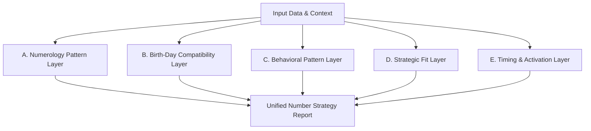

# ASTRO-NUM-001 — Number Strategy Module Specification v1

เอกสารข้อกำหนดเชิงโครงสร้างและความต้องการของระบบ (Specification) สำหรับโมดูล **Number Strategy (กลยุทธ์การบริหารจัดการหมายเลขโทรศัพท์และช่องทางติดต่อ)** ภายใต้กรอบการทำงานของ **Astro Strategy Lab**

---

> **Reconciliation Status — Wave 1 Baseline Recovery**
>
> - Recovery Status: Historical artifact recovered into current reconciliation lineage
> - Current Authority: Candidate baseline only; architecture alignment under review
> - Original Provenance: feat/project-docs-sqlite-persistence @ 668d5beeccc03edd5157e15ea33e0f215b570936
> - Current-Lineage Review: **ARCHITECTURE_ALIGNMENT_REVIEW_REQUIRED** — compatibility with current Astro architecture direction pending
> - Note: Historical body is preserved unchanged. Prior specification status does not automatically constitute current baseline authority until architecture alignment is confirmed.

---

## 1. Module Purpose (วัตถุประสงค์ของโมดูล)

โมดูล **Number Strategy** ได้รับการออกแบบให้ทำหน้าที่เป็น **ชั้นแนะนำกลยุทธ์เชิงสัญลักษณ์ (Strategic Advisory Layer)** สำหรับการประเมิน ตรวจสอบ และบริหารจัดการหมายเลขโทรศัพท์ ช่องทางติดต่อสื่อสาร (Contact Identities) การจัดสรรบทบาทการใช้งานของแต่ละหมายเลข (Number Roles) ตลอดจนการเลือกจังหวะเวลาในการเปิดใช้งาน (Timing of Activation)

### หลักการสำคัญในการแนะนำ (Core Advisory Philosophy)
* **เครื่องมือสนับสนุนการตัดสินใจเชิงกลยุทธ์ (Strategic Decision Support)**: ใช้ระบุจุดเด่น ข้อพึงระวัง และความสอดคล้องระหว่างพลังงานเชิงสัญลักษณ์ของตัวเลขกับเป้าหมายทางธุรกิจ/โครงการ เพื่อช่วยในการจัดสรรหน้าที่ให้ตัวเลขอย่างเหมาะสม
* **การสร้างความตระหนักรู้เชิงพฤติกรรม (Behavioral Awareness)**: มุ่งเน้นการสะท้อนพฤติกรรมหรือแนวโน้มการแสดงออกที่เกี่ยวข้องกับกลุ่มตัวเลข เพื่อให้ผู้ใช้งานเตรียมตัวรับมือและปรับเปลี่ยนพฤติกรรมในทางปฏิบัติจริง
* **แนวทางปฏิเสธการทำนายโชคชะตาแบบสมบูรณ์ (Non-Deterministic Approach)**:
  * **ห้ามกล่าวอ้าง (Prohibition of Absolute Claims)** ว่าหมายเลขใดๆ สามารถกำหนดชะตาชีวิต ความร่ำรวย สุขภาพ บุคลิกภาพ หรือผลลัพธ์ของเหตุการณ์ต่างๆ ได้อย่างเด็ดขาด
  * **ไม่มีคำว่าดีที่สุดหรือแย่ที่สุดในตัวเอง**: หมายเลขแต่ละชุดมีทั้งจุดเด่นและมุมที่ต้องระมัดระวัง (Caution Points) เสมอ ขึ้นอยู่กับบทบาทหน้าที่ (Role) และบริบทในการนำไปใช้งาน
  * **การบริหารแบบไม่กระตุ้นความกลัว (Anti-Fear Framework)**: ไม่ใช้คำพูดหรือการอธิบายเชิงสร้างความตื่นตระหนก ขู่เข็ญ หรือทำให้เกิดความกังวลจนต้องเปลี่ยนเบอร์โดยทันที หากแต่เน้นการปรับพฤติกรรมและการจัดสรรหน้าที่ของเบอร์

---

## 2. Core Positioning (การจัดวางตำแหน่งภายในระบบ)

โมดูล Number Strategy วางตำแหน่งเป็นส่วนหนึ่งของระบบสนับสนุนการวางแผนกลยุทธ์ภายใต้แบรนด์ **Astro Strategy Lab** และไม่มีส่วนเกี่ยวข้องโดยตรงกับระบบการผลิตเนื้อหาหรือบทความความรู้ของ Green Fineness

### แผนผังตำแหน่งระบบ (System Architecture Hierarchy)
```text
Astro Strategy Lab
└── Tools & Modules
    └── Number Strategy (โมดูลกลยุทธ์การบริหารจัดการหมายเลข)
        ├── Input Collector (ตัวรับข้อมูลบริบท)
        ├── Multilayer Analysis (การวิเคราะห์หลายมิติ)
        └── Strategy Output Generator (ระบบสรุปข้อแนะนำและจังหวะเวลา)
```

### การตั้งชื่ออย่างเป็นทางการ (Official Naming Options)
* **Astro Number Strategy Module** (เมื่อเรียกใช้ในฐานะส่วนประกอบระบบหลัก)
* **Number Timing & Contact Strategy** (เมื่อใช้ในการอธิบายในหน้าต่างแนะนำกลยุทธ์และจังหวะเวลาเริ่มต้น)
* **Number Strategy Review** (เมื่ออ้างอิงถึงเอกสารเคสการประเมินตัวเลขรายบุคคล)

---

## 3. Input Fields (โครงสร้างฟิลด์ข้อมูลนำเข้า)

เพื่อให้การวิเคราะห์สอดคล้องกับบริบทการใช้งานจริง (Context-Aware Analysis) ระบบจะเปิดรับฟิลด์ข้อมูลดังต่อไปนี้:

| ฟิลด์ข้อมูล (Input Fields) | ประเภทข้อมูล | คำอธิบาย | ตัวอย่างข้อมูล |
|---|---|---|---|
| `phone_number` | String | หมายเลขโทรศัพท์ที่ต้องการประเมิน (กรองเฉพาะตัวเลข 7-10 หลักหลัง) | `"0812345678"` |
| `owner_name` | String | ชื่อเจ้าของหมายเลข หรือชื่อเรียกโครงการที่ใช้งาน | `"สมชาย สตูดิโอ"` |
| `birth_date` | Date | วันเดือนปีเกิดของผู้ใช้งานหลัก (เพื่อใช้เปรียบเทียบ) | `1990-05-15` |
| `birth_weekday` | Enum | วันเกิดในสัปดาห์ (วันอาทิตย์ - วันเสาร์) | `Sunday` |
| `birth_time_optional` | String (Optional) | เวลาเกิดโดยประมาณ (ถ้ามี) | `"09:30"` |
| `current_number_status`| Enum | สถานะของเบอร์ในปัจจุบัน | `Active (เบอร์หลัก)`, `Candidate (เบอร์คัดเลือก)`, `Inactive` |
| `intended_number_role` | Enum | บทบาทหน้าที่ที่คาดหวังหรือต้องการกำหนดให้ | `work`, `consult`, `content` (ดูรายละเอียดด้านล่าง) |
| `project_context` | Text | ข้อมูลโครงการหรือชื่อเพจ/ธุรกิจที่นำเบอร์นี้ไปใช้งาน | `"Green Fineness Content Hub"` |
| `business_context` | Text | บริบทธุรกิจ ลักษณะลูกค้า หรือรูปแบบการหารายได้ | `"บริการให้คำปรึกษาเกษตรอินทรีย์ B2B"` |
| `usage_goal` | Text | เป้าหมายที่แท้จริงของการนำเบอร์นี้ไปติดตั้ง | `"ต้องการเน้นงานเจรจา ปิดการขายทางโทรศัพท์"` |
| `current_usage_notes`  | Text | บันทึกความรู้สึกหรือสถิติการใช้งานที่ผ่านมา | `"รู้สึกว่ารับสายหนัก มีเรื่องร้องเรียนบ่อย"` |
| `candidate_number_status` | Enum | กรณีเปรียบเทียบหลายเบอร์ | `Primary Candidate`, `Secondary Candidate` |
| `comparison_set` | Array[String] | รายชื่อเบอร์อื่นที่นำมาเปรียบเทียบร่วมกันในเซสชันเดียวกัน | `["0899999999", "0888888888"]` |
| `reviewer_notes` | Text | ข้อสังเกตเพิ่มเติมของผู้เชี่ยวชาญ/ที่ปรึกษา | `"ลูกค้ามีเบอร์หลักที่ใช้อยู่แล้ว 3 เบอร์"` |

### นิยามบทบาทหน้าที่ของหมายเลข (Number Roles)
1. **personal main number**: เบอร์ส่วนตัวหลักสำหรับครอบครัวและคนใกล้ชิด (เน้นความสัมพันธ์และความสงบส่วนตัว)
2. **work number**: เบอร์สำหรับติดต่อประสานงานทั่วไป งานธุรการ และงานสั่งซื้อ
3. **business number**: เบอร์สำหรับการทำธุรกิจเชิงพาณิชย์ขนาดกลาง/ใหญ่ การเจรจาผลประโยชน์
4. **consult number**: เบอร์สำหรับให้คำปรึกษา การเยียวยา การแนะแนวทาง หรือการวิเคราะห์ข้อมูลเชิงลึก
5. **content number**: เบอร์สำหรับผูกกับบัญชีผู้สร้างคอนเทนต์ เพจ หรือใช้ประสานงานสื่อมีเดีย
6. **internet / data number**: เบอร์สำหรับใช้งานอินเทอร์เน็ต อุปกรณ์ IoT หรือไม่มีการรับสายติดต่อภายนอก
7. **backend / system number**: เบอร์สำหรับรับ OTP ระบบธนาคาร หรือรันระบบบริการหลังบ้าน
8. **spare number**: เบอร์สำรองที่ยังไม่ได้เปิดใช้ หรือถือครองเพื่อวัตถุประสงค์เฉพาะกิจ
9. **brand-facing number**: เบอร์กลางสำหรับโปรโมตบนป้ายโฆษณา หน้าเว็บไซต์ หรือศูนย์บริการหลัก

---

## 4. Analysis Layers (ชั้นการวิเคราะห์กลยุทธ์)

การประเมินหมายเลขจะทำหน้าที่แยกออกเป็น 5 ชั้นการวิเคราะห์ (Analysis Layers) เพื่อไม่ให้คำแนะนำยึดติดกับมิติใดมิติหนึ่งเพียงอย่างเดียว:



### A. Numerology Pattern Layer (ชั้นโครงสร้างตัวเลขเชิงสถิติ)
* **Digit Frequency**: ความถี่การกระจายตัวของตัวเลขแต่ละตัวในหมายเลข (เช่น มีเลข 9 กี่ตัว เลข 5 กี่ตัว)
* **Repeating Numbers**: ตรวจหาเลขซ้ำติดกัน (เช่น 22, 555) เพื่อดูพฤติกรรมสะสมของพลังงานเชิงสัญลักษณ์
* **Paired Numbers**: การจับคู่อันดับตัวเลขสองหลักในเบอร์ (เช่น 7 ตัวท้าย แบ่งเป็นคู่ๆ: AB, BC, CD, DE, EF, FG)
* **Total Sum**: ผลรวมเชิงตัวเลขทั้งหมดของเบอร์ (นำทุกหลักมารวมกันเป็นเลข 2 หลัก หรือลดเหลือ 1 หลัก)
* **Head / Middle / Tail Pattern**: การแบ่งสัดส่วนเบอร์เป็น 3 ส่วน (3 ตัวแรก - 3 ตัวกลาง - 4 ตัวท้าย) เพื่อวิเคราะห์ทิศทางการไหลเวียนของกลุ่มปฏิสัมพันธ์
* **Overall Tone, Strengths, Caution Points**: สรุปโทนเสียงของเบอร์ จุดแข็งเด่นชัด และจุดที่ต้องระมัดระวังเป็นพิเศษจากกลุ่มสัญลักษณ์คู่ตัวเลข

### B. Birth-Day Compatibility Layer (ชั้นตัวกรองความสอดคล้องกับวันเกิด)
* **Symbolic Filters (อ้างอิงตามทักษาหรือวันเกิดเชิงสัญลักษณ์)**: ใช้ระบบวันเกิดประจำวันในสัปดาห์ (จันทร์-อาทิตย์) ในการระบุตัวเลขกลุ่มสนับสนุนเชิงสัญลักษณ์ (เช่น เลขกลุ่มส่งเสริมบทบาทการพูด, เลขกลุ่มเก็บทรัพย์)
* **Caution Signals, Not Deterministic Rejection**: ตัวเลขที่เป็นอริหรือกาลกิณีตามระบบทักษาวันเกิดจะถูกแสดงผลเป็น **"สัญญาณพึงระวัง (Caution Signal)"** เพื่อแจ้งเตือนพฤติกรรมที่อาจเกิดขึ้น เช่น พฤติกรรมอารมณ์ร้อน หรือภาระความรับผิดชอบที่มากเกินไป **ห้ามประเมินว่าเป็นข้อห้ามใช้เด็ดขาดหรือต้องปฏิเสธเบอร์นั้นทันที**
* **Advisory Layer Only**: เน้นย้ำเสมอว่าความเข้ากันได้กับวันเกิดเป็นเพียงหนึ่งในมุมมองเปรียบเทียบเพื่อการจัดการความเสี่ยงเท่านั้น

### C. Behavioral Pattern Layer (ชั้นวิเคราะห์พฤติกรรมและแนวโน้ม)
* **Interpretation of Tendencies**: ตีความผลกระทบเชิงสัญลักษณ์ของคู่ตัวเลขเป็นลักษณะแนวโน้มพฤติกรรมที่อาจเกิดขึ้นซ้ำๆ หรือความท้าทายในจิตใจของผู้ใช้งาน เช่น:
  * **กลุ่มเลขรับภาระหนัก (เช่น 76, 47)**: แปลผลว่าผู้ใช้อาจมีแนวโน้มแบกรับความรับผิดชอบสูงเกินตัว หรือมีงานล้นมือ
  * **กลุ่มเลขอารมณ์อ่อนไหว (เช่น 32, 23)**: แปลผลว่าอาจมีความอ่อนไหวในคำพูดของคนรอบข้าง หรือมีแรงดึงดูดเรื่องความรัก/เสน่ห์สูง
  * **กลุ่มเลขวิเคราะห์เชิงลึก (เช่น 59, 95)**: แปลผลว่าชอบหาความรู้เชิงลึก สนใจระบบความคิด วางแผนอย่างมีหลักการ
  * **กลุ่มเลขปิดการขายและเจรจา (เช่น 46, 64)**: แปลผลว่าสนับสนุนการพูดคุยที่มีจังหวะจะโคน มีเสน่ห์ทางคำพูด
* **No Direct Cause Claims**: ปฏิเสธการอ้างว่ากลุ่มตัวเลขทำให้เกิดโรคมะเร็ง อุบัติเหตุรุนแรง การสูญเสียทรัพย์สินแบบฉับพลัน หรือบังคับให้แยกทางกับครอบครัวโดยไร้เหตุผลทางพฤติกรรมจริง

### D. Strategic Fit Layer (ชั้นประเมินความสอดคล้องกับเป้าหมาย)
* **Role Alignment**: เปรียบเทียบเป้าหมายที่แท้จริงของผู้ใช้งาน (`usage_goal` และ `intended_number_role`) กับกลุ่มคู่ตัวเลขในเบอร์
* **Suited for Context**: วิเคราะห์ว่าเบอร์นี้เหมาะสำหรับใช้ลุยธุรกิจหนักๆ (เช่น เน้นคู่เลข 39, 36) หรือเหมาะสำหรับนั่งวิเคราะห์ข้อมูลหลังบ้านเงียบๆ (เช่น เน้นคู่เลข 55, 15, 59) หรือเหมาะสำหรับการโฆษณาแบรนด์ให้คนจำง่าย (เลขโฟลว์เด่น)
* **Directional Support**: ประเมินว่าหมายเลขช่วยส่งเสริมทิศทางการทำงานปัจจุบันหรือไม่ หรือควรปรับปรุงวิธีการรับสายโทรศัพท์อย่างไรเพื่อลดความเสี่ยงเชิงพฤติกรรม

### E. Timing & Activation Layer (ชั้นแนะนำจังหวะเวลาและการเปิดใช้งาน)
* **Mindful Starting Rhythm**: แนะนำฤกษ์ยามหรือช่วงเวลาเริ่มต้นใช้งานหมายเลขตามหลักโหราศาสตร์สัญลักษณ์ เพื่อเป็นจุดตั้งต้นทางจิตวิทยาที่ให้ความสงบ มั่นใจ และตื่นรู้ในการทำงาน
* **Non-Guaranteed Framing**: แจ้งเตือนชัดเจนว่าช่วงเวลาฤกษ์ยามเป็นเพียงสัญลักษณ์การเริ่มต้นที่ดี ไม่ได้การันตีความสำเร็จเชิงตัวเลขทางการเงินหากขาดการลงมือทำจริง
* **Activation Types**: แบ่งคำแนะนำการเปิดใช้งานออกเป็น 4 ระดับ เพื่อความยืดหยุ่นในทางปฏิบัติ:
  1. *Backend Activation (การลงทะเบียนซิมเข้าสู่ระบบเครือข่าย)*
  2. *Private Activation (การเริ่มส่งข้อความหรือทดลองโทรกับผู้ใกล้ชิด)*
  3. *Public Announcement (การนำเบอร์ขึ้นแสดงบนหน้าเว็บหรือประกาศขายอย่างเป็นทางการ)*
  4. *Full Role Switch (การโอนย้ายข้อมูลธุรกรรมหลักเสร็จสมบูรณ์)*
* **Dynamic Generation Policy**: ห้ามระบุจังหวะเวลาคงที่ถาวร (Static Permanent Rules) ในโค้ด แต่ต้องใช้ค่าประมวลผลเปรียบเทียบตามฐานดวงและบริบทเป็นกรณีๆ ไป

---

## 5. Output Format (ข้อกำหนดรูปแบบการแสดงผล)

เมื่อระบบทำการประเมินหมายเลขเสร็จสิ้น รายงานความเห็นเชิงกลยุทธ์ควรแบ่งออกเป็นส่วนๆ ดังต่อไปนี้อย่างชัดเจน:

### 1. Number Summary (สรุปภาพรวมหมายเลข)
* แสดงหมายเลข บทบาทหน้าที่ที่กำหนด และผลประเมินทิศทางโดยสังเขป (เช่น "เหมาะสำหรับรองรับลูกค้าเชิงลึก มีสัญญาณพึงระวังเรื่องภาระงานสะสม")

### 2. Numerology Pattern (โครงสร้างตัวเลขเชิงสถิติ)
* สถิติตัวเลขในเบอร์ ผลรวม และรายการคู่ตัวเลขเด่นที่พบ พร้อมคำอธิบายความหมายเชิงสัญลักษณ์ของคู่เหล่านั้น

### 3. Birth-Day Filter (ตัวกรองความสอดคล้องกับวันเกิด)
* รายงานเลขสนับสนุนตามวันเกิด และการระบุกลุ่มตัวเลขที่ต้องเฝ้าระวังเพื่อเตรียมแผนบริหารจัดการตนเอง

### 4. Behavioral Pattern (แนวโน้มพฤติกรรมที่อาจสะท้อน)
* บทวิเคราะห์แนวโน้มลักษณะนิสัย พฤติกรรมการตัดสินใจ หรือการมีปฏิกิริยากับผู้อื่นเมื่อใช้งานเบอร์นี้เป็นประจำ

### 5. Strategic Role (ข้อเสนอแนะบทบาทกลยุทธ์)
* สรุปบทบาทการใช้งานที่เหมาะสมในเชิงกลยุทธ์สำหรับเบอร์นี้ พร้อมเหตุผลประกอบ และข้อแนะนำในการวางตัวทางธุรกิจให้สอดคล้องกับเป้าหมาย บริบทงาน และข้อพึงระวังเชิงพฤติกรรม

### 6. Risk & Guardrails (ความเสี่ยงและแนวทางระวังภัย)
* สรุปความเสี่ยงเชิงพฤติกรรม (เช่น ความประมาท, ความอึดอัดใจในการปฏิเสธคน) พร้อมเสนอทางแก้เชิงกายภาพ เช่น การสร้างเช็กลิสต์ก่อนตัดสินใจ หรือการวางระบบตอบรับอัตโนมัติ

### 7. Timing Recommendation (จังหวะเวลาในการเริ่มดำเนินการ)
* คำแนะนำวันที่และเวลาสำหรับการเริ่มเปิดซิมการ์ด การเชื่อมต่อธนาคาร หรือการประกาศเบอร์สู่สาธารณะ

### 8. Practical Next Step (ขั้นตอนปฏิบัติจริงถัดไป)
* แนะนำการกระทำเชิงกายภาพอย่างเป็นรูปธรรม เช่น "แนะนำให้ทดลองใช้งานรับสายหลังบ้านก่อน 30 วัน", "บันทึกสถิติเรื่องร้องเรียนเพื่อประเมินความสอดคล้องเชิงพฤติกรรม"

---

## 6. Safety / Non-Deterministic Wording Rules (กฎเหล็กความปลอดภัยในการใช้ถ้อยคำ)

เพื่อความปลอดภัยสูงสุด ป้องกันประเด็นความงมงาย การกล่าวอ้างเกินจริง และการสร้างความกังวลใจให้แก่ผู้ใช้งาน ทีมพัฒนาและเนื้อหาในระบบต้องยึดกฎการใช้ภาษาอย่างเคร่งครัดดังนี้:

### กฎข้อห้ามเด็ดขาด (Strict Prohibitions)
1. **ห้ามใช้ถ้อยคำตัดสินชี้ขาด (No absolute claims)**: เช่น "เบอร์นี้จะทำให้ธุรกิจเจ๊งแน่นอน", "ถ้าใช้เบอร์นี้จะไม่มีทางรวย", "เบอร์นี้จะส่งผลให้เป็นโรคร้ายแรง", "เบอร์กาลกิณีห้ามใช้เด็ดขาด"
2. **ห้ามสร้างความหวาดกลัว (No fear-based copy)**: หลีกเลี่ยงคำพูดที่ข่มขู่ กดดัน หรือทำให้ผู้ใช้งานเกิดความรู้สึกวิตกกังวลจนนอนไม่หลับ หรือส่งผลลบต่อความมั่นใจในชีวิตประจำวัน
3. **ห้ามผลักภาระการตัดสินใจทั้งหมดไปที่หมายเลข**: ห้ามแนะนำให้เปลี่ยนงานหลัก เลิกกับคู่ครอง หรือยกเลิกโครงการสำคัญ เพียงเพราะตัวเลขระบุว่าเป็นจังหวะที่ไม่ดีหรือไม่เหมาะสม

### คำศัพท์และรูปแบบถ้อยคำที่ควรเลือกใช้ (Recommended Safe Wording)
* **ถ้อยคำบอกความน่าจะเป็น / แนวโน้ม**:
  * *"กลุ่มตัวเลขชุดนี้สะท้อนถึงโอกาสหรือการส่งเสริมในด้าน..."*
  * *"ในมุมมองเชิงสัญลักษณ์ หมายเลขนี้อาจสนับสนุนลักษณะพฤติกรรม..."*
  * *"อาจสะท้อนรูปแบบแนวโน้มพฤติกรรมที่ควรระมัดระวัง เช่น..."*
  * *"สามารถนำมาพิจารณาเป็นแนวทางประกอบการบริหารความเสี่ยง"*
* **ถ้อยคำตรรกะแบบมีเงื่อนไขและบริบทปฏิบัติจริง**:
  * *"ภายใต้ระบบการตีความสัญลักษณ์ตัวเลขชุดนี้..."*
  * *"เมื่อพิจารณาร่วมกับบริบทเป้าหมายงาน B2B ของคุณ..."*
  * *"คำแนะนำนี้ควรพิจารณาร่วมกับปัจจัยความพร้อมทางธุรกิจและการตลาดจริงเป็นหลัก"*

---

## 7. Example Use Cases (กรณีศึกษาและพฤติกรรมจำลองของระบบ)

*(สถาปัตยกรรมเอกสารรอบนี้ระบุเฉพาะหัวข้อและเงื่อนไขเปรียบเทียบ โดยยังไม่ฝังกรณีข้อมูลประวัติส่วนตัวจริง)*

1. **Reviewing an existing main number (การตรวจสอบเบอร์หลักปัจจุบัน)**
   * *เป้าหมาย*: วิเคราะห์เพื่อทำความเข้าใจว่าเบอร์หลักที่ใช้อยู่ในปัจจุบันส่งผลสะท้อนพฤติกรรมใดบ้าง เพื่อหาทางป้องกันความเสี่ยงเชิงพฤติกรรม (เช่น ช่วยเตือนไม่ให้ทำกิจกรรมที่ใจร้อนจนเกินไป)
2. **Comparing candidate numbers (การเปรียบเทียบเบอร์แคนดิเดต)**
   * *เป้าหมาย*: ป้อนตัวเลือกเบอร์ใหม่ 2-3 เบอร์เพื่อนำมาเปรียบเทียบคู่ขนานตามโครงสร้างและความเหมาะสมกับบทบาทที่ได้รับมอบหมาย
3. **Assigning number roles across personal / business / backend use (การกระจายบทบาทเบอร์)**
   * *เป้าหมาย*: ลูกค้ามีเบอร์โทรศัพท์หลายเบอร์ จึงต้องการจัดกลุ่มว่าเบอร์ใดเหมาะสำหรับติดต่อลูกค้าคอร์สอบรม เบอร์ใดควรนำไปผูกรับ OTP ของธนาคาร และเบอร์ใดควรเก็บไว้คุยส่วนตัว
4. **Choosing a timing window for activating a number (การหาช่วงเวลาเปิดใช้งาน)**
   * *เป้าหมาย*: มองหาช่วงเวลาที่ดีที่สุดในเดือนสำหรับการเริ่มเปลี่ยนผ่านระบบติดต่อ เพื่อสร้างความรู้สึกมั่นใจในการเริ่มต้นใหม่
5. **Reviewing character heaviness / speed / softness (การประเมินน้ำหนัก พลวัต และความนุ่มนวล)**
   * *เป้าหมาย*: ประเมินว่าเบอร์มีความก้าวร้าวหรือเน้นการแข่งขันสูงเกินไปหรือไม่ (เช่น กลุ่มเลข 39, 33) หรือเฉื่อยชาและเข้าหาคนยากจนเกินไปสำหรับตำแหน่งฝ่ายขาย (เช่น กลุ่มเลข 55, 50, 05)

---

## 8. Future Implementation Notes (หมายเหตุกระบวนการพัฒนาในอนาคต)

หมายเหตุ: รายการต่อไปนี้เป็นทิศทางในอนาคตเท่านั้น ไม่ใช่ขอบเขตของ ASTRO-NUM-001 และไม่อนุญาตให้เพิ่ม UI, component, database schema, migration, mock data, scoring logic หรือ calculation code ในงานรอบนี้

โมดูลนี้ได้รับการวางรากฐานแนวคิดเพื่อเตรียมตัวสำหรับการพัฒนาทางเทคนิคในรอบรันไทม์และอินเตอร์เฟสถัดไป โดยไม่ผูกติดกับการเขียนโค้ดลอจิกจริงในรอบปัจจุบัน:

* **Number Review Template**: เอกสารและโครงสร้างข้อมูลแบบประเมินเบอร์ที่สามารถบันทึกและนำกลับมาใช้งานซ้ำได้ (Reusable System)
* **Personal Number Role Mapping Case**: ไฟล์กรณีศึกษาสำหรับจัดทำพิมพ์เขียววิเคราะห์เบอร์โทรศัพท์รายบุคคลตามบทบาทหน้าที่
* **Timing Recommendation Template**: โครงร่างสรุปกำหนดจังหวะเวลาเพื่ออำนวยความสะดวกในการจัดส่งฤกษ์ยามให้แก่ลูกค้าอย่างเป็นระบบ
* **Astro Strategy Lab UI Form**: หน้าต่างกรอกข้อมูล (Forms) ในระบบบริหารจัดการเพื่อกรอกข้อมูลอินพุตตัวเลขและเลือกเปรียบเทียบ
* **Comparison Table component**: คอมโพเนนต์แสดงผลเปรียบเทียบข้อมูลเบอร์แคนดิเดตในรูปแบบตารางเปรียบเทียบจุดเด่น-ข้อควรระวัง
* **Saved Review Records Schema**: การออกแบบโครงร่างจัดเก็บประวัติการวิเคราะห์เบอร์โทรศัพท์ลงในฐานข้อมูลภายในระบบ
* **QA Checklist for calculations**: เช็กลิสต์ยืนยันความปลอดภัยและความถูกต้องเมื่อมีการเขียนลอจิกถอดคู่อันดับตัวเลขในอนาคต (เช่น การห้ามถอดคู่สัญลักษณ์ผิดพลาด หรือห้ามแปลงค่าผลรวมเบอร์ตกหล่น)

---

## 9. Conclusion (บทสรุป)

ข้อกำหนดฉบับนี้เป็นแนวทางการออกแบบสำหรับโมดูล **Number Strategy** ที่ตั้งอยู่บนพื้นฐานของจริยธรรม ความปลอดภัยทางความคิด และการวางแผนงานอย่างสร้างสรรค์ โดยไม่มีการสร้างรหัสลอจิกการคำนวณจริงใดๆ ที่เป็นผลผูกพันต่อการทำงานในกระบวนการทำงานระดับควบคุมการพัฒนาปัจจุบัน (Runtime App Behavior)
