# ASTRO-NUM-002 — Personal Number Role Mapping Case — คุณตั้ม 3 เบอร์

เอกสารบันทึกกรณีศึกษาการกำหนดบทบาทหมายเลขโทรศัพท์ส่วนบุคคล (Personal Number Role Mapping Case) สำหรับกรณีศึกษาของ **คุณตั้ม / อภิรักษ์** ภายใต้กรอบการดำเนินงานเชิงสัญลักษณ์และกลยุทธ์ของ **Astro Strategy Lab**

---

## 1. Case Purpose (วัตถุประสงค์กรณีศึกษา)

เอกสารฉบับนี้จัดทำขึ้นเพื่อใช้เป็น **กรณีศึกษาอ้างอิงเชิงปฏิบัติ (Reference Case)** ในการทดสอบและทวนสอบความสอดคล้องตามโครงสร้างวิเคราะห์ของโมดูล **ASTRO-NUM-001 (Number Strategy Module Specification v1)** 

โดยมุ่งเน้นการจำลองวิธีเปลี่ยนผ่านจากการถอดความสัญลักษณ์ตัวเลขเชิงสถิติ (Symbolic Readings) ไปสู่กระบวนการที่นำไปใช้ได้จริงในเชิงกายภาพ ได้แก่ การกำหนดบทบาทหน้าที่เฉพาะเจาะจง (Role Assignment), ความตระหนักรู้ในพฤติกรรมของตนเอง (Behavioral Awareness), การวางมาตรการควบคุมความเสี่ยง (Risk Guardrails) และขั้นตอนการวางแผนทดลองใช้งานจริง

---

## 2. Case Boundary (ขอบเขตและข้อจำกัดของกรณีศึกษา)

เพื่อให้เป็นไปตามกฎเหล็กด้านจริยธรรมข้อมูลและความปลอดภัยเชิงความคิดของระบบ:
* **การแปลผลเชิงสัญลักษณ์เพื่อสะท้อนพฤติกรรม (Reflective Framework)**: การวิเคราะห์ทั้งหมดในเอกสารนี้เป็นกระบวนการเปรียบเทียบเชิงสัญลักษณ์ เพื่อกระตุ้นการตระหนักรู้ในตนเองและการวางระบบการทำงานเท่านั้น
* **ปฏิเสธคำทำนายโชคชะตาแบบตายตัว (Non-Deterministic)**: เอกสารนี้ไม่มีการกล่าวอ้างว่าหมายเลขโทรศัพท์ใด ๆ จะการันตีความร่ำรวย ความล้มเหลวทางธุรกิจ สถานะทางสุขภาพ หรือลิขิตโชคชะตาชีวิตและครอบครัวอย่างเด็ดขาด
* **การประกอบปัจจัยจริงเป็นหลัก**: แนะนำให้ผู้ใช้งานประเมินน้ำหนักของคำแนะนำร่วมกับสภาวะเศรษฐกิจ ตลาด รูปแบบบริการ และพฤติกรรมการลงมือทำงานจริงเป็นปัจจัยหลักก่อนการตัดสินใจใด ๆ

---

## 3. Owner Context (บริบทส่วนบุคคลและเป้าหมายผู้ใช้งาน)

* **ผู้ใช้งานหลัก**: คุณตั้ม / อภิรักษ์
* **บริบทวันเกิดเชิงสัญลักษณ์**: เกิดในวันพฤหัสบดี (Thursday Birth Context)
  * *ข้อพิจารณาทักษาเชิงสัญลักษณ์*: ใช้ระบบตัวกรองวันพฤหัสบดีเพื่อระบุสัญญาณความสอดคล้องเชิงสัญลักษณ์ โดยกำหนดให้ตัวเลขกาลกิณีทักษาเป็นเพียง **"สัญญาณพึงระวัง (Caution Signal)"** ในทางพฤติกรรม (เช่น ป้องกันภาระที่ตึงเครียดหรือการสื่อสารที่กดดันเกินไป) ไม่ใช่ข้อห้ามตัดขาดถาวร
* **บริบทการทำงานในปัจจุบัน**: 
  * ผู้ก่อตั้งและผู้ดูแลระบบคลังความรู้และการผลิตเนื้อหาเชิงระบบ **Green Fineness**
  * ผู้วางแผนสถาปัตยกรรมและกลยุทธ์ข้อมูล **Astro Strategy Lab**
  * ผู้ใช้งานระบบปฏิบัติการจัดสรรงานส่วนตัวและโครงการ **WorkOS-Lite / ArborDesk**
* **เป้าหมายระยะยาว (Long-Term Goal)**:
  * การพัฒนาสร้างระบบจัดการความรู้ คอนเทนต์คุณภาพ เครื่องมือซอฟต์แวร์สนับสนุน และการมีช่องทางรายได้ที่ยั่งยืนผ่านการเจรจาเชิงกลยุทธ์ B2B และบริการที่ปรึกษาเชิงลึก

---

## 4. Number Inventory (ตารางสรุปคลังหมายเลขและการจัดบทบาท)

ตารางเปรียบเทียบบทบาทหน้าที่และโทนเชิงสัญลักษณ์ของหมายเลขทั้ง 3 เบอร์ที่ผู้ใช้งานถือครองในปัจจุบัน:

| หมายเลขโทรศัพท์ | สถานะปัจจุบัน | โทนสัญลักษณ์ที่ตรวจพบ | บทบาทเดิม | บทบาทใหม่ที่เสนอแนะ (Proposed Role) | จุดพึงระวังเชิงพฤติกรรม (Caution Points) |
|---|---|---|---|---|---|
| **098-2515551** | เบอร์ส่วนตัวใช้งานหลัก | พลังงานกลุ่มเลข 5 เด่นชัด (ครู, ความน่าเชื่อถือ, วิชาการ) | เบอร์หลักติดต่อทั่วไป | **Personal Main Number** (เบอร์หลักส่วนตัว / บทบาทที่ปรึกษาอาวุโส) | พฤติกรรมคิดนานเกินไป, ความเฉื่อยช้า, ความตึงเครียดของบทบาทครู |
| **083-4454499** | เบอร์อินเทอร์เน็ต / อุปกรณ์ | พลังงานกลุ่มเลข 4 และ 99 (ข้อมูล, งานเขียน, สื่อสารดิจิทัล) | เบอร์ใช้งานเน็ต | **Internet & Backend System** (เบอร์ระบบหลังบ้าน / ผูก WorkOS) | ความหนาแน่นของข้อมูลนำเข้า, อาการคิดวนเวียน (Overthinking) |
| **064-5952244** | เบอร์สำรอง (ยังไม่เปิดตัว) | พลังงานกลุ่มเลข 64, 45, 59, 22, 44 (ติดต่อ, เจรจา, บริการ, คอนเทนต์) | เบอร์สำรอง | **Work & Business Contact** (เบอร์ติดต่อประสานงานแบรนด์ / ที่ปรึกษา) | ภาระแชทติดต่อมากเกินไป (Chat Load), การลื่นไหลของขอบเขตเวลาคุย |

---

## 5. Individual Number Review (การวิเคราะห์รายละเอียดรายหมายเลข)

### A. หมายเลข 098-2515551 (เบอร์หลักส่วนตัวและความน่าเชื่อถือ)
* **สถานะการทำงานในปัจจุบัน**: เบอร์หลักส่วนตัว (Main Personal Number)
* **สรุปโครงสร้างสัญลักษณ์**:
  * การครองเลขกลุ่ม 5 จำนวนมากสะท้อนถึงการเจรจาเชิงหลักการ ความรู้ การเป็นผู้บรรยาย ความน่าเชื่อถือสูง และความเคารพนับถือ (Seniority / Wisdom / Advisorship)
* **ความเข้ากันได้ทางกลยุทธ์ (Strategic Fit)**: เหมาะในเชิงกลยุทธ์สำหรับใช้ติดต่อประสานงานธุรกรรมสำคัญ เรื่องส่วนตัวครอบครัว หรือสามารถใช้เป็นบทบาทที่ต้องการภาพลักษณ์สุขุมและน่าเชื่อถือระดับสถาบัน
* **แนวโน้มพฤติกรรมและจุดพึงระวัง (Behavioral Caution)**:
  * อาจสะท้อนแนวโน้มพฤติกรรมที่เน้นกฎเกณฑ์ ความเป็นวิชาการ มีความละเอียดรอบคอบเกินเหตุ (Overly Cautious) จนดูเป็นทางการหรือมีความเฉื่อยช้า ไม่สอดคล้องกับจังหวะรวดเร็วของการหาลูกค้าใหม่หรือการปิดการขายรายวัน
* **รูปแบบการใช้งานที่แนะนำ**:
  * ใช้ติดต่อกับหุ้นส่วนหลัก เพื่อนฝูงคนสนิท ครอบครัว หรือใช้ลงทะเบียนบัญชีธนาคารส่วนตัวหลัก
* **รูปแบบการใช้งานที่ไม่แนะนำ**:
  * ไม่ควรนำไปโปรโมตเป็นเบอร์รับสายหน้าเพจโฆษณา หรือใช้รองรับสายลูกค้าสอบถามทั่วไปเนื่องจากโทนเสียงเป็นทางการเกินไป
* **มาตรการควบคุมความปลอดภัยเฉพาะตัว (Practical Guardrail)**:
  * กำหนดกรอบการพิจารณาตัดสินใจเรื่องธุรกิจด้วย "สูตรจำกัดเวลามองหาทางเลือก" เพื่อลดความลังเลสงสัยเชิงสัญลักษณ์ของเลข 5 ที่สะสมมากเกินไป

### B. หมายเลข 083-4454499 (เบอร์ระบบหลังบ้านและคลังข้อมูลดิจิทัล)
* **สถานะการทำงานในปัจจุบัน**: เบอร์สำหรับอินเทอร์เน็ตและอุปกรณ์ IoT (Internet / Data Number)
* **สรุปโครงสร้างสัญลักษณ์**:
  * เลข 4 และ 99 เด่นชัด สะท้อนถึงช่องทางการไหลเวียนข้อมูลดิจิทัล งานเขียน การค้นคว้ารวดเร็ว ระบบอัตโนมัติ และฐานข้อมูลหลังบ้าน
* **ความเข้ากันได้ทางกลยุทธ์ (Strategic Fit)**: เหมาะสำหรับทำหน้าที่เป็นเบอร์ควบคุมโมเด็ม อุปกรณ์ทำงานเคลื่อนที่ และการรับค่า OTP ระบบหลังบ้านของแพลตฟอร์มอย่าง ArborDesk/WorkOS
* **แนวโน้มพฤติกรรมและจุดพึงระวัง (Behavioral Caution)**:
  * โทนคู่เลขอาจสะท้อนความฟุ้งซ่านทางความคิด การคิดวิเคราะห์ที่ไม่หยุดหย่อน (Overthinking) และความตื่นตระหนกจากข้อมูลแจ้งเตือน (Notifications) ในช่องทางออนไลน์
* **รูปแบบการใช้งานที่แนะนำ**:
  * ใช้เป็นหมายเลขผูกระบบ Cloud Server, ระบบ IoT ในฟาร์ม (Ava Farm Context), หรือระบบเครือข่ายอินเทอร์เน็ตสำนักงาน
* **รูปแบบการใช้งานที่ไม่แนะนำ**:
  * ไม่แนะนำให้นำไปผูกกับแอปแชทสื่อสารหลักที่ต้องมีการรับสายจากบุคคลจำนวนมาก
* **มาตรการควบคุมความปลอดภัยเฉพาะตัว (Practical Guardrail)**:
  * ปิดการเปิดรับการแจ้งเตือน (Mute Notifications) นอกเวลาปฏิบัติงาน และจำกัดแอปพลิเคชันที่เข้าถึงเบอร์นี้ให้อยู่เฉพาะฟังก์ชันหลังบ้านเท่านั้น

### C. หมายเลข 064-5952244 (เบอร์กลยุทธ์ธุรกิจและประสานงานแบรนด์)
* **สถานะการทำงานในปัจจุบัน**: เบอร์สำรองที่ยังไม่ได้เปิดตัวสู่สาธารณะ (Spare Number)
* **สรุปโครงสร้างสัญลักษณ์**:
  * คู่เลข **64/46** (ส่งเสริมการติดต่อเจรจาด้านการเงินและบริการ), **45/54** (การอธิบายให้ความรู้และโครงสร้างความคิด), **59/95** (ความรู้เฉพาะทาง จิตวิญญาณและกลยุทธ์เชิงลึก), **22** (ความอ่อนน้อมถ่อมตน การเชื่อมประสานคน), และลงท้ายด้วย **44** (งานเขียน งานคอนเทนต์ ช่องทางเผยแพร่)
* **ความเข้ากันได้ทางกลยุทธ์ (Strategic Fit)**: เป็นเบอร์ที่สอดคล้องกับบทบาทงานสื่อสารการตลาด คอร์สอบรมของ Green Fineness และงานที่ปรึกษาเชิงลึกของ Astro Strategy Lab
* **แนวโน้มพฤติกรรมและจุดพึงระวัง (Behavioral Caution)**:
  * สัญลักษณ์เลข 22 และ 44 ในตำแหน่งท้ายอาจอ่านเป็นสัญญาณให้ระวังภาระงานบริการ การตอบแชท และการกำหนดขอบเขตเวลาสื่อสาร เพื่อไม่ให้เกิดปริมาณงานสนทนาถามตอบที่หนาแน่นเกินไปจนควบคุมเวลาชีวิตยาก
* **รูปแบบการใช้งานที่แนะนำ**:
  * แนะนำให้จัดสรรเป็นเบอร์ติดต่อทางการค้า การรับสายลูกค้าหน้าเว็บไซต์ ผูกบัญชี LINE Official Account (LINE OA) หรือใช้ประสานงานบริการเชิงเนื้อหา
* **รูปแบบการใช้งานที่ไม่แนะนำ**:
  * ไม่ควรใช้เป็นเบอร์ส่วนตัวเพื่อความบันเทิง หรือใช้งานนอกเวลาทำการโดยไม่มีการกั้นสิทธิ์ผู้รับสาย
* **มาตรการควบคุมความปลอดภัยเฉพาะตัว (Practical Guardrail)**:
  * บังคับใช้ระบบตั้งเวลาปิดเครื่องรับสายตอบกลับอัตโนมัติ (Automated Response Windows) และใช้ทีมผู้ช่วยหรือระบบคัดกรองคำถามในขั้นต้น เพื่อแบ่งเบาภาระแชทสะสมของเลข 22/44

---

## 6. Role Mapping Recommendation (แนวทางการจัดบทบาทเชิงกลยุทธ์)

ทีมงานขอเสนอทางเลือกเชิงกลยุทธ์ในการบริหารจัดการหมายเลขโทรศัพท์ 3 แนวทาง โดยขอแนะนำ **Option A และ B** ร่วมกันในระยะสั้น:

### Option A: คงโครงสร้างเบอร์หลักเดิม และนิยามบทบาทหน้าที่ใหม่ (Recommended)
* **หลักการ**: รักษาเบอร์เดิม 098-2515551 เป็นเบอร์หลักในการระบุตัวตนและความสัมพันธ์ส่วนตัวสูงสุด เพื่อความเสถียรของธุรกรรมเดิม
* **การดำเนินการ**: ส่งมอบหมายเลข 083-4454499 ให้ไปดูแลข้อมูลระบบและการทดสอบสแกนดิจิทัล 100% ส่วนเบอร์ 064-5952244 ให้ทำหน้าที่เป็นช่องทาง B2B / Consulting และ Green Fineness

### Option B: ค่อย ๆ เปิดตัวหมายเลข 064-5952244 เป็นช่องทางงานหลัก (Recommended Action)
* **หลักการ**: เปิดใช้งานเบอร์ 064-5952244 ควบคู่ไปกับเบอร์หลักเดิมโดยไม่มีการยกเลิก เพื่อใช้ทดสอบการรับผลตอบรับของพฤติกรรมการเจรจาค้าขายและการผลิตบทความเนื้อหา
* **การดำเนินการ**: เชื่อมโยงเบอร์นี้เข้ากับช่องทางบริการลูกค้าและโปรไฟล์งานที่ปรึกษา Astro Strategy Lab

### Option C: การโอนย้ายบทบาทเบอร์หลักในอนาคต (Future Consideration Only)
* **หลักการ**: จะประเมินแนวทางนี้เฉพาะในกรณีที่มีหลักฐานยืนยันจากระยะเวลาทดลองว่า เบอร์หลักปัจจุบัน (098) ทำให้การติดต่อเชิงพาณิชย์ล่าช้าหรือเฉื่อยชาเกินไปอย่างมีนัยสำคัญ
* **ข้อกำหนด**: **ห้ามทำทันที** ต้องผ่านระยะการเก็บข้อมูลพฤติกรรมในระยะทดลองขั้นต่ำ 60 วันก่อน

---

## 7. 30–60 Day Trial Plan (แผนการทดลองใช้งานระบบ 30–60 วัน)

เพื่อควบคุมพฤติกรรมความกังวลใจและสร้างผลลัพธ์ที่เป็นระเบียบเรียบร้อย ขอแนะนำแผนการทดสอบแบบมีขั้นตอนดังนี้:

```mermaid
gantt
    title แผนทดลองใช้งานเบอร์สำรองเชิงกลยุทธ์ (064-5952244)
    dateFormat  D
    axisFormat %d
    section เตรียมการ
    Preparation (Day 1-7)           :active, p1, 1, 7d
    section ทดลองภายใน
    Private Testing (Day 8-30)       :active, p2, after p1, 23d
    section เปิดตัวจำกัด
    Selective Launch (Day 31-60)     :p3, after p2, 30d
    section ประเมินผล
    Review Checkpoint (Day 60)       :milestone, p4, after p3, 1d
```

| Stage (ระยะการดำเนินงาน) | Day Range (ช่วงวัน) | Action (กิจกรรมที่ทำ) | Review Criteria (เกณฑ์การวัดผล/ตรวจสอบ) |
|---|---|---|---|
| เตรียมการ (Preparation) | วันที่ 1–7 | เปิดเบอร์ ซื้อแพ็คเกจ และตั้งค่าขอบเขตเวลาทำงานในเครื่องโทรศัพท์ | สัญญาณซิมใช้งานได้ มีการล็อกระบบตอบรับอัตโนมัติเรียบร้อย |
| ทดลองภายใน (Private Testing) | วันที่ 8–30 | ทดลองโทรออกและรับสายกับทีมงาน หรือผูกระบบใช้งานภายใน | ความเสถียรของสัญญาณ และการจัดการสภาวะอารมณ์/ความมั่นใจ |
| เปิดตัวจำกัด (Selective Launch) | วันที่ 31–60 | ใช้ติดต่อกับพาร์ทเนอร์ B2B เฉพาะราย หรือลงในนามผู้ประสานงานหลักบางคอร์ส | จำนวนการติดต่อสะสม และการรักษาสมดุลขอบเขตเวลาแชท (Chat boundaries) |
| ประเมินผล (Review Checkpoint) | วันที่ 60 | วิเคราะห์สถิติจำนวนสาย, ภาระงานแชท, และความตึงเครียดของพฤติกรรม | สัดส่วนผลตอบแทนเทียบกับความเครียดสะสมในการรับสาย |

1. **ระยะเตรียมการ (Day 1–7: Preparation Stage)**
   * ทำการเปิดเบอร์ลงทะเบียนซิมการ์ด 064-5952244 เข้าสู่เครือข่ายอย่างเป็นทางการ (Backend Activation)
   * ตั้งค่าสิทธิ์และขอบเขตเวลาทำงานภายในเครื่องโทรศัพท์ที่ใช้รองรับเบอร์
2. **ระยะทดลองภายใน (Day 8–30: Private Testing Stage)**
   * ทดลองส่งข้อความ สื่อสารกับคนใกล้ชิดในทีมงาน หรือใช้รับสายโครงการภายใน Green Fineness เพื่อทดสอบคุณภาพการโทรและการตอบรับเชิงจิตวิทยา
3. **ระยะเปิดตัวแบบจำกัด (Day 31–60: Selective Launch Stage)**
   * เริ่มใช้เบอร์นี้ลงทะเบียนเป็นผู้ประสานงานหลักบนเอกสารนำเสนองาน B2B บางราย หรือผูก LINE OA ของ Astro Strategy Lab 
4. **จุดประเมินผลสัมฤทธิ์ (Day 60: Review Checkpoint)**
   * รวบรวมข้อมูลสถิติจำนวนผู้ติดต่อ คุณภาพผู้ติดต่อ และวัดผลภาวะทางอารมณ์/ความตึงเครียดในการทำงานร่วมกับทีมที่ปรึกษา

---

## 8. Risks & Guardrails (การควบคุมความเสี่ยงในทางปฏิบัติ)

* **ห้ามโอนย้ายบัญชีธุรกรรมหลักทั้งหมดพร้อมกัน**: ป้องกันความสับสนของช่องทางติดต่อลูกค้าเก่าและความปลอดภัยของระบบยืนยันตัวตน
* **จำกัดพื้นที่ประกาศเบอร์**: หลีกเลี่ยงการนำเบอร์ธุรกิจใหม่ไปแสดงผลบนพื้นที่ที่ถาวรและไม่มีการควบคุมสิทธิ์ เพื่อป้องกันการถูกดึงเบอร์ไปใช้สแปมโฆษณา
* **แยกเรื่องความเชื่อและสัญลักษณ์ออกจากลอจิกธุรกิจ**: หากลูกค้าติดต่อเข้ามาน้อย ให้โฟกัสที่การทำตลาด การทำ SEO และคุณภาพของเนื้อหาความรู้ในระบบ Green Fineness เป็นสำคัญ ไม่ควรมุ่งโทษความล้มเหลวไปที่พลังงานตัวเลขเพียงมิติเดียว

---

## 9. Strategic Verdict (บทสรุปวิเคราะห์กลยุทธ์)

หมายเลขโทรศัพท์ 3 เบอร์ของคุณตั้ม มีการผสมผสานพลังงานเชิงสัญลักษณ์ที่สอดรับกับกระบวนการทำงานความรู้ (Knowledge Systems) และการดำเนินกลยุทธ์ข้อมูล โดยแนวทางการบริหารที่ดีที่สุดไม่ใช่การเปลี่ยนเบอร์ใหม่เพิ่มเติม แต่เป็นการ **"ระบุและกักแยกขอบเขตหน้าที่อย่างชัดเจน"** 

โดยแบ่งบทบาทให้ 098 ทำหน้าที่เสาหลักด้านความน่าเชื่อถือและการวิเคราะห์วิจัย, 083 เป็นพื้นที่ประมวลผลระบบดิจิทัลเบื้องหลัง, และเปิดใช้ 064 เป็นช่องทางทดลองสำหรับการประสานงานติดต่อทางธุรกิจและผู้คนอย่างนุ่มนวลและเป็นสัดส่วน

---

## 10. Next Step (แผนงานขั้นตอนถัดไป)

* **ความเคลื่อนไหวแนะนำ**: จัดทำเอกสารข้อกำหนดแม่แบบการหาจังหวะเวลาเปิดใช้งาน **ASTRO-NUM-003 — Number Timing Recommendation Template v1**
* **กรอบความปลอดภัยข้อมูล**: การจัดทำ ASTRO-NUM-003 ต้องดำเนินงานภายใต้เงื่อนไข **"เอกสารแผนงานเท่านั้น (Docs-only)"** ห้ามสร้างรหัสโปรแกรมคำนวณปฏิทินจริง, UI หน้ารับส่งข้อมูล, หรือเพิ่มโครงสร้างตารางฐานข้อมูลใด ๆ ในกระบวนการทำงานรอบถัดไป
