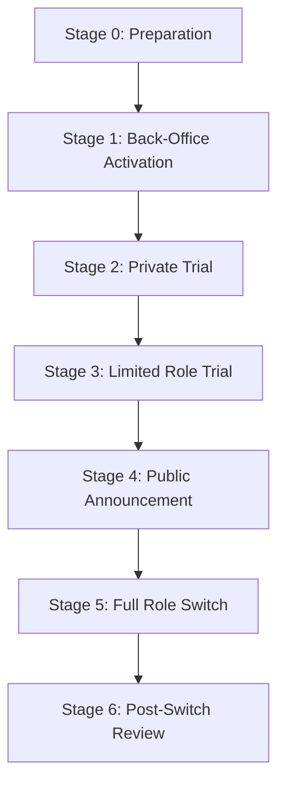

# ASTRO-NUM-003 — Number Timing Recommendation Template v1

* **สถานะของเอกสาร (Status)**: Draft / Docs-only / Advisory Template (ร่างเอกสาร / เฉพาะงานเอกสาร / แม่แบบแนะนำเชิงกลยุทธ์)
* **รหัสอ้างอิงของงาน**: ASTRO-NUM-003

---

## 1. Purpose (วัตถุประสงค์)

เอกสารฉบับนี้ทำหน้าที่เป็น **กรอบโครงร่างคำแนะนำเชิงกลยุทธ์ (Advisory Framework Template)** สำหรับวางแผนขั้นตอนและจังหวะเวลาในการเริ่มใช้งานหมายเลขโทรศัพท์ (Number Activation Timing) หลังจากผ่านขั้นตอนการประเมินและจัดบทบาทหน้าที่ของหมายเลข (Number Role Mapping) เป็นที่เรียบร้อยแล้ว (อ้างอิงจากกระบวนการจัดทำในเอกสาร ASTRO-NUM-002)

แม่แบบนี้ช่วยแนะนำผู้ใช้งานในการกักแยกขอบเขตและเปรียบเทียบระยะการเปลี่ยนผ่านตั้งแต่ระยะเตรียมระบบหลังบ้าน ทดลองใช้งานในกลุ่มปิด ไปจนถึงการเปิดตัวกับลูกค้า เพื่อสร้างความตื่นรู้และความพร้อมเชิงปฏิบัติการจริง โดยไม่เคลมว่าจังหวะเวลาสามารถการันตีความสำเร็จทางการเงิน ผลลัพธ์ชีวิต หรือผลลัพธ์ทางธุรกิจได้โดยตรง

---

## 2. Relationship to ASTRO-NUM-002 (ความเชื่อมโยงกับ ASTRO-NUM-002)

* **อ้างอิงประวัติการทำงานถัดจาก**: ASTRO-NUM-002 — Personal Number Role Mapping Case (Commit: `0128d884a8b1c5a7edf1ac8924266257af519da5`)
* **จุดเชื่อมโยงทางข้อมูล**: 
  * เอกสาร **ASTRO-NUM-002** ทำหน้าที่ระบุขอบเขตและวิเคราะห์ความเหมาะสมของการจัดบทบาท (Role Mapping) ให้แก่เบอร์โทรศัพท์แต่ละหมายเลข
  * เอกสาร **ASTRO-NUM-003** นี้จะไม่ทำการแปลความหมายเชิงสัญลักษณ์ของคู่ตัวเลขในเบอร์อีกครั้ง (No reinterpretation) และไม่มีการคำนวณคะแนนเบอร์โทรศัพท์ใหม่ (No new scoring)
  * หน้าที่หลักของเอกสารนี้มีเพียงกำหนด **กระบวนการและจังหวะขั้นตอนการเปิดใช้ (Activation Stages)** เพื่อป้องกันความเสี่ยงในการสูญเสียช่องทางการติดต่อและลดผลกระทบเชิงพฤติกรรม

---

## 3. Advisory Principles (หลักการแนะนำเชิงกลยุทธ์)

1. **เวลาคือกรอบวางแผน ไม่ใช่อนาคตที่ถูกกำหนดไว้ล่วงหน้า (Planning Aid, Not Prediction)**: ใช้ช่วงเวลาเชิงสัญลักษณ์เป็นจุดตั้งต้นทางจิตวิทยาเพื่อเตรียมความมั่นใจและการตื่นตัวเท่านั้น
2. **ความพร้อมเชิงปฏิบัติการต้องมาก่อนเสมอ (Practical Readiness First)**: หากเบอร์โทรศัพท์พร้อมตามกำหนดฤกษ์ยาม แต่ระบบธุรกิจหลังบ้าน หน้าเพจ หรือทีมงานยังไม่พร้อม ให้เลื่อนการเปิดใช้งานออกไปโดยยึดความพร้อมในการทำงานจริงเป็นที่ตั้ง
3. **ระบบการเปลี่ยนผ่านที่ยืดหยุ่นและย้อนกลับได้ (Reversible Migration)**: การเปลี่ยนผ่านช่องทางการติดต่อสื่อสารควรดำเนินไปอย่างช้า ๆ และสามารถสลับกลับไปใช้ช่องทางเดิมได้ทันทีหากระบบขัดข้อง
4. **ความตระหนักรู้ในภาระการสื่อสาร (Communication Workload Awareness)**: พึงระวังความหนาแน่นของการแชทหรือสายโทรศัพท์ที่อาจเพิ่มขึ้นในแต่ละขั้นตอนการเปิดตัว
5. **การแยกบทบาทช่องทางที่ชัดเจน (Role Separation)**: ไม่ควรนำเบอร์สำหรับงานหลังบ้านหรือเบอร์ระบบ OTP ไปปะปนกับเบอร์ติดต่อหลักเพื่อความปลอดภัย
6. **การประเมินสภาวะอารมณ์และจิตใจ (Emotional & Comfort Check)**: ทบทวนความรู้สึกสบายใจและความมั่นใจในการหยิบยกหมายเลขนั้นขึ้นมาติดต่อค้าขาย
7. **ไม่ทำลายช่องทางเดิมเร็วเกินไป (Preserve Fallback Channels)**: รักษาช่องทางแชทหรือหมายเลขโทรศัพท์เดิมไว้เป็นทางเลือกสำรองจนกว่าเบอร์ใหม่จะมีความเสถียรในทุกระบบเป็นเวลาอย่างน้อย 60 วัน
8. **การทดลองแบบค่อยเป็นค่อยไป (Gradual Experimentation)**: เริ่มต้นเปิดใช้กับกลุ่มผู้ใช้ขนาดเล็กและควบคุมได้ ก่อนขยายวงกว้างไปสู่สาธารณะ
9. **ห้ามสร้างความกดดันหรือความวิตกกังวล (No Urgency or Fear-Based Prompts)**: การแนะนำจังหวะเวลาต้องไม่ทำให้ผู้ใช้เกิดความหวาดกลัวหรือบังคับให้ต้องเปลี่ยนระบบงานอย่างเร่งรีบ
10. **ข้อมูลฤกษ์ยามคือส่วนสนับสนุนเชิงสัญลักษณ์ (Supportive Context)**: ฤกษ์ยามการเปิดซิมทำหน้าที่เป็นข้อมูลส่งเสริมกำลังใจ ไม่ใช่ตัวรับประกันผลสัมฤทธิ์ทางการเงินโดยปราศจากการลงมือทำตลาด

---

## 4. Timing Stages (ขั้นตอนจังหวะเวลาการเปิดใช้งาน)

### Stage 0 — Preparation (ขั้นเตรียมความพร้อม)
* **วัตถุประสงค์**: รวบรวมบัญชีผู้ใช้ รายชื่อผู้ติดต่อ สำเนาข้อความแจ้งเตือน แผนการสำรองข้อมูล และแผนการกู้คืนช่องทางเดิม (Rollback Plan)
* **กิจกรรมหลัก**:
  * สำรวจบัญชีธนาคารและแอปพลิเคชันธุรกรรมที่ผูกกับเบอร์เดิม
  * ร่างข้อความที่จะใช้แจ้งพาร์ทเนอร์หรือลูกค้ากรณีเปลี่ยนเบอร์ติดต่อ
  * กำหนดเกณฑ์สำหรับตัดสินใจหยุดทดลองหรือกู้คืนช่องทางเดิม (Rollback triggers)
* **ข้อพึงหลีกเลี่ยง**: ห้ามทำการแก้ไขระบบติดต่อสำคัญหรือบัญชีธนาคารของบริษัทในขั้นนี้

### Stage 1 — Back-Office Activation (ขั้นเปิดระบบหลังบ้านเงียบ)
* **วัตถุประสงค์**: ทดสอบการลงทะเบียนซิมการ์ด เช็กการรับสาย-ส่งข้อความ และความเสถียรของเครื่องโทรศัพท์เป็นการภายใน
* **กิจกรรมหลัก**:
  * ลงทะเบียนซิมการ์ดเข้าสู่ระบบเครือข่ายมือถือ (Backend Activation)
  * ตั้งค่าอุปกรณ์เคลื่อนที่ ลงทะเบียนระบบแจ้งเตือน และแอปพลิเคชันผูกเบอร์หลังบ้าน
  * ทดลองกดสายเข้า-ออก และตรวจสอบความถูกต้องของการรับรหัส OTP
* **ข้อพึงหลีกเลี่ยง**: ห้ามประกาศหมายเลขนี้บนโซเชียลมีเดียหรือหน้าเว็บไซต์ใด ๆ และห้ามนำไปสมัครบัญชีสำคัญของบริษัท

### Stage 2 — Private Trial (ขั้นทดลองกับกลุ่มปิด)
* **วัตถุประสงค์**: ตรวจทานคุณภาพของการรับสายและการไหลเวียนข้อความร่วมกับกลุ่มทดสอบที่ควบคุมความเสี่ยงได้
* **กิจกรรมหลัก**:
  * สื่อสารหรือส่งข้อความจำลองกับเพื่อนร่วมงาน สมาชิกในครอบครัว หรือพาร์ทเนอร์ในทีมหลัก
  * ประเมินพฤติกรรมความพร้อมในการพิมพ์ตอบ ข้อความเทมเพลต และคุณภาพของสัญญาณ
  * สังเกตว่ากลุ่มทดลองมีความสับสนในตัวตนของเบอร์ใหม่นี้หรือไม่
* **ข้อพึงหลีกเลี่ยง**: ห้ามนำเบอร์ไปติดต่อกับลูกค้าจริงที่ยังไม่ทราบเรื่อง หรือนำไปใช้กับการต่อรองผลประโยชน์ทางธุรกิจ

### Stage 3 — Limited Role Trial (ขั้นเปิดบทบาทจำกัดเฉพาะงาน)
* **วัตถุประสงค์**: เริ่มต้นใช้งานเบอร์นี้ในการทำงานจริงแบบล็อกขอบเขตงานเฉพาะมิติเดียว
* **กิจกรรมหลัก**:
  * เปิดใช้เบอร์เพื่อจุดประสงค์งานวิจัย งานที่ปรึกษาเชิงลึก หรือรับสายจากโครงการเฉพาะกิจ (เช่น โครงการ Green Fineness หรือ Astro Strategy Lab บางส่วน)
  * รักษาการแยกช่องทางการติดต่อส่วนตัวและช่องทางธุรกิจไม่ให้ทับซ้อนกัน
  * บันทึกปริมาณข้อความสนทนาที่เข้ามาเพื่อวัดผล
* **ข้อพึงหลีกเลี่ยง**: ห้ามผูกเบอร์ใหม่นี้เข้ากับระบบรับสายหน้าบ้านหรือระบบรับสอยการเคลมสินค้าแบบหนาแน่นในเวลาเดียวกัน

### Stage 4 — Public Announcement (ขั้นแจ้งสื่อสารสาธารณะ)
* **วัตถุประสงค์**: เผยแพร่เบอร์โทรศัพท์สู่หน้าเว็บไซต์ ใบเสนอราคา หรือช่องทางออนไลน์อย่างเป็นทางการ
* **กิจกรรมหลัก**:
  * ปรับเปลี่ยนข้อมูลในหน้า Contact Us, แบนเนอร์ หรือโพสต์ปักหมุด
  * แนบข้อแนะนำช่องทางสำรอง (เช่น ช่องทาง LINE OA หรืออีเมล) ควบคู่กับเบอร์ใหม่เสมอ เพื่อลดผลกระทบกรณีสัญญาณไม่เสถียร
* **ข้อพึงหลีกเลี่ยง**: หลีกเลี่ยงการใช้คำเคลมเชิงสัญลักษณ์หรือความเชื่อในหน้าประกาศ (เช่น ประกาศว่าเบอร์ใหม่นี้จะนำความเฮงมาสู่ผู้ติดต่อ) และห้ามยกเลิกช่องทางเดิมทันที

### Stage 5 — Full Role Switch (ขั้นเปลี่ยนผ่านเต็มรูปแบบ)
* **วัตถุประสงค์**: ย้ายบทบาทหลักมาใช้เบอร์ใหม่นี้ในการดำเนินธุรกรรมและเป็นตัวแทนบทบาทหลักอย่างสมบูรณ์
* **กิจกรรมหลัก**:
  * พิจารณาอัปเดตข้อมูลติดต่อในเอกสารธุรกิจ เว็บไซต์ หรือโปรไฟล์สาธารณะก่อน ส่วนบัญชีการเงิน บัญชีตัวตน หรือระบบนิติบุคคลที่มีความเสี่ยงสูง ควรแยกเป็นขั้นตอนเฉพาะและทำเมื่อมีแผน rollback ชัดเจนเท่านั้น
  * ประกาศความเสถียรของช่องทางการติดต่อและสรุปให้คนในทีมใช้งานเป็นทางการ
* **ข้อพึงหลีกเลี่ยง**: ห้ามปิดซิมการ์ดของเบอร์ติดต่อเดิมในทันที อย่างน้อยต้องเก็บรักษาการเชื่อมต่อเบอร์เดิมไว้เพื่อรับสายโอนสิทธิ์ขั้นต่ำ 60-90 วัน

### Stage 6 — Post-Switch Review (ขั้นตรวจสอบและทบทวนภายหลังเปลี่ยนผ่าน)
* **วัตถุประสงค์**: ประเมินความเหมาะสมของเบอร์ใหม่ในบทบาทหน้าที่จริงหลังใช้งานระยะหนึ่ง
* **กิจกรรมหลัก**:
  * ตรวจวัดสถิติจำนวนสาย, ภาระงานแชทสะสม, ความเครียดในการตอบสนอง, และประเด็นความสับสนของลูกค้า
  * ประเมินพฤติกรรมและปรับปรุงระบบตอบรับอัตโนมัติหรือขอบเขตเวลาติดต่อ
* **ข้อพึงหลีกเลี่ยง**: หลีกเลี่ยงการปล่อยปละละเลยภาระงานตอบสายจนกระกระทบต่อสภาวะอารมณ์และชีวิตส่วนตัว

---

## 5. Review Windows (หน้าต่างจังหวะตรวจสอบและทวนสอบสิทธิ์)

เพื่อควบคุมพฤติกรรมให้เป็นระบบและประเมินผลเชิงรูปธรรม กำหนดให้มีจุดตรวจและสิทธิ์การอนุมัติผ่านเข้าสู่เฟสถัดไปดังนี้:

### Day 7 Review (จุดตรวจสอบในวันที่ 7)
* **เป้าหมาย**: ตรวจสอบความมั่นคงเชิงเทคนิคและความคุ้นชินเบื้องต้น
* **เกณฑ์การตรวจสอบ**:
  * [ ] ระบบซิม รับสาย รับข้อความ และรับ OTP ผ่านการทดสอบในสถานการณ์ใช้งานหลัก
  * [ ] แอปพลิเคชันตั้งค่าสิทธิ์ความเป็นส่วนตัวถูกต้อง
  * [ ] สมาชิกกลุ่มทดสอบในทีมเข้าใจบทบาทเบอร์นี้ตรงกัน
* **การตัดสินใจ (Decision Options)**: ดำเนินขั้นตอนการทดลองปิดต่อไป / พักชะลอชั่วคราวเพื่อตั้งค่าความพร้อมเชิงอุปกรณ์

### Day 14 Review (จุดตรวจสอบในวันที่ 14)
* **เป้าหมาย**: ประเมินความรู้สึกและการตอบรับพฤติกรรมในขอบเขตปิด
* **เกณฑ์การตรวจสอบ**:
  * [ ] การพิมพ์สนทนากับกลุ่มปิดไม่มีความอึดอัดทางจิตใจ
  * [ ] ปริมาณแชทและสายเข้าอยู่ในสัดส่วนที่จัดการได้ง่าย
  * [ ] ไม่พบสัญญาณข้อขัดข้องทางเทคนิคด้านการจัดเก็บข้อมูลเบอร์
* **การตัดสินใจ (Decision Options)**: อนุมัติผ่านเข้าสู่เฟสจำกัดบทบาทเฉพาะงาน (Stage 3) / เลื่อนการขยายบทบาทเพื่อทดสอบในระยะทดลองปิดต่อ

### Day 30 Review (จุดตรวจสอบในวันที่ 30)
* **เป้าหมาย**: ประเมินการกักแยกบทบาทการทำงานและปริมาณข้อความ
* **เกณฑ์การตรวจสอบ**:
  * [ ] บริบทบทบาทการทำงาน (เช่น งานที่ปรึกษา B2B) แยกขาดจากงานส่วนตัวได้ราบรื่น
  * [ ] ไม่มีปัญหาข้อมูลลูกค้าจากเพจหลักไหลปนเป
  * [ ] จัดสรรเวลาตอบกลับลูกค้าและพฤติกรรมส่วนตัวได้สมดุล
* **การตัดสินใจ (Decision Options)**: เตรียมวางแผนทำคำประกาศสาธารณะ (Stage 4) / ดำเนินการล็อกบทบาทให้แคบลงและงดการประกาศออกสื่อ

### Day 60 Review (จุดตรวจสอบในวันที่ 60)
* **เป้าหมาย**: ประเมินความเหมาะสมระยะยาวของบทบาทหมายเลขนี้
* **เกณฑ์การตรวจสอบ**:
  * [ ] สถิติการติดต่อและการจัดการภาระงานสนทนามีความสม่ำเสมอ
  * [ ] ช่องทางสำรองทำงานได้ไร้รอยต่อ
  * [ ] ผู้ใช้ประเมินความสอดคล้องเชิงสัญลักษณ์แล้วพบว่าไม่มีภาวะความเครียดสะสม
* **การตัดสินใจ (Decision Options)**: ยืนยันบทบาทหน้าที่ยาวนานของเบอร์ถาวร / ปรับลดระดับบทบาทของเบอร์ลงเป็นเบอร์สำรอง และสลับกลับไปใช้โครงสร้างเบอร์หลักเดิม

---

## 6. Safety Wording for Timing / ฤกษ์ยาม (การควบคุมกรอบจริยธรรมด้านถ้อยคำ)

เพื่อเป็นแนวทางการแสดงผลภาษาและการสื่อความหมายเชิงสัญลักษณ์ที่ถูกต้อง ปลอดภัย ไม่ส่งเสริมความเชื่องมงาย กำหนดรายการเปรียบเทียบถ้อยคำดังนี้:

### ถ้อยคำที่แนะนำให้ใช้ (Recommended Safe Wording)
* *"ช่วงเวลานี้อาจเหมาะสำหรับการเริ่มทดลองใช้อย่างค่อยเป็นค่อยไป"*
* *"ควรใช้ช่วงนี้เป็นจังหวะเตรียมระบบมากกว่าการประกาศออกหน้าทันที"*
* *"สามารถใช้เป็นช่วงทดลองกับกลุ่มเล็กก่อนตัดสินใจขยายบทบาท"*
* *"จังหวะนี้เหมาะกับการทบทวนความพร้อมและจัดระบบหลังบ้าน"*
* *"หากระบบจริงยังไม่พร้อม ควรให้ความพร้อมเชิงปฏิบัติสำคัญกว่าฤกษ์"*
* *"ควรใช้ฤกษ์ยามเป็นข้อมูลประกอบ ไม่ใช่เหตุผลเดียวในการตัดสินใจ"*
* *"การเปลี่ยนบทบาทเบอร์ควรทำแบบค่อยเป็นค่อยไปและมีช่องทางสำรอง"*
* *"หากพบความสับสนหรือภาระการสื่อสารมากเกินไป ควรชะลอการขยายบทบาท"*

### ถ้อยคำที่ต้องหลีกเลี่ยงเด็ดขาด (Strictly Avoid)
* *"วันนี้ดีที่สุดเท่านั้น"*
* *"ถ้าไม่ใช้วันนี้จะเสียโอกาส"*
* *"เบอร์นี้จะทำให้สำเร็จ"*
* *"เบอร์นี้จะดึงดูดเงินแน่นอน"*
* *"ต้องเปลี่ยนทันที"*
* *"ห้ามพลาดฤกษ์นี้"*
* *"ใช้แล้วจะดีขึ้นแน่นอน"*
* *"เลขนี้ส่งผลให้ชีวิตเปลี่ยนทันที"*
* *"ถ้าไม่เปลี่ยนจะเกิดปัญหา"*

---

## 7. Risk Guardrails (แนวทางการควบคุมความเสี่ยงของแม่แบบ)

1. **ห้ามใช้คำตัดสินเด็ดขาด (No deterministic claims)**: ห้ามเคลมความร่ำรวย โชคดี หรือปัญหาสุขภาพ
2. **ไม่การันตีผลลัพธ์ (No guaranteed outcomes)**: ทุกจังหวะแนะนำทำหน้าที่สนับสนุนสัญลักษณ์เชิงจิตวิทยาเท่านั้น
3. **ปราศจากภาษาที่สร้างความกดดันหรือความหวาดกลัว (No fear-based copy)**: ห้ามข่มขู่หรือชี้นำพฤติกรรมกังวล
4. **ลำดับความพร้อมเชิงระบบเหนือฤกษ์ยาม (System readiness over timing)**: ระบบทางเทคนิคต้องเป็นเงื่อนไขอนุมัติหลัก
5. **ไม่เคลมความสัมพันธ์เหตุและผลโดยตรง (No direct cause-effect claims)**: การตีความเชิงสัญลักษณ์ของตัวเลขไม่ควรถูกใช้แทนการวางแผน การลงมือทำ และการติดตามผลจริง
6. **ห้ามคำนวณวันเวลามงคลจริงลงในตัวเอกสารข้อกำหนดนี้ (No actual date calculation)**: ใช้เฉพาะกรอบขั้นตอนเชิงแม่แบบและถ้อยคำเชิง advisory เท่านั้น
7. **ห้ามสร้างระบบการให้คะแนนความเหมาะสม (No scoring/ranking rules)**: ป้องกันการประเมินทับซ้อนข้อจำกัดของ ASTRO-NUM-002
8. **ห้ามแก้ธุรกรรมนิติบุคคลหลักจนกว่าจะผ่านเฟสทดลองปิด (No critical account changes before review)**: ป้องกันความขัดข้องทางธุรกรรม
9. **กักเก็บช่องทางการสื่อสารเดิมไว้ครบถ้วน (Preserve legacy channels)**: ป้องกันการขาดการติดต่อจากหุ้นส่วนเดิม
10. **เตรียมแผนย้อนคืนพฤติกรรมระบบ (Rollback Plan)**: ต้องระบุขั้นตอนการปิดและถอยกลับระบบได้อย่างรวดเร็ว

---

## 8. Example Timing Template Table (ตารางแม่แบบจัดการจังหวะเวลา)

| Stage (ระยะ) | Timing Role (บทบาทจังหวะ) | Main Action (กิจกรรมหลัก) | Should Do (ควรทำ) | Should Avoid (ควรเลี่ยง) | Review Gate (จุดทดสอบผ่านเกณฑ์) |
|---|---|---|---|---|---|
| **Stage 0** | ขั้นวางแผนเตรียมการ | รวบรวมรายชื่อระบบและแผนย้อนคืนช่องทางเดิม | สำรวจรายการผูกบัญชี, เตรียมสำรองข้อความประกาศ | แก้ไขระบบธุรกรรมการเงินนิติบุคคลหลักทันที | มีเช็กลิสต์ความเสี่ยงครบถ้วนและแผนกู้ระบบพร้อมใช้งาน |
| **Stage 1** | ขั้นเปิดระบบหลังบ้าน | ตรวจสอบการรับสัญญาณ OTP เช็กเครือข่ายจำกัดวง | ลงซิมการ์ด, ตรวจความปลอดภัยอุปกรณ์เคลื่อนที่ | โปรโมตเบอร์บนหน้าเพจหรือเว็บไซต์สาธารณะ | ตรวจความถูกต้องของ OTP และรับสายทดลองผ่านเกณฑ์ |
| **Stage 2** | ขั้นทดลองกลุ่มปิด | ตรวจระบบสื่อสารและการทำความเข้าใจของพาร์ทเนอร์ในทีม | สื่อสารแชท/โทรในครอบครัวและทีมหลักที่ไว้ใจได้ | นำเบอร์ใหม่ติดต่อคู่ค้าเชิงกลยุทธ์ภายนอก | พาร์ทเนอร์แจ้งรับสายลื่นไหลและเข้าใจบทบาทเบอร์ตรงกัน |
| **Stage 3** | ขั้นจำกัดบทบาท | เริ่มประสานงานโครงการทดลองเฉพาะด้าน (GF/Astro Lab) | แยกสายลูกค้า B2B ออกเป็นรายโครงการ | สลับระบบรับสายพนักงาน B2C หน้าโชว์รูมหรือผูกแชทหลัก | ปริมาณสายเข้าสม่ำเสมอและไม่เพิ่มภาระความเครียดตอบแชท |
| **Stage 4** | ขั้นแจ้งสาธารณะ | ปรับปรุงช่องทางรายละเอียด Contact Us บนแบนเนอร์ออนไลน์ | แนบข้อมูลช่องทาง LINE OA สำรองคู่กันเสมอ | ใช้คีย์เวิร์ดเกี่ยวกับความเชื่อหรือโชคลาภบนหน้าป้ายโฆษณา | ข้อมูลแสดงผลถูกต้อง และมีช่องทางกู้คืนเมื่อสายไม่ติด |
| **Stage 5** | ขั้นเปลี่ยนบทบาทหลัก | ดำเนินการย้ายข้อมูลระบบติดต่อและการทำสัญญาอย่างเป็นทางการ | อัปเกรดเบอร์ในโปรไฟล์บริษัทและระบบธุรกรรม B2B | ปิดใช้ซิมโทรศัพท์เบอร์ติดต่อเดิมทันที | บัญชีธุรกิจสลับเบอร์สำเร็จ และมีสัญญาณรับ OTP ปกติ |
| **Stage 6** | ขั้นตรวจสอบประเมินผล | ตรวจทานประสิทธิผลและควบคุมการวางตัวเชิงพฤติกรรมธุรกิจ | ปิดแอปสนทนานอกเวลาทำการ, ตรวจสอบภาวะอารมณ์ | ละเลยปริมาณสายค้างหรือละทิ้งเป้าหมายธุรกิจจริง | ผลลัพธ์สถิติการใช้งานครบ 60 วันได้รับการประเมินเปรียบเทียบ |

---

## 9. Decision Checklist (เกณฑ์การตรวจอนุมัติผ่านระยะ)

- [ ] **ระบบอุปกรณ์เทคนิคทำงานปกติหรือไม่?** (สลับเครื่อง, รับ OTP, สัญญาณชัดเจน)
- [ ] **เป้าหมายบทบาทของหมายเลขชัดเจนและไม่มีการก้าวล่วงข้ามหน้าที่หรือไม่?**
- [ ] **ระบบติดต่อสื่อสารสำรอง (Fallback channels) ยังมีสถานะเปิดใช้งานหรือไม่?**
- [ ] **บัญชีผู้ใช้ที่มีระดับความเสี่ยงสูง (เช่น ธุรกรรมการเงินหลัก) ยังปลอดภัยและไม่มีการย้ายลนลานหรือไม่?**
- [ ] **ได้ทดลองประเมินผลกับพาร์ทเนอร์ในกลุ่มปิดเรียบร้อยแล้วหรือไม่?**
- [ ] **ภาระการตอบแชทและการรับสายโทรศัพท์ในแต่ละวันอยู่ในระดับที่จัดสรรได้หรือไม่?**
- [ ] **ไม่มีสัญญาณความสับสนหรือข้อเรียกร้องเชิงลบจากคู่ติดต่อใช่หรือไม่?**
- [ ] **ผู้ใช้รู้สึกสบายใจ มั่นใจ และตื่นรู้ในการทำงานร่วมกับระบบเบอร์นี้ใช่หรือไม่?**
- [ ] **ระยะหน้าต่างเวลาทบทวนทวนสอบ (Review window) ผ่านเกณฑ์ครบตามที่กำหนดใช่หรือไม่?**
- [ ] **การประเมินอยู่บนพื้นฐานความพร้อมเชิงกลยุทธ์ปฏิบัติจริง (Practical Readiness) ร่วมกับบริบทเชิงสัญลักษณ์หรือฤกษ์ยามในฐานะข้อมูลประกอบใช่หรือไม่?**
- [ ] **สิทธิ์ในการย้อนคืนแผนการใช้งานเดิม (Rollback) ยังมีความพร้อมที่จะทำได้ทันทีใช่หรือไม่?**

---

## 10. Recommended Next Milestone (แผนงานในขั้นถัดไป)

* **ความเคลื่อนไหวแนะนำถัดไป**: **ASTRO-NUM-004 — Number Timing Case Application for Tum v1**
* **คำจำกัดความขอบเขตงานถัดไป**: นำโครงร่างแม่แบบจังหวะแนะนำของ ASTRO-NUM-003 มาสอบทานร่วมกับแผนงานเปรียบเทียบเบอร์จริงของคุณตั้ม 3 เบอร์จาก ASTRO-NUM-002 โดยกำหนดให้อยู่ในกรอบการแนะนำในงานเอกสารเท่านั้น (Docs-only Advisory planning) ห้ามคำนวณวันฤกษ์มงคลแบบอัตโนมัติหรือติดตั้งชุดข้อมูล UI ลงในโค้ดระบบหลักจนกว่าจะได้รับการอนุมัติอย่างเป็นลายลักษณ์อักษร
