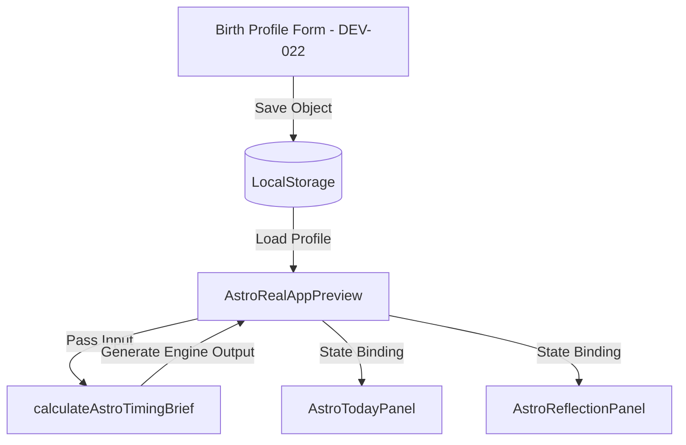

# แผนการเชื่อมต่อระบบคำนวณและทบทวนข้อกำหนดผลลัพธ์ (Astrology Engine Integration Plan & Output Contract Review) — Astro Real App

เอกสารนี้ทำหน้าที่สรุปผลการประเมินการคำนวณดาราศาสตร์ และโครงสร้างสัญญาเชื่อมต่อข้อมูล (Output Contract) ก่อนที่จะนำ อะแดปเตอร์คำนวณ ไปเชื่อมต่อเข้ากับคอมโพเนนต์การแสดงผลจริงและแบบฟอร์มบันทึกข้อมูลดวงเกิด

---

## 1. เป้าหมาย (Goal)
ทบทวนความครบถ้วนและอภิปรายความถูกต้องของสัญญาเชื่อมโยงข้อมูลดาราศาสตร์เชิงกลยุทธ์ (Astrology Output Contract) ให้มีความมั่นคง ปลอดภัย มีประตูกั้นจริยธรรมข้อมูล (Ethics boundaries) ชัดเจน และวางแนวทางการเชื่อมโยงเข้ากับระบบพรีวิวหลักในเฟสถัดไป

---

## 2. ขอบเขตงาน (Scope)
* **ปรับปรุงประเภทข้อมูล (Type Refinements)**: ขยายและปรับแต่งโมเดล `AstroEngineOutput` ให้มีความเป็นอ่านอย่างเดียว (Readonly) และเพิ่ม `AstroEngineMetadata` เพื่อระบุเวอร์ชัน วิธีการคำนวณ และความมั่นใจของผลลัพธ์
* **ประเมินพื้นที่แสดงผล (UI Gaps Inspection)**: สำรวจโค้ดคอมโพเนนต์พรีวิวเพื่อหาจุดผูกโยงข้อมูลทดแทนค่า Mock
* **สร้างเอกสารสัญญาร่วม**: ออกแบบโครงสร้างแผนการรับส่งข้อมูลและการจัดเก็บข้อมูลดวงเกิดลง localStorage

---

## 3. สิ่งที่อยู่นอกเหนือขอบเขต (Non-Scope)
* **ไม่มีการเชื่อมโยงระบบเข้ากับ UI จริงในเฟสนี้**: เพจ `/workspaces/astro-strategy/real-app-preview` ยังคงแสดงผลค่าจำลองดั้งเดิม
* **ไม่มีการสร้างแบบฟอร์มกรอกโปรไฟล์ดวงเกิดจริง**: จะเก็บรายละเอียดส่วนติดต่อผู้ใช้ไว้ในเฟส DEV-022

---

## 4. ผลการตรวจสอบอะแดปเตอร์คำนวณปัจจุบัน (Current Adapter Review)
อะแดปเตอร์ `astroRealAppAstrologyEngineAdapter.ts` มีลักษณะการทำงานที่ดีดังนี้:
* **Pure Functions**: ฟังก์ชันไม่มีการรบกวนหรือดึงสถานะภายนอก (Side-effects) ทำให้ทดสอบได้ง่ายมาก
* **Rule-based Cycle**: ตรรกะจังหวะชีวิตหมุนเวียนสัมพันธ์กับรอบวันเกิดของผู้ใช้แบบคงเส้นคงวา (Deterministic) ทำให้ความถูกต้องของจังหวะคำนวณเป็นไปอย่างสม่ำเสมอ
* **Refined Types**: การปรับเป็น `readonly` ช่วยป้องกันไม่ให้คอมโพเนนต์อื่นทำการแอบแก้ไขผลลัพธ์การคำนวณภายนอกอะแดปเตอร์

---

## 5. จุดเชื่อมโยงข้อมูล Mock ใน UI ปัจจุบัน (Existing UI Mock Data Locations)
* **`AstroRealAppPreview.tsx`**:
  * บรรทัดที่ 91: `strategyMode: MOCK_TODAY_DATA.strategyMode` ใช้สรุปโหมดส่งเข้าประวัติสะท้อนคิด
  * บรรทัดที่ 284: แท็บ `today` เรนเดอร์ `<AstroTodayPanel {...MOCK_TODAY_DATA} />`
  * บรรทัดที่ 295: แท็บ `reflection` ส่งค่า `reflectionPrompt={MOCK_TODAY_DATA.reflectionPrompt}`

---

## 6. แนวทางและโครงสร้างข้อมูลไหล (Proposed Data Flow & Boundary)


---

## 7. กรอบความปลอดภัยและคำอ่านทางจิตวิทยา (Safety Language Guardrails)
คำอ่านและการคำนวณเชิงกลยุทธ์ต้องอยู่ภายใต้กฎ 3 ข้อ:
1. **ไม่ใช่คำทำนายตายตัว (Non-deterministic)**: หลีกเลี่ยงคำทำนายแบบระบุเหตุการณ์ร้ายดี เช่น "จะสูญเสียเงิน" หรือ "ระวังอุบัติเหตุ"
2. **ไม่มีคำกล่าวอ้างทางการแพทย์ (No Medical Claims)**: ห้ามระบุเรื่องโรคภัยไข้เจ็บ การบำบัดรักษา หรือการวินิจฉัยโรค สัญญาณกายที่ระบุ (เช่น Eye strain) ต้องพรีฟิกซ์ด้วยคำว่าเป็นเพียง "สัญญาณส่วนตัวเพื่อการเฝ้าระวังจังหวะงาน"
3. **คำเตือนกำกับชัดเจน (Disclaimer)**: ทุกๆ ข้อมูลนำออก (Output) ต้องมี Disclaimer บรรทัดสุดท้ายแนบเพื่อย้ำว่า "ใช้ประกอบการจัดระบบงานและการสะท้อนคิดเท่านั้น"

---

## 8. การจัดเก็บข้อมูลดวงเกิดในอนาคต (Birth Profile Storage Plan)
* **Key**: `astro-real-app:birth-profile:v1`
* **Schema**:
  ```json
  {
    "version": 1,
    "updatedAt": "2026-06-07T16:00:00Z",
    "data": {
      "birthDate": "1980-06-05",
      "birthTime": "06:45",
      "birthPlace": "Siriraj Hospital, Bangkok, Thailand",
      "timezone": "Asia/Bangkok",
      "birthWeekday": "Thursday"
    }
  }
  ```

---

## 9. ข้อแนะนำสำหรับขั้นตอนถัดไป (Proposed DEV-022 Scope)
* พัฒนา **Birth Profile Form Panel** ให้ผู้ใช้กรอกประวัติดวงเกิดพร้อมระบบพยากรณ์คำนวณสรุปจังหวะชีวิต และบันทึกเซฟลง localStorage อัตโนมัติ
* เชื่อมต่อตรรกะจากอะแดปเตอร์คำนวณแบบสดเข้าสู่หน้าพรีวิวแทนที่ระบบจำลอง Mock เดิมทั้งหมด
