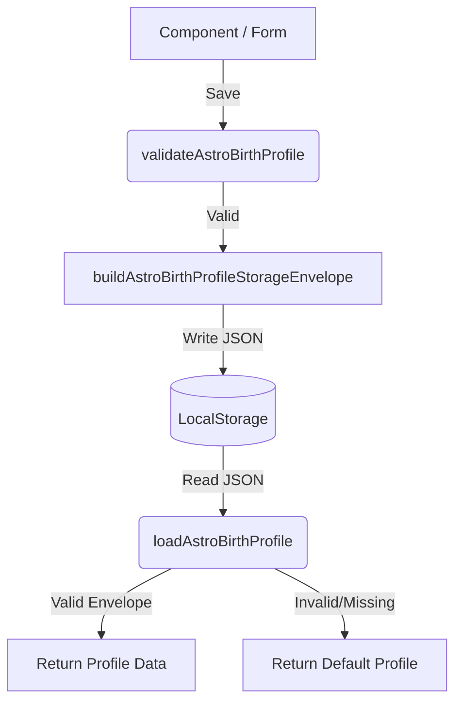

# ASTRO-REAL-APP-DEV-022 — Birth Profile Persistence Adapter

This document specifies the design, types, and client-side LocalStorage persistence adapter for the real app birth profile. It prepares the codebase for a future Birth Profile Form and dynamic astrology timing calculations while ensuring isolation from the prototype route.

## Goal
Establish a safe, typed LocalStorage persistence adapter for the real-app birth profile under the key `astro-real-app:birth-profile:v1`. This adapter will handle retrieval, storage, validation, and resets of the profile.

## Scope
- Define Typescript models for validation issues, validation results, envelope wrapping, and persistence actions.
- Implement a default birth profile containing the default user information (คุณตั้ม / อภิรักษ์).
- Add validation logic to verify correctness of fields (`birthDate`, `birthTime`, etc.).
- Create the storage adapter helpers.
- Add read-only key status and schema details to the Data Tools panel.

## Non-Scope
- Do NOT touch the active route `/workspaces/astro-strategy` behavior.
- Do NOT switch routes.
- Do NOT replace existing mock data in the Real App Preview UI.
- Do NOT add a Birth Profile Form UI.
- Do NOT wire birth profile persistence into visible timing UI.
- Do NOT change migration logic.
- Do NOT delete existing localStorage keys or overwrite unrelated keys.

## Storage Specifications

### Storage Key
`astro-real-app:birth-profile:v1`

### Schema Version
`1`

### Default Profile
- **displayName**: คุณตั้ม
- **fullName**: อภิรักษ์
- **birthDate**: `1980-06-05`
- **birthTime**: `06:45`
- **birthPlace**: `Siriraj Hospital, Bangkok, Thailand`
- **timezone**: `Asia/Bangkok`
- **utcOffset**: `+07:00`
- **birthWeekday**: `Thursday`
- **notes**: `ข้อมูลตั้งต้นของระบบ`
- **updatedAt**: (ISO string or timestamp formatted)
- **schemaVersion**: `1`

## Validation Rules
1. **birthDate**: Must match pattern `^\d{4}-\d{2}-\d{2}$` (YYYY-MM-DD) and represent a valid calendar date.
2. **birthTime**: Must match pattern `^\d{2}:\d{2}$` (HH:mm) and represent a valid clock time.
3. **timezone**: Must not be empty.
4. **displayName**: Must not be empty.
5. **fullName**: Must not be empty.

## Data Flow Diagram

## Files Changed/Created
- `src/components/workspaces/astro-strategy/real-app/data/astroRealAppTypes.ts` (Type refinements)
- `src/components/workspaces/astro-strategy/real-app/data/astroRealAppBirthProfileStorageAdapter.ts` (New adapter file)
- `src/components/workspaces/astro-strategy/real-app/components/AstroPreviewDataToolsPanel.tsx` (Read-only status row)
- `docs/astro-strategy/astro-real-app-022-birth-profile-persistence-adapter.md` (This document)
- `docs/astro-strategy/qa-real-app-022-birth-profile-persistence-adapter.md` (QA record)

## Future DEV-023 Recommendation
Once the persistence layer is verified, DEV-023 should implement the Birth Profile Form UI component, wire it into a tab or side panel, and enable the live timing calculation adapter by feeding the stored birth profile into `calculateAstroTimingBrief` to replace mock timing data.
