# ASTRO-REAL-APP-DEV-024 — Today Timing Engine Integration

เอกสารนี้ระบุการเชื่อมต่อระบบประมวลผลดาราศาสตร์ (Astrology Engine Output) เข้าสู่หน้าจอแผงสรุปวันนี้ (Today Panel) ในระบบ Real App Preview โดยใช้ข้อมูลวันเกิดจริงของผู้ใช้จากคีย์ `astro-real-app:birth-profile:v1`

## Goal
เชื่อมระบบประมวลผลสรุปจังหวะเวลาดาราศาสตร์รายวัน (Today Panel) กับประวัติวันเกิดในคีย์ความปลอดภัยของผู้ใช้งาน เพื่อให้ผลการสะสมพลังงานและแนวทางเชิงกลยุทธ์เป็นไปตามข้อมูลการโคจรดาวของบุคคลนั้นๆ จริง โดยยังไม่เปิดใช้งานในส่วนของมุมมองรายสัปดาห์หรือรายเดือน

## Scope
- สร้าง ViewModel [astroRealAppTodayTimingViewModel.ts](file:///Users/tamz/projects/workos-lite/src/components/workspaces/astro-strategy/real-app/data/astroRealAppTodayTimingViewModel.ts) เพื่อแปลงข้อมูลจาก `AstroEngineOutput` ไปเป็นโครงสร้างการแสดงผล `AstroTodayData`
- ปรับปรุง [AstroTodayPanel.tsx](file:///Users/tamz/projects/workos-lite/src/components/workspaces/astro-strategy/real-app/components/AstroTodayPanel.tsx) ให้รองรับการแสดงผล Metadata คำนวณ (CalculationMode, Source, Confidence) และคำแนะนำความปลอดภัยเพิ่มเติม
- อัปเดตการดึงข้อมูลตอน Hydration ในหน้าหลัก [AstroRealAppPreview.tsx](file:///Users/tamz/projects/workos-lite/src/components/workspaces/astro-strategy/real-app/AstroRealAppPreview.tsx) เพื่อคำนวณผลสรุปเวลาของบุคคลจริงและรองรับการเกิดข้อผิดพลาดโดยการตกกลับไปหาค่า Mock (Fallback)

## Non-Scope
- ไม่รบกวนหน้าหลักโปรโตไทป์ `/workspaces/astro-strategy` หรือไฟล์ `AstroStrategyPrototypeClient.tsx`
- ไม่เชื่อมระบบคำนวณสำหรับ Weekly หรือ Monthly
- ไม่เปลี่ยนโครงสร้างการเก็บข้อมูลประวัติสะท้อนคิดเดิม

## Data Flow

```mermaid
graph TD
    A[(LocalStorage)] -->|loadAstroBirthProfile| B(AstroBirthProfile)
    B -->|buildAstroTimingInput| C(AstroTimingInput)
    C -->|buildAstroEngineOutput| D(AstroEngineOutput)
    D -->|mapEngineOutputToTodayData| E(AstroTodayData + Metadata)
    E -->|Render State| F[AstroTodayPanel UI]
    style F fill:#0d1117,stroke:#58a6ff,stroke-width:2px
```

## Fallback Behavior
หากการดึงข้อมูลเกิดความเสียหาย โครงสร้าง JSON ถูกทำลาย หรือกระบวนการประมวลผลล้มเหลว ระบบจะดักจับ (Catch) ข้อผิดพลาดอย่างสงบและนำข้อมูล Mock ใน `MOCK_TODAY_DATA` มาแสดงผลแทน พร้อมส่งคำเตือนขนาดเล็กระบุว่ากำลังใช้ข้อมูลจำลองทั่วไปเพื่อป้องกันหน้าจอค้างทำงานล้มเหลว

## Safety Language Disclaimers
ผลลัพธ์การคำนวณเวลาเชิงดาราศาสตร์ที่แสดงผลจะถูกกำกับด้วยประโยคจริยธรรมข้อมูลอย่างเคร่งครัด:
- "ข้อมูลนี้ใช้เพื่อการสะท้อนและวางแผนเชิงกลยุทธ์เท่านั้น ไม่ใช่คำทำนายตายตัวหรือคำแนะนำทางการแพทย์"

## Files Changed/Created
- `src/components/workspaces/astro-strategy/real-app/data/astroRealAppTodayTimingViewModel.ts` [NEW]
- `src/components/workspaces/astro-strategy/real-app/components/AstroTodayPanel.tsx` (เพิ่มการรับพารามิเตอร์ Metadata และป้ายแจ้งเตือน)
- `src/components/workspaces/astro-strategy/real-app/AstroRealAppPreview.tsx` (เชื่อม Logic คำนวณใน Hook การเรนเดอร์)
- `docs/astro-strategy/astro-real-app-024-today-timing-engine-integration.md` [NEW]
- `docs/astro-strategy/qa-real-app-024-today-timing-engine-integration.md` [NEW]

## Future DEV-025 Recommendation
หลังจากระบบรายวันได้รับการยืนยันความเสถียร ในขั้นถัดไปควรเชื่อมต่อประวัตินี้เข้ากับกระบวนการบันทึกประวัติสะท้อนคิด (Reflection Log) เพื่อส่งต่อประเภทของกลยุทธ์ (เช่น Focus, Stabilize, Pause) จากปฏิทินเกิดของวันนั้น ๆ ลงบันทึกประวัติได้อย่างแท้จริง
