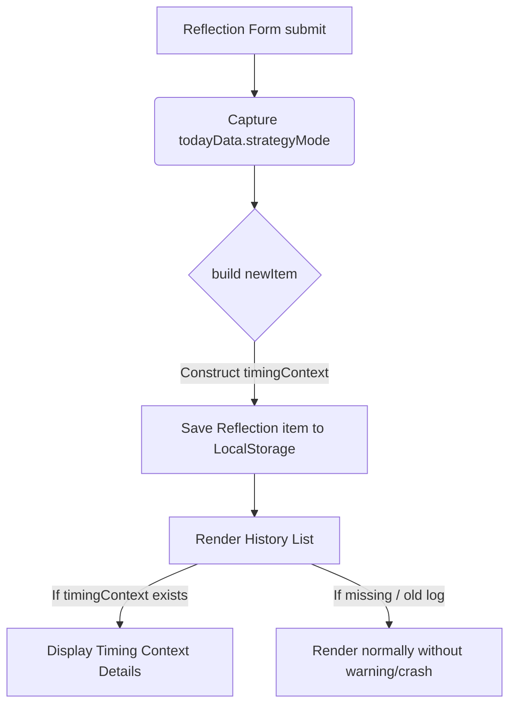

# ASTRO-REAL-APP-DEV-026 — Reflection History Mode Integration

เอกสารนี้ระบุสเปกการเชื่อมจังหวะเวลาของวันนี้ (Today Timing Mode) เข้ากับระบบบันทึกประวัติสะท้อนคิด (Reflection History) เพื่อเก็บบันทึกประเภทจังหวะดาวประจำวันร่วมกับความรู้สึกส่วนตัวของผู้ใช้งาน

## Goal
เชื่อมโยงจังหวะกลยุทธ์เวลา (strategyMode) ที่ได้จากการประมวลผลดาราศาสตร์ในวันนี้ ไปเก็บลงในโครงสร้างประวัติสะท้อนคิดเมื่อผู้ใช้คลิกบันทึกประวัติ (Reflection Log) และแสดงผลแถบป้ายกำกับขนาดเล็กในกล่องประวัติแบบมองย้อนกลับได้อย่างสงบ ปลอดภัย และยืดหยุ่น

## Scope
- ปรับปรุงโมเดลข้อมูล `ReflectionHistoryItem` ใน [astroRealAppTypes.ts](file:///Users/tamz/projects/workos-lite/src/components/workspaces/astro-strategy/real-app/data/astroRealAppTypes.ts) และ [AstroReflectionHistoryPanel.tsx](file:///Users/tamz/projects/workos-lite/src/components/workspaces/astro-strategy/real-app/components/AstroReflectionHistoryPanel.tsx) ให้รองรับตัวแปรเลือกเพิ่มเติม `timingContext?`
- กำหนดรูปแบบ `timingContext` ดังนี้:
  ```typescript
  timingContext?: {
    mode: string;
    label: string;
    source: "engine" | "fallback" | "manual" | "legacy";
    capturedAt: string;
    disclaimer?: string;
  }
  ```
- ปรับฟังก์ชันการบันทึกประวัติการสะท้อนคิด `handleSubmitReflection` ใน [AstroRealAppPreview.tsx](file:///Users/tamz/projects/workos-lite/src/components/workspaces/astro-strategy/real-app/AstroRealAppPreview.tsx) ให้เก็บค่าโหมดดาราศาสตร์ประจำวันและรายละเอียด Metadata ณ จุดเวลาบันทึก
- ปรับการเรนเดอร์ใน `AstroReflectionHistoryPanel` ให้จัดแสดงผลสรุปประกอบสะท้อนจังหวะเวลารายการบันทึกแต่ละรายการ

## Non-Scope
- ไม่รบกวนหน้าหลักโปรโตไทป์เดิม
- ไม่เปลี่ยนแปลง Schema ดั้งเดิมจนทำให้ข้อมูลเดิมสูญหาย
- ไม่บังคับกรอกข้อมูลคีย์เดิม (ยืดหยุ่นและรองรับความเข้ากันได้แบบ Backward compatibility)
- ไม่มีภาษาทำนายหรือข้ออ้างทางการแพทย์ใดๆ

## Data Flow


## Backward Compatibility
ข้อมูลบันทึกประวัติสะท้อนคิดดั้งเดิมที่ไม่มีตัวแปร `timingContext` จะถูกโหลดและเรนเดอร์ข้ามไปอย่างปลอดภัยโดยไม่มีการฟิลเตอร์แจ้งข้อผิดพลาดหรือเกิดอาการแอปค้าง (Graceful Fallback)

## Files Changed/Created
- `src/components/workspaces/astro-strategy/real-app/data/astroRealAppTypes.ts` (ปรับโมเดลประวัติ)
- `src/components/workspaces/astro-strategy/real-app/components/AstroReflectionHistoryPanel.tsx` (ปรับโครงสร้าง Type ท้องถิ่นและการเรนเดอร์การ์ดประวัติ)
- `src/components/workspaces/astro-strategy/real-app/AstroRealAppPreview.tsx` (ปรับ Logic ตอนเก็บค่าบันทึกประวัติสะท้อนคิด)
- `docs/astro-strategy/astro-real-app-026-reflection-history-mode-integration.md` [NEW]
- `docs/astro-strategy/qa-real-app-026-reflection-history-mode-integration.md` [NEW]

## Future DEV-027 Recommendation
ในขั้น DEV-027 แนะนำให้ทำการเชื่อมโยงข้อมูลคำนวณเข้ากับแผงปฏิทินรายสัปดาห์ (Weekly Timing Brief) เพื่อให้นักพัฒนาและผู้ใช้ตรวจสอบการปรับตัวสัปดาห์ได้อย่างสอดคล้องกับวันครบรอบวันเกิด
