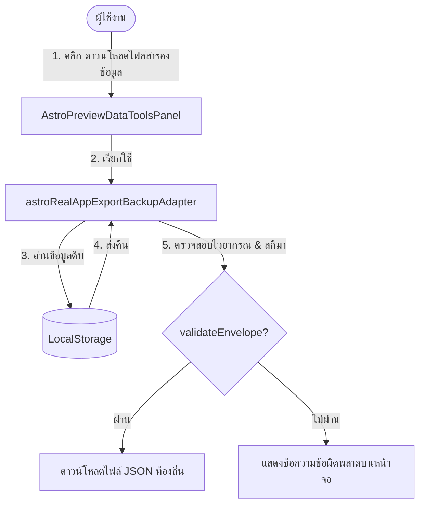

# ASTRO-REAL-APP-DEV-044 — Export / Backup Implementation

เอกสารรายละเอียดการทำงานและคู่มือการพัฒนาฟังก์ชันการส่งออกและสำรองข้อมูล (Export / Backup Implementation) สำหรับ Astro Real App MVP-v3

## Goal
พัฒนาฟังก์ชันส่งออกข้อมูลความจำเป็นไฟล์ JSON ฝั่งไคลเอนต์ (Client-side JSON download) เพื่อให้ผู้ใช้สามารถสำรองประวัติกลยุทธ์ส่วนบุคคลเก็บรักษาไว้ได้อย่างปลอดภัย 100% ไร้ความเสี่ยงในการรั่วไหลและข้อมูลสูญหาย

---

## Scope & Non-Scope

### ขอบเขตการอิมพลีเมนต์ (Scope)
1. เพิ่มชนิดตัวแปรที่เกี่ยวข้องกับการส่งออกใน `astroRealAppTypes.ts`
2. พัฒนาโมดูลอะแดปเตอร์ส่งออก [astroRealAppExportBackupAdapter.ts](file:///Users/tamz/projects/workos-lite/src/components/workspaces/astro-strategy/real-app/data/astroRealAppExportBackupAdapter.ts) ควบคุมการจัดเก็บโครงสร้าง จัดตั้งชื่อไฟล์ และเขียนส่งออกเป็นไฟล์ดาวน์โหลด
3. เพิ่มแถบแผงควบคุม UI ในแท็บ **"เครื่องมือข้อมูล" (Data Tools)** บนหน้า Preview
4. กำหนดข้อความแจ้งเตือนความเป็นส่วนตัวและการรักษาข้อมูล PII
5. ตรวจสอบเงื่อนไขความถูกต้อง (Validation) ของสกีมา JSON ก่อนส่งดาวน์โหลดจริง

### นอกเหนือขอบเขต (Non-Scope)
- ไม่พัฒนาฟังก์ชันนำเข้า/กู้คืนข้อมูล (Import/Restore) ในเฟสนี้
- ไม่เขียนทับคีย์จัดเก็บอื่นๆ ใน LocalStorage ระหว่างส่งดาวน์โหลด
- ไม่ดัดแปลงหรือสลับเส้นทางของ Production หรือ Prototype client

---

## Export Data Flow

---

## Included & Excluded Keys

- **Included Keys** (คีย์ที่จะถูกบันทึกสำรอง):
  - `astro-real-app:birth-profile:v1`
  - `astro-real-app:reflection-history:v1`
  - `astro-real-app:planning-notes:v1`
  - `astro-real-app:reflection-draft:v1`
  - `astro-real-app:onboarding:v1`
- **Excluded Keys** (คีย์ที่จะถูกแยกออกอย่างเด็ดขาด):
  - คีย์ระบบเก่าดั้งเดิม (`astro-strategy:*`, `astro.strategy.*`)
  - คีย์อื่น ๆ ในบราวเซอร์ที่ไม่เกี่ยวข้องกับ Namespace พรีวิวของ Astro Lab

---

## JSON Envelope Structure & File Naming

### โครงสร้างไฟล์ข้อมูล
- ไฟล์มีหัวข้อสกีมา `$schema: "https://arbor-desk.com/schemas/astro-strategy-backup-v1.json"`
- บรรจุ `metadata` ระบุเวลาส่งออก วันเกิด ขนาด เวอร์ชันคีย์ และขอบเขต
- บรรจุ `data` ครอบคลุมออบเจกต์ของคีย์ทั้งหมด (หากคีย์ไม่มีข้อมูลจะคงรูปไว้ในสเกล `null` เพื่อความมั่นคงปลอดภัย)

### กฎการตั้งชื่อไฟล์
- `astro-strategy-backup-[YYYY-MM-DD]-[displayName].json`
  - ตัวอย่าง: `astro-strategy-backup-2026-06-08-tumz.json`

---

## Privacy Warning & UI Location

- **คำแจ้งเตือนความเป็นส่วนตัว**: 
  > *“ไฟล์สำรองอาจมีข้อมูลวันเกิด เวลาเกิด บันทึกสะท้อนคิด และแผนส่วนตัว โปรดเก็บไฟล์ไว้ในพื้นที่ปลอดภัย และไม่แชร์ไฟล์นี้กับบุคคลอื่นเพื่อรักษาความเป็นส่วนตัวสูงสุดของคุณ”*
- **UI Location**: แทรกอยู่ใต้โมดูลจำลองการย้ายข้อมูล (Migration tools) ในแท็บ **"⚙️ เครื่องมือข้อมูล" (Data Tools)** บนหน้าจอ Preview โดยระบุสถานะขนาดไบต์ของแต่ละคีย์เพื่อความโปร่งใส

---

## สรุปคำแนะนำในขั้นตอนถัดไป (Future DEV-045 Import / Restore Safety Plan)
สำหรับการพัฒนาขั้นถัดไป (**DEV-045 — Import / Restore Safety Implementation**):
- จำเป็นต้องใช้กระบวนการตรวจรับไฟล์ดาวน์โหลด (Import validation) ตรวจเช็คสกีมาอย่างรัดกุมก่อนเขียนบันทึกทดแทน
- มีการยืนยันกล่องข้อความยืนยันล่วงหน้าเพื่อป้องกันอุบัติเหตุเขียนทับประวัติจริงของผู้ใช้
