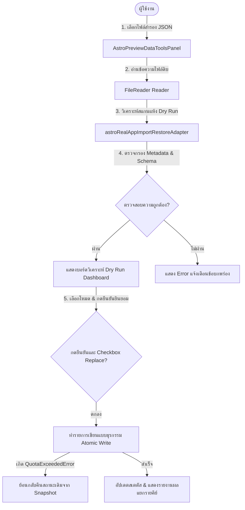

# ASTRO-REAL-APP-DEV-046 — Import / Restore Implementation

เอกสารรายละเอียดการทำงานและคู่มือการพัฒนาฟังก์ชันการนำเข้าและกู้คืนข้อมูล (Import / Restore Implementation) สำหรับ Astro Real App MVP-v3

---

## 1. Goal (เป้าหมาย)
พัฒนาฟังก์ชันนำเข้าและกู้คืนข้อมูล (Import & Restore) จากไฟล์สำรองข้อมูล JSON ฝั่งไคลเอนต์เข้าสู่หน่วยความจำ LocalStorage ของเบราว์เซอร์อย่างปลอดภัย โดยมีการวิเคราะห์ข้อมูลแบบจำลองก่อนบันทึกจริง (Dry Run Preview) มีโหมดผสานข้อมูล (Merge-safe) และโหมดแทนที่ข้อมูล (Replace) หลังผ่านการยืนยันตัวตน เพื่อป้องกันอุบัติเหตุข้อมูลประวัติสะสมผู้ใช้สูญหาย

---

## 2. Scope & Non-Scope (ขอบเขตและขอบเขตนอกเหนืองาน)

### ขอบเขตการอิมพลีเมนต์ (Scope)
1. เพิ่มชนิดตัวแปรอินเตอร์เฟซใน [astroRealAppTypes.ts](file:///Users/tamz/projects/workos-lite/src/components/workspaces/astro-strategy/real-app/data/astroRealAppTypes.ts)
2. พัฒนาอะแดปเตอร์ตรวจเช็คสกีมาและเขียนข้อมูล [astroRealAppImportRestoreAdapter.ts](file:///Users/tamz/projects/workos-lite/src/components/workspaces/astro-strategy/real-app/data/astroRealAppImportRestoreAdapter.ts)
3. ปรับปรุงแถบแผงควบคุม UI ในแท็บ **"กู้คืนและนำเข้าข้อมูล (Import & Restore Data)"** ในหน้า Preview [AstroPreviewDataToolsPanel.tsx](file:///Users/tamz/projects/workos-lite/src/components/workspaces/astro-strategy/real-app/components/AstroPreviewDataToolsPanel.tsx)
4. ปฏิบัติตามนโยบายสลัดคืนสถานะเดิมกรณีเขียนข้อมูลไม่ผ่าน (Atomic Rollback Strategy)

### นอกเหนืองาน (Non-Scope)
- **ไม่แสดงผลส่วนการนำเข้าข้อมูลบนเส้นทางจริง (Production Route)** โดยสงวนเครื่องมือนี้ไว้เฉพาะใน Preview Data Tools ของเส้นทางพรีวิวเท่านั้น
- ไม่ทำการเขียนลง LocalStorage อัตโนมัติทันทีที่เลือกไฟล์ (ต้องรันขั้นตอน Dry Run และกดยืนยันจากผู้ใช้ก่อน)
- ไม่สุ่มเปลี่ยนตำแหน่งคีย์การคำนวณ หรือดัดแปลงข้อมูลประวัติโปรโตไทป์เก่า (`astro-strategy:*`)

---

## 3. Import Data Flow (ลำดับขั้นตอนการส่งต่อข้อมูล)

---

## 4. Dry-Run & Metadata / Schema Validation Behavior (พฤติกรรมการตรวจสอบล่วงหน้า)

เมื่อเลือกไฟล์ระบบจะรันขั้นตอนตรวจสอบทันทีโดยไม่มีการเขียนลงเบราว์เซอร์:
- **Metadata Check**: ตรวจฟิลด์ `$schema` ต้องตรงกับสกีมาสำรองเวอร์ชัน 1, ตรวจ `appName` ต้องเป็น `"Astro Strategy Lab"` และรุ่นเป็น `1`
- **Schema Validation**: ตรวจทานฟอร์แมตวันเวลาเกิดของ Birth Profile, ตรวจสถานะ Array ในประวัติสะสม, และตรวจสอบว่าไม่มีคีย์ต้องห้ามหรือคีย์แปลกปลอมปะปน
- **Dashboard Reporting**: แสดงสถิติก่อนทำการเปลี่ยนจริง ได้แก่ข้อมูลชื่อบุคคล วันเวลาส่งออก และผลการเปรียบเทียบสถานะกับคีย์ปัจจุบันในเบราว์เซอร์ (Match, New, Diff, Missing) เพื่อความโปร่งใสสูงสุด

---

## 5. Suggested Restore Modes & Conflict Resolution (โหมดการกู้คืนและการแก้ปัญหาความขัดแย้ง)

1. **Merge-Safe Mode (โหมดผสานปลอดภัย - แนะนำ)**:
   - ตรวจสอบรายการประวัติสะสมในอาเรย์ที่มีค่า `id` หรือวันที่ตรงกัน จะคงประวัติเดิมในเครื่องไว้ รายการใหม่ในไฟล์ที่เครื่องไม่มีจะอัปโหลดผสานเข้าไป
   - สำหรับ Birth Profile, Planning Notes, Onboarding หากในเครื่องปัจจุบันมีข้อมูลอยู่แล้ว ระบบจะไม่เขียนทับ ปลอดภัย 100%
2. **Replace Mode (โหมดแทนที่ทั้งหมด)**:
   - เขียนทับข้อมูลทั้งหมดตรง ๆ ตามข้อมูลในไฟล์สำรอง
   - มีกลไกป้องกันโดยบังคับทำเครื่องหมายยินยอมความเสี่ยงในกล่อง Checkbox และตอบตกลง Confirm Dialogue ซ้ำอีกชั้นหนึ่ง

---

## 6. Allowed & Forbidden Keys Registry (ตารางควบคุมสิทธิ์คีย์กู้คืน)

- **Allowed Keys (คีย์ที่กู้คืนได้)**:
  - `astro-real-app:birth-profile:v1`
  - `astro-real-app:reflection-history:v1`
  - `astro-real-app:planning-notes:v1`
  - `astro-real-app:reflection-draft:v1`
  - `astro-real-app:onboarding:v1`
- **Forbidden Keys (คีย์ต้องห้ามกู้คืน)**:
  - คีย์ประวัติโปรโตไทป์เก่า (`astro-strategy:*`, `astro.strategy.*`)
  - คีย์บราวเซอร์อื่นที่ไม่ใช่พรีวิวสเปซ
  - ข้อมูลรายงาน Dry Run และค่า debug อื่น ๆ

---

## 7. Rollback Snapshot Behavior (กลไกการสลับคืนค่าเก่า)

- ระบบทำการเก็บสถานะข้อมูลปัจจุบันของคีย์ทั้ง 5 ลงในหน่วยความจำชั่วคราวก่อนเริ่มดำเนินการเขียนข้อมูลจริง
- หากการบันทึกคีย์ตัวใดตัวหนึ่งขัดข้อง (เช่น พื้นที่หน่วยความจำ LocalStorage ของผู้ใช้เต็มและเกิด Error) ระบบจะยกเลิกการแก้ไข และนำข้อมูลในตัวแปรสำรองเขียนกลับคืนสภาพเดิมทันทีเพื่อให้เครื่องยังทำงานได้อย่างมีเสถียรภาพ

---

## 8. UI Location & Operation Warning (ตำแหน่งการใช้งานและกล่องเตือนความเป็นส่วนตัว)

- **ตำแหน่งอินเตอร์เฟซ**: เครื่องมือนี้ถูกจัดวางไว้ด้านล่างเซกชันดาวน์โหลดสำรองข้อมูล ในส่วนเครื่องมือข้อมูล (Data Tools Panel) บนเส้นทาง Preview เท่านั้น
- **กล่องแจ้งเตือนภัย**: ขึ้นป้ายแบนเนอร์คำเตือนความเป็นส่วนตัวและการรักษาข้อมูล PII พร้อมป้ายเน้นสีแดงเตือนให้ดาวน์โหลดสำรองข้อมูลปัจจุบันของเครื่องเก็บไว้ก่อนทำการกู้คืนข้อมูลทุกครั้ง

---

## 9. Manual QA Steps (ขั้นตอนการทดสอบควบคุม)

1. เข้าไปที่เส้นทาง [real-app-preview](file:///Users/workspaces/astro-strategy/real-app-preview) ตรวจสอบว่ามีแถบ **นำเข้าและกู้คืนข้อมูลสำรอง** ปรากฏปกติ
2. ทดลองเลือกไฟล์ที่ชำรุดหรือสกีมาผิด ตรวจทานว่ามีคำแจ้งเตือน Error ชัดเจนและปุ่มกู้คืนข้อมูลอยู่ในสภาวะ disabled
3. ตรวจสอบการกู้คืนในโหมด **Merge-Safe** ว่าสามารถรวมข้อมูลประวัติเดิมและข้อมูลใหม่เข้าด้วยกันได้อย่างถูกต้อง ปราศจากการทำประวัติเดิมสูญหาย
4. ทดสอบโหมด **Replace** ตรวจสอบว่าโปรไฟล์ดวงเกิดอัปเดตตรงตามไฟล์สำรองข้อมูล และระบบเขียนข้อมูลเรียบร้อย

---

## 10. Future DEV-047 Recommendation (ข้อแนะนำในการดำเนินงานเฟสถัดไป)
สำหรับเฟสถัดไป (**ASTRO-REAL-APP-DEV-047 — Import / Restore QA & Regression Verification**):
- ตรวจทานและทดสอบการทดสอบถอยกลับ (Regression QA) ทุกโมดูลหลังจากการกู้คืนข้อมูล โดยเน้นผลลัพธ์การอ่านค่าของ Today, Weekly และ Monthly Engine เพื่อรับประกันว่าไม่มีส่วนขัดข้องเชิงประวัติ
