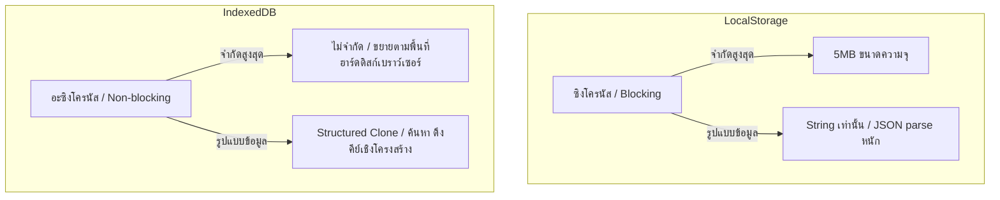

# ASTRO-REAL-APP-DEV-048 — Storage Scaling Review: LocalStorage → IndexedDB

เอกสารการทบทวนความสามารถในการขยายขนาดระบบจัดเก็บข้อมูล (Storage Scaling Review) จาก LocalStorage สู่ IndexedDB สำหรับ Astro Real App MVP-v3

---

## 1. Goal (เป้าหมาย)

วิเคราะห์สถาปัตยกรรมการจัดเก็บข้อมูลปัจจุบันบนเบราว์เซอร์ ประเมินความเสี่ยงและข้อจำกัดของระบบ LocalStorage เมื่อข้อมูลผู้ใช้เติบโตขึ้นในอนาคต (โดยเฉพาะข้อมูลประวัติสะท้อนคิดรายวันสะสม) พร้อมเสนอพิมพ์เขียวและแนวทางการย้ายเทคโนโลยีฐานข้อมูลไปยัง **IndexedDB** เพื่อรองรับความจุข้อมูลปริมาณมหาศาลอย่างมีประสิทธิภาพและมั่นคงปลอดภัย

---

## 2. Scope & Non-Scope (ขอบเขตและขอบเขตนอกเหนืองาน)

### ขอบเขตการทำงาน (Scope)
1. ทบทวนคีย์จัดเก็บปัจจุบันในระบบจัดเก็บเบราว์เซอร์
2. วิเคราะห์ประเด็นขีดจำกัดความเร็วและขนาด (Performance & Storage capacity limitations) ของ LocalStorage
3. เสนอข้อดีและข้อเสียเปรียบเทียบระหว่าง LocalStorage และ IndexedDB
4. กำหนดจุดกระตุ้นระดับวิกฤต (Thresholds) ในการย้ายแพลตฟอร์ม
5. ออกแบบแผนสถาปัตยกรรมและอะแดปเตอร์เพื่อรองรับ IndexedDB ในอนาคต
6. ร่างโฟลว์การย้ายข้อมูล (Data Migration Strategy) และกระบวนการประกันภัยการกู้คืน

### นอกเหนืองาน (Non-Scope)
- **ห้ามแก้ไขโค้ดการทำงานจริง (Runtime Code)** หรือปรับเปลี่ยน Adapter ใด ๆ ในซอร์สโค้ดปัจจุบัน
- ไม่ทำการเขียนหรือย้ายข้อมูลจริงลง IndexedDB ในรอบงานนี้
- ไม่เพิ่มสิทธิ์หรือเปลี่ยนแปลงโครงสร้างปุ่ม UI ของหน้าพรีวิว

---

## 3. Current LocalStorage Architecture & Key Inventory (โครงสร้างคีย์ปัจจุบัน)

ปัจจุบันแอปพลิเคชันจัดเก็บข้อมูลดิบทั้งหมดฝั่งไคลเอนต์ (Client-Side) บน LocalStorage ของเบราว์เซอร์ผ่าน Namespace `astro-real-app:` โดยแยกตามกลุ่มข้อมูลความรับผิดชอบดังนี้:

| คีย์เป้าหมาย (LocalStorage Key) | ประเภทข้อมูล (Type) | ขนาดเฉลี่ยต่อรายการ | อัตราการเติบโตของข้อมูล |
| :--- | :--- | :--- | :--- |
| `astro-real-app:birth-profile:v1` | Object (โปรไฟล์ดวงเกิด) | ~300 Bytes | คงที่ (แก้ไขน้อยครั้งมาก) |
| `astro-real-app:reflection-history:v1` | Array (ประวัติสะสม) | ~2KB - 5KB ต่อวัน | **สูงมาก** (สะสมบันทึกใหม่ทุกวัน) |
| `astro-real-app:planning-notes:v1` | Object (แผนเชิงกลยุทธ์) | ~500 Bytes - 1KB | คงที่ (อัปเดตทับค่าเดิม) |
| `astro-real-app:reflection-draft:v1` | Object / null (ดราฟต์พิมพ์ค้าง) | ~200 Bytes - 2KB | ชั่วคราว (ถูกล้างเมื่อกดเซฟบันทึก) |
| `astro-real-app:onboarding:v1` | Object (สถานะ onboarding) | ~100 Bytes | คงที่ (เปลี่ยนครั้งเดียว) |

---

## 4. Data Growth & Scaling Risks (ความเสี่ยงเมื่อปริมาณข้อมูลเติบโต)

### ก. ความเสี่ยงจากขนาดประวัติสะสม (Reflection History Scaling Risk)
ข้อมูลคีย์ `astro-real-app:reflection-history:v1` เป็นประวัติการจดจ่อและการสะท้อนคิดรายวันของผู้ใช้งาน ซึ่งในหนึ่งรายการประกอบไปด้วยคำสรุป โน้ตข้อคิดเห็น แผนงานขนาดเล็ก สเตตัสพลังงานใจ-กาย และ Markdown Snapshot ที่มีความยาวเป็นข้อความยาว:
- **หลังการใช้งาน 1 ปี**: 365 วัน x 3KB = ~1.1MB
- **หลังการใช้งาน 3 ปี**: 1,095 วัน x 3KB = ~3.3MB
- ซึ่งมีแนวโน้มเข้าใกล้และทะลุ **ขีดจำกัดสูงสุดของ LocalStorage** (ซึ่งจำกัดไว้เพียง 5MB เท่านั้นในบางเบราว์เซอร์ เช่น Safari หรือ Chrome บนมือถือ)

### ข. ผลกระทบต่อประสิทธิภาพการทำงาน (Performance Blocking)
LocalStorage ทำงานแบบ **ซิงโครนัส (Synchronous / Blocking)** ทุกครั้งที่มีการบันทึกหรือแปลงโครงสร้าง JSON ขนาดใหญ่ เบราว์เซอร์จะต้องหยุดประมวลผลอินเตอร์เฟซหลัก (Main UI Thread) ชั่วขณะ:
- หากประวัติมีขนาดเกิน 1MB การรันคำสั่ง `JSON.stringify` และการบันทึกภาพถ่ายประวัติสะสมซ้ำ ๆ ในเบราว์เซอร์จะทำให้ UI ของแอปพลิเคชันเกิดอาการกระตุกชั่วขณะ (Jank / Lag) ซึ่งส่งผลเสียอย่างรุนแรงต่อประสาทสัมผัสในการทำงานระยะยาว

### ค. ผลกระทบต่อการกู้คืนและการส่งออกข้อมูล (Export / Import Implications)
การดาวน์โหลดและอัปโหลดไฟล์สำรองข้อมูล JSON ที่มีขนาดใหญ่มาก จะกินเวลานานขึ้น และทำให้มีโอกาสที่การพาร์ส JSON บนเมมโมรี่ไคลเอนต์ล้มเหลว หรือกระตุ้นข้อผิดพลาดหน่วยความจำเต็มระหว่างกู้คืนได้ง่ายขึ้น

---

## 5. LocalStorage vs IndexedDB Comparison (การเปรียบเทียบเทคโนโลยีจัดเก็บ)



### ข้อจำกัดของ LocalStorage
1. ขนาดบรรจุสูงสุดจำกัดเพียง 5MB
2. บล็อกกระบวนการแสดงผล UI หลักของเบราว์เซอร์ (Synchronous Write/Read)
3. เก็บข้อมูลได้เพียงตัวอักษรสตริง (String) ต้องเสียทรัพยากรไปกับการทำ `JSON.stringify` และ `JSON.parse` เสมอ

### ข้อดีของ IndexedDB
1. ความจุสูงสุดไม่มีข้อจำกัดเชิงเทคนิค (ขยายขนาดได้ตามพื้นที่จัดเก็บฮาร์ดดิสก์เบราว์เซอร์ของผู้ใช้ บางเบราว์เซอร์รองรับถึง 50% ของพื้นที่ดิสก์ว่าง)
2. ทำงานแบบ **อะซิงโครนัส (Asynchronous)** ไม่รบกวนความสมบูรณ์และประสิทธิภาพของหน้าจอ UI
3. รองรับการทำงานแบบ Object Storage เก็บโครงสร้างออบเจกต์ได้โดยตรงผ่าน Structured Clone (ไม่ต้องพาร์ส JSON)
4. มีความสามารถรันการค้นหาเชิงลึก การจัดดัชนี (Indexing) ค้นหาเฉพาะช่วงวันที่สะท้อนคิดได้รวดเร็วโดยไม่ต้องอ่านข้อมูลออกมาทั้งอาเรย์

### ข้อเสียเปรียบเทียบของ IndexedDB
1. การเขียนโค้ดและเรียกใช้มีความซับซ้อนสูง (ต้องใช้ Promises/Callback Event handling)
2. การดูแลจัดการเวอร์ชันและการปรับโครงสร้างข้อมูลในอนาคต (Schema Upgrades/Migrations) มีความยากกว่า
3. ไม่สามารถเข้าใช้ข้อมูลแบบ Synchronous ได้ ทำให้การเรียกโหลดค่าเริ่มต้นตอนเข้าหน้าแอปต้องปรับโครงสร้างเป็น Asynchronous Component / Loader

---

## 6. Migration Threshold & Future Architecture (เกณฑ์การตัดสินใจและแผนสถาปัตยกรรม)

### เกณฑ์การเปิดใช้งาน IndexedDB (Trigger Thresholds)
เราแนะนำให้เสนอการย้ายระบบจัดเก็บเมื่อพบเงื่อนไขใดเงื่อนไขหนึ่งดังนี้:
1. จำนวนประวัติสะสมสะท้อนคิด (`Reflection History`) มีจำนวน **ตั้งแต่ 500 รายการขึ้นไป**
2. ขนาดพื้นที่ไฟล์ส่งออก JSON หรือความจุสะสมรวมของแอปใน LocalStorage **เกิน 2.5MB**

### การจำแนกประเภทข้อมูลเพื่อจัดเก็บ (Candidate Data Groups)

- **ย้ายไปที่ IndexedDB (สำหรับข้อมูลขยายขนาดสูง)**:
  - `astro-real-app:reflection-history:v1` (ประวัติสะสมประวัติตัวจริง)
  - ข้อมูลบันทึกประวัติการคำนวณดวงเชิงลึกในอดีต (ถ้ามี)
- **ยังคงรูปไว้ใน LocalStorage (สำหรับข้อมูลตั้งค่าขนาดเล็ก)**:
  - `astro-real-app:birth-profile:v1` (ขนาดเล็ก โหลดด่วนตอนเปิดหน้าแอป)
  - `astro-real-app:planning-notes:v1` (ประมวลผลทับค่าเดิม)
  - `astro-real-app:reflection-draft:v1` (ดราฟต์พิมพ์ชั่วคราว)
  - `astro-real-app:onboarding:v1` (สวิตช์ปิด/เปิดแผงพรีวิว)

---

## 7. Migration & Rollback Strategy (แผนการโอนย้ายระบบและสลัดกลับ)

สถาปัตยกรรมอินเตอร์เฟซอะแดปเตอร์จะถูกปรับปรุงดังนี้:

```typescript
export interface AstroStrategyDataAdapter {
  // สลับการเรียกใช้งานหลังผ่านเงื่อนไขตรวจเช็ค
  loadReflectionHistory(): Promise<ReflectionHistoryItem[]>;
  saveReflectionHistory(history: ReflectionHistoryItem[]): Promise<void>;
}
```

### ขั้นตอนการอัปเกรดฐานข้อมูล (Migration Plan)
1. **การดาวน์โหลดไฟล์สำรองล่วงหน้า (Backup-Before-Migration Rule)**:
   - บังคับรันกระบวนการดาวน์โหลดไฟล์สำรองข้อมูลดิบ JSON ล่าสุดของผู้ใช้เก็บไว้ก่อนเสมอในเครื่องออฟไลน์ก่อนอัปเกรดฐานข้อมูล
2. **การคัดลอกข้อมูลดิบเข้าสู่ระบบใหม่ (Copy Transaction)**:
   - ดึงอาเรย์ประวัติทั้งหมดจาก LocalStorage มาจัดระเบียบและสั่งบันทึกเข้าสู่ IndexedDB Object Store
3. **การยืนยันความถูกต้อง (Verification Checks)**:
   - อ่านรายการจาก IndexedDB มาเปรียบเทียบตรวจสอบความเข้ากันได้ และเช็คขนาดไบต์และรหัส `id` ว่าตรงตามข้อมูลดั้งเดิมทุกประการ
4. **การทำความสะอาดพื้นที่เก่า (Cleaning Phase)**:
   - เมื่อยืนยันว่าเขียนเข้า IndexedDB สำเร็จ 100% จึงจะรันการลบคีย์ `astro-real-app:reflection-history:v1` ออกจาก LocalStorage เพื่อคืนพื้นที่หน่วยความจำ
5. **การย้อนคืนสภาพ (Rollback Logic)**:
   - หากขั้นตอนการย้ายข้อมูลพบข้อผิดพลาดหรือ IndexedDB โหลดไม่ได้ จะต้องยกเลิกการเขียน และรักษาสภาพคีย์ใน LocalStorage ไว้ให้ใช้งานได้อย่างต่อเนื่องตามเดิม

---

## 8. Manual QA Plan for Future Migration (แผนการตรวจสอบสำหรับการย้ายเทคโนโลยีในอนาคต)

1. **ทดสอบย้ายข้อมูลขนาดใหญ่ (Heavy Load Upgrade)**: จำลองสร้างประวัติสะสม 1,000 รายการใน LocalStorage แล้วรันอัปเกรดแอป ตรวจทานว่าข้อมูลย้ายเข้าสู่ IndexedDB สำเร็จและเรียงตามลำดับเดิม
2. **ทดสอบกรณียกเลิกสิทธิ์ IndexedDB**: จำลองกรณีที่เบราว์เซอร์ของผู้ใช้งานบล็อกการใช้งาน IndexedDB (เช่น โหมด Private Browsing ในบางรุ่น) ตรวจสอบว่าระบบสามารถทำ Safe fallback สลับมาใช้ระบบ LocalStorage ได้อย่างมีเสถียรภาพโดยไม่พังชำรุด
3. **ตรวจสอบความลื่นไหลของ UI (Jank-Free Test)**: ประเมินการกระตุกของหน้าจอหลังจากบันทึกสะท้อนคิด เพื่อเปรียบเทียบว่า Main Thread ไม่มีอาการสะดุดเมื่อย้ายไปใช้ระบบอะซิงโครนัสของ IndexedDB

---

## 9. Recommended Next Task (ขั้นตอนที่แนะนำในรอบการพัฒนาถัดไป)

- ทำการประกาศเสร็จสิ้นแอปพลิเคชันเวอร์ชันอย่างเป็นทางการ **ASTRO-REAL-APP-DEV-049 — Final MVP-v3 Transition Checkpoint** เพื่อตรวจสอบความมั่นคงปลอดภัยสุดท้าย รวบรวมเอกสารพิมพ์เขียวทั้งหมด และยืนยันความพร้อมในการนำไปใช้งานระยะยาวใน ArborDesk
