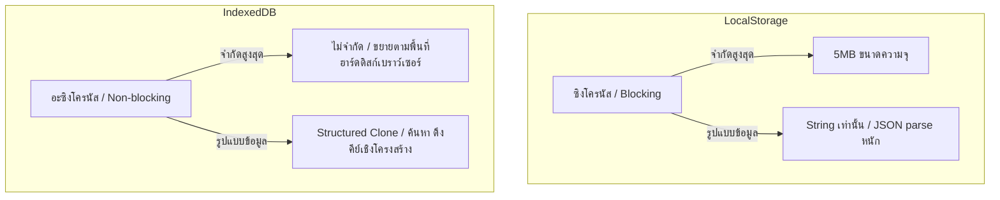

# ASTRO-REAL-APP-DEV-048 — Storage Scaling Review: LocalStorage → IndexedDB

เอกสารการทบทวนความสามารถในการขยายขนาดระบบจัดเก็บข้อมูล (Storage Scaling Review) จาก LocalStorage สู่ IndexedDB สำหรับ Astro Real App MVP-v3

---

## 1. Goal (เป้าหมาย)

วิเคราะห์สถาปัตยกรรมการจัดเก็บข้อมูลปัจจุบันบนเบราว์เซอร์ ประเมินความเสี่ยงและข้อจำกัดของระบบ LocalStorage เมื่อข้อมูลผู้ใช้เติบโตขึ้นในอนาคต (โดยเฉพาะข้อมูลประวัติสะท้อนคิดรายวันสะสม) หลังจากที่ระบบส่งออกและนำเข้าข้อมูล (Export / Import / Restore) ผ่านกระบวนการทดสอบความปลอดภัย QA สำเร็จเสร็จสิ้นแล้ว การประเมินในรอบงานนี้มีวัตถุประสงค์เพื่อกำหนดแผนงาน คีย์ เกณฑ์การตัดสินใจ และพิมพ์เขียวในการย้ายเทคโนโลยีฐานข้อมูลไปยัง **IndexedDB** ในเฟสอนาคตเพื่อความเสถียรและประสิทธิภาพสูงสุดต่อการบันทึกข้อมูลระยะยาวของผู้ใช้

---

## 2. Scope & Non-Scope (ขอบเขตและขอบเขตนอกเหนืองาน)

### ขอบเขตการทำงาน (Scope)
1. วิเคราะห์ระบบจัดเก็บคีย์ปัจจุบัน (Current LocalStorage Architecture & Key Inventory)
2. ประเมินความเสี่ยงด้านการเติบโตและการขยายขนาดของข้อมูลรายคีย์ (Data Growth & Scaling Risks) ทั้ง 5 คีย์
3. วิเคราะห์ขีดจำกัดด้านประสิทธิภาพและขนาดความจุของ LocalStorage รวมถึงผลกระทบต่อระบบนำเข้า/ส่งออก (Export / Import Implications)
4. เปรียบเทียบข้อดี ข้อเสีย และข้อแลกเปลี่ยน (LocalStorage Limitations vs IndexedDB Benefits & Trade-offs) ของสองเทคโนโลยี
5. กำหนดจุดกระตุ้นระดับวิกฤต (Trigger Thresholds) ในการย้ายแพลตฟอร์ม
6. จำแนกข้อมูลออกเป็นกลุ่มที่จะย้ายฐานข้อมูล (Candidate Data Groups) และกลุ่มที่จะคงไว้ที่เดิม
7. เสนอร่างแผนการย้ายข้อมูล (Migration Strategy) รวมถึงกฎการสำรองข้อมูลล่วงหน้า (Backup-before-migration rule) แผนการกู้คืนย้อนกลับ (Rollback considerations) และพิมพ์เขียวสถาปัตยกรรมอแดปเตอร์ในอนาคต (Proposed future adapter architecture)
8. จัดทำแผนการทดสอบคุณภาพด้วยตนเอง (Manual QA Plan) สำหรับกระบวนการย้ายระบบในอนาคต

### นอกเหนืองาน (Non-Scope)
- **ห้ามแก้ไขซอร์สโค้ดฝั่งรันไทม์จริง (Do NOT change runtime code)**
- ไม่ทำการรันหรือติดตั้งระบบ IndexedDB จริงลงในแอปพลิเคชัน ณ ปัจจุบัน
- ไม่ทำการปรับแต่งคีย์ LocalStorage ปัจจุบัน หรือระบบจัดการข้อมูลการส่งออกนำเข้าที่มีอยู่เดิม
- ไม่เปลี่ยนแปลงโครงสร้างฐานข้อมูลสะท้อนคิด (Reflection History schema) หรือแก้ไขรายการประวัติสะสมใด ๆ

---

## 3. Current LocalStorage Architecture & Key Inventory (โครงสร้างคีย์ปัจจุบัน)

ปัจจุบันแอปพลิเคชันจัดเก็บข้อมูลดิบทั้งหมดฝั่งไคลเอนต์ (Client-Side Only) บน LocalStorage ของเบราว์เซอร์ผ่าน Namespace `astro-real-app:` โดยแยกตามกลุ่มข้อมูลความรับผิดชอบและเก็บโครงสร้างแบบ Wrapper `{ version: number, updatedAt: string, data: T }` ดังตารางด้านล่าง:

| คีย์เป้าหมาย (LocalStorage Key) | ประเภทข้อมูล (Type) | ขนาดเฉลี่ยต่อรายการ | อัตราการเติบโตของข้อมูล | การใช้งานในระบบปัจจุบัน |
| :--- | :--- | :--- | :--- | :--- |
| `astro-real-app:birth-profile:v1` | Object (โปรไฟล์ดวงเกิด) | ~300 Bytes | คงที่ (แก้ไขน้อยครั้งมาก) | จัดเก็บข้อมูลเวลาและสถานที่เกิดเพื่อใช้คำนวณจังหวะเวลาส่วนตัว |
| `astro-real-app:reflection-history:v1` | Array (ประวัติสะสม) | ~2KB - 5KB ต่อวัน | **สูงมาก** (สะสมบันทึกใหม่ทุกวัน) | จัดเก็บประวัติบันทึกสะท้อนคิด รายงานพลังงาน และภาพจำสภาวะวันนี้ |
| `astro-real-app:planning-notes:v1` | Object (แผนเชิงกลยุทธ์) | ~500 Bytes - 1KB | คงที่ (อัปเดตทับค่าเดิม) | จัดเก็บแผนกลยุทธ์รายสัปดาห์/รายเดือนปัจจุบัน |
| `astro-real-app:reflection-draft:v1` | Object / null (ดราฟต์พิมพ์ค้าง) | ~200 Bytes - 2KB | ชั่วคราว (ถูกล้างเมื่อกดเซฟบันทึก) | พักข้อมูลแบบร่างการพิมพ์สะท้อนคิดรายวันเพื่อกันข้อมูลสูญหาย (Autosave) |
| `astro-real-app:onboarding:v1` | Object (สถานะ onboarding) | ~100 Bytes | คงที่ (เปลี่ยนครั้งเดียว) | จัดเก็บธงสถานะว่าผู้ใช้ผ่านการอ่านหน้าแรกของระบบหรือยัง |

---

## 4. Data Growth & Scaling Risks (การประเมินความเสี่ยงด้านการเติบโตของข้อมูล)

การใช้งานแอปพลิเคชันอย่างต่อเนื่องทำให้ปริมาณข้อมูลในเครื่องผู้ใช้เพิ่มขึ้น ซึ่งก่อให้เกิดความเสี่ยงในมิติต่าง ๆ แยกตามประเภทข้อมูลดังนี้:

### ก. ความเสี่ยงจากการเติบโตของประวัติสะสม (Reflection History Scaling Risk)
- **อัตราการเติบโต (Growth Rate):** สูงสุดในระบบ
- **ความเสี่ยง (Risk Level):** **สูงมาก (Critical)**
- **คำอธิบาย:** ข้อมูลคีย์ `astro-real-app:reflection-history:v1` เป็นประวัติการจดจ่อและการสะท้อนคิดรายวันของผู้ใช้งาน ซึ่งแต่ละวันจะจัดเก็บทั้งข้อสรุป โน้ตการสังเกต แผนงานเล็ก ระดับพลังงานกาย-ใจ โหมดจังหวะเวลา และหน้าเอกสาร Markdown Snapshot ขนาดใหญ่
  - *หลังการใช้งาน 1 ปี:* 365 วัน x 3KB = ~1.1MB
  - *หลังการใช้งาน 3 ปี:* 1,095 วัน x 3KB = ~3.3MB
  - ซึ่งการเติบโตนี้มีแนวโน้มจะชนขีดจำกัดความจุสูงสุด (Quota Limit) 5MB ของ LocalStorage บนเบราว์เซอร์บางค่าย (เช่น Safari หรือ Chrome บนสมาร์ตโฟน) ส่งผลให้ไม่สามารถบันทึกข้อมูลสะท้อนคิดเพิ่มเติมได้อีก

### ข. ความเสี่ยงจากขนาดแผนเชิงกลยุทธ์ (Planning Notes Scaling Risk)
- **อัตราการเติบโต (Growth Rate):** ต่ำ
- **ความเสี่ยง (Risk Level):** **ต่ำ (Low)**
- **คำอธิบาย:** คีย์ `astro-real-app:planning-notes:v1` ใช้การอัปเดตแบบเขียนทับค่าเดิม (Overwrite) ทำให้ขนาดพื้นที่จัดเก็บค่อนข้างคงที่คงเหลือไม่เกิน 1-2KB อย่างไรก็ดี หากในอนาคตมีการขยายระบบให้บันทึกประวัติการวางแผนเชิงยุทธศาสตร์ย้อนหลัง (Strategic Planning Version History) ความเสี่ยงในการขยายขนาดจะแปรผันตามจำนวนประวัติและรุ่น (Version) ของแผนที่เพิ่มขึ้น

### ค. ความเสี่ยงจากฐานข้อมูลดวงชะตาเกิด (Birth Profile Storage Risk)
- **อัตราการเติบโต (Growth Rate):** ต่ำมาก (ใกล้เคียงศูนย์)
- **ความเสี่ยง (Risk Level):** **ต่ำมาก (Negligible)**
- **คำอธิบาย:** คีย์ `astro-real-app:birth-profile:v1` จัดเก็บเฉพาะข้อมูลสตริงประวัติข้อมูลวันเวลาเกิด (~300 Bytes) แก้ไขเพียงครั้งแรกที่ลงทะเบียนและอัปเดตไม่บ่อยครั้ง ข้อมูลชิ้นนี้ไม่มีความเสี่ยงด้านการเติบโตของพื้นที่ แต่จำเป็นต้องเข้าถึงได้อย่างรวดเร็วและต่อเนื่องเมื่อเปิดโปรแกรมเนื่องจากระบบต้องการคำนวณค่าจังหวะชีวิตในทันที

### ง. ความเสี่ยงจากระบบดราฟต์บันทึกอัตโนมัติ (Draft Autosave Storage Risk)
- **อัตราการเติบโต (Growth Rate):** ชั่วคราว (Ephemeral)
- **ความเสี่ยง (Risk Level):** **ต่ำ (Low)**
- **คำอธิบาย:** คีย์ `astro-real-app:reflection-draft:v1` เป็นร่างบันทึกสะท้อนคิดชั่วคราว มีขอบเขตข้อมูลไม่เกิน 2KB และมีตรรกะสั่งล้าง (Clear) คีย์นี้ทิ้งทันทีที่ระบบบันทึกประวัติเสร็จสิ้นสมบูรณ์ ความเสี่ยงด้านขนาดจึงแทบไม่มี แต่อาจมีขีดจำกัดหากเกิดกรณีค้างส่งในระบบ หรือมีข้อผิดพลาดที่ไม่ยอมล้างแบบร่าง ซึ่งสามารถจัดการได้ด้วยการตั้งค่าระบบความปลอดภัยตรวจจับข้อผิดพลาด

### จ. ความเสี่ยงจากตัวชี้สถานะ Onboarding (Onboarding Storage Risk)
- **อัตราการเติบโต (Growth Rate):** คงที่
- **ความเสี่ยง (Risk Level):** **ต่ำมาก (Negligible)**
- **คำอธิบาย:** คีย์ `astro-real-app:onboarding:v1` เก็บบันทึกเพียงค่าสวิตช์ Boolean แสดงสถานะการผ่านขั้นตอนแนะแนวการใช้ (~100 Bytes) ไม่ส่งผลใด ๆ ต่อความจุเก็บข้อมูล

### ฉ. ผลกระทบต่อประสิทธิภาพการนำเข้าและส่งออกข้อมูล (Export / Import Implications)
- เมื่อขนาดประวัติในเครื่องมีขนาดใหญ่ (เช่น เกิน 2MB) การทำงานผ่าน Main Thread เพื่อดึงสตริง JSON ขนาดใหญ่มาจัดระเบียบสำหรับ Export จะทำให้หน้าจอหลักหยุดการประมวลผลชั่วคราว (UI Freeze)
- กระบวนการนำเข้า (Restore/Merge) ที่ต้องทำธุรกรรมแบบอะตอมิก (Atomic Transaction with Rollback) จะมีความเสี่ยงสูงขึ้นหากเกิดกรณีหน่วยความจำของเบราว์เซอร์เต็ม (Out of Memory) ระหว่างทำการคัดลอกประวัติย้อนหลัง ส่งผลให้ระบบกู้คืนเสียหายกลางคัน

---

## 5. LocalStorage vs IndexedDB Comparison (การเปรียบเทียบเทคโนโลยีจัดเก็บ)



### ข้อจำกัดของ LocalStorage (LocalStorage Limitations)
1. **ขนาด Quota จำกัด:** สูงสุดเพียง 5MB ต่อหนึ่ง Origin
2. **บล็อก Main Thread (Synchronous UI Block):** ทุกการทำงานรันแบบซิงโครนัส หากมีการเซฟออบเจกต์ JSON ขนาดใหญ่ใน Main Thread เบราว์เซอร์จะสะดุดชั่วขณะ (Jank / Lag) ก่อให้เกิดประสบการณ์ใช้งานที่ไม่ราบรื่น
3. **จัดเก็บสตริงเท่านั้น:** ไม่สนับสนุนการเก็บออบเจกต์ตรง ต้องแปลงผ่านสตริง `JSON.stringify` และอ่านผ่าน `JSON.parse` ซึ่งใช้พลังงานประมวลผลสูง (CPU overhead) เมื่อวัตถุมีขนาดใหญ่ขึ้น

### ข้อดีของ IndexedDB (IndexedDB Benefits)
1. **ความจุขนาดมหึมา:** ไม่มีข้อจำกัดทางเทคนิคตายตัว (Quota ขยายตามพื้นที่ว่างในฮาร์ดดิสก์ของผู้ใช้งาน บางเบราว์เซอร์อนุญาตให้จัดเก็บได้ถึง 50% ของเนื้อที่ว่าง หรือคิดเป็นร้อยๆ Megabytes)
2. **ไม่หน่วงความเร็ว UI (Asynchronous Non-blocking):** ทำงานผ่านอะซิงโครนัสและรองรับการทำงานใน Web Workers ทำให้เบราว์เซอร์แสดงผลได้ลื่นไหล ไร้อาการสะดุด
3. **จัดเก็บโครงสร้าง Object โดยตรง:** สนับสนุนเทคโนโลยี Structured Clone ของเบราว์เซอร์ ทำให้สามารถจัดเก็บข้อมูลโครงสร้าง Array และ Object ได้โดยไม่ต้องพาร์สสตริง
4. **ระบบดัชนีสืบค้น (Indexing & Querying):** สามารถค้นหาข้อมูลประวัติเฉพาะช่วงวันที่ต้องการ หรือตัวกรองที่เจาะจงได้โดยตรงโดยไม่ต้องโหลดข้อมูลประวัติทั้งหมดขึ้นมาบนเมมโมรี่

### ข้อแลกเปลี่ยนและความท้าทายของ IndexedDB (IndexedDB Trade-offs)
1. **ความซับซ้อนของตรรกะโค้ด:** การควบคุมคำสั่งต้องการใช้งานผ่าน Promises หรือ Callback API ซึ่งมีความซับซ้อนกว่าคำสั่งระดับบรรทัดเดียวของ LocalStorage
2. **ความยุ่งยากในการอัปเกรดฐานข้อมูล:** การเปลี่ยนผ่าน Schema หรือการจัดการ Database Version (เช่น ย้ายจาก v1 ไป v2) ต้องใช้กลไกการเปลี่ยนรุ่นที่เป็นระบบ (Schema Upgrades Lifecycle)
3. **การพึ่งพาอะซิงโครนัสในการเข้าถึง:** เนื่องจากไม่สามารถดึงค่าได้แบบซิงโครนัส ทำให้ฟังก์ชันช่วงเริ่มเปิดโปรแกรม (Initialization Phase) ต้องมีการพัฒนา State Loader หรือหน้าต่างรอโหลดรองรับ (Async Hydration state)

---

## 6. Migration Threshold & Future Architecture (เกณฑ์การตัดสินใจและแผนสถาปัตยกรรม)

### เกณฑ์การเปิดใช้งานการย้ายฐานข้อมูล (Migration Trigger Thresholds)
ระบบควรตัดสินใจย้ายข้อมูลจาก LocalStorage ไปยัง IndexedDB เมื่อพบเงื่อนไขความเสี่ยงระดับสูงอย่างใดอย่างหนึ่งดังนี้:
1. จำนวนประวัติบันทึกย้อนหลังในคีย์ `Reflection History` **มากกว่าหรือเท่ากับ 500 รายการ**
2. ขนาดรวมไบต์ของคีย์ทั้งหมดที่จัดเก็บภายใต้ namespace ของแอปใน LocalStorage **มีขนาดเกิน 2.5MB**

### การจำแนกประเภทข้อมูลเพื่อจัดเก็บ (Candidate Data Groups)

- **กลุ่มข้อมูลที่ต้องย้ายเข้าสู่ IndexedDB (ข้อมูลไดนามิกขนาดใหญ่/เติบโตสูง):**
  - `astro-real-app:reflection-history:v1` (ประวัติการสะท้อนคิดรายวันสะสมที่เพิ่มปริมาณทุกวัน)
- **กลุ่มข้อมูลที่สามารถคงไว้ใน LocalStorage (ข้อมูลขนาดเล็ก/คงที่/ต้องการโหลดเร็ว):**
  - `astro-real-app:birth-profile:v1` (โปรไฟล์เวลาเกิด - มีขนาดเล็กและต้องพร้อมคำนวณระบบจังหวะทันที)
  - `astro-real-app:planning-notes:v1` (ข้อมูลแผนกลยุทธ์ - ประมวลผลทับของเดิม มีความจำเป็นในการโหลดเร็วตอนเปลี่ยนแท็บ)
  - `astro-real-app:reflection-draft:v1` (ร่างพิมพ์ชั่วคราว - ขนาดเล็กและล้างค่าบ่อย)
  - `astro-real-app:onboarding:v1` (ธงตรวจสอบประวัติ)

---

## 7. Migration & Rollback Strategy (แผนการโอนย้ายระบบและสลัดกลับ)

### พิมพ์เขียวอแดปเตอร์ในอนาคต (Proposed Future Adapter Architecture)
สถาปัตยกรรมซอฟต์แวร์ควรใช้ตรรกะที่อินเตอร์เฟซหลัก `AstroStrategyDataAdapter` ทำงานแยกขาดจากเทคโนโลยีจัดเก็บจริง โดยมี **Storage Orchestrator** ตรวจสอบ Quota และเลือกโหลดข้อมูลสลับกันอย่างแนบเนียน:

```typescript
export class HybridAstroStrategyDataAdapter implements AstroStrategyDataAdapter {
  private localAdapter = AstroRealAppLocalStorageAdapter;
  private indexedDBAdapter = AstroRealAppIndexedDBAdapter; // เพื่อพัฒนาในเฟสหน้า
  
  async loadReflectionHistory(): Promise<ReflectionHistoryItem[]> {
    const isIndexedDBEnabled = await this.checkIfIndexedDBShouldBeActive();
    if (isIndexedDBEnabled) {
      return this.indexedDBAdapter.loadReflectionHistory();
    }
    return this.localAdapter.loadReflectionHistory();
  }
  
  async saveReflectionHistory(history: ReflectionHistoryItem[]): Promise<void> {
    const shouldMigrate = history.length >= 500;
    if (shouldMigrate) {
      await this.runHistoryMigrationToIndexedDB(history);
      return this.indexedDBAdapter.saveReflectionHistory(history);
    }
    return this.localAdapter.saveReflectionHistory(history);
  }
  
  // โครงสร้างเมทอดอื่น ๆ เช่น birthProfile ให้โหลดผ่าน LocalStorage เสมอ
}
```

### ขั้นตอนการโอนย้ายข้อมูล (Migration Strategy)
1. **กฎข้อบังคับการสำรองข้อมูลล่วงหน้า (Backup-Before-Migration Rule):**
   - ก่อนจะเริ่มกระบวนการเขียนฐานข้อมูลใหม่ใน IndexedDB ระบบจะต้องรันตรรกะการรวบรวมข้อมูลดิบล่าสุด (LocalStorage) ออกมาเป็นไฟล์สำรองข้อมูล JSON (Export Envelope) และทำการดาวน์โหลดเก็บลงเครื่องผู้ใช้โดยอัตโนมัติ เพื่อเป็นเกราะป้องกันหาก IndexedDB พังเสียหายระหว่างติดตั้ง
2. **ธุรกรรมการคัดลอกข้อมูล (Copy & Write Transaction):**
   - เริ่มรันกระบวนการเขียนประวัติสะสมทั้งหมดเข้า IndexedDB ในรูปแบบอะตอมิกทรานแซกชัน (Atomic Transaction) เพื่อป้องกันการเขียนไม่สมบูรณ์
3. **การตรวจสอบผลลัพธ์ความถูกต้อง (Verification Checks):**
   - ทำการอ่านข้อมูลประวัติสะสมจาก IndexedDB กลับขึ้นมาเปรียบเทียบกับ LocalStorage เดิม โดยเช็คผลรวมรายการ ขนาดไบต์ และรหัสไอดี (`id`) ว่าตรงกันครบถ้วน 100%
4. **การทำความสะอาดคีย์จัดเก็บเดิม (Old Storage Cleanup):**
   - หลังจากกระบวนการยืนยันผลลัพธ์ผ่านเกณฑ์ถูกต้องทั้งหมดแล้วเท่านั้น จึงสั่งลบประวัติในคีย์ `astro-real-app:reflection-history:v1` ออกจาก LocalStorage เพื่อเคลียร์พื้นที่ Quota คืนแก่ระบบเบราว์เซอร์
5. **แผนการย้อนคืนสภาพ (Rollback Considerations):**
   - หากกระบวนการตรวจสอบล้มเหลว หรือตัว IndexedDB ในเครื่องผู้ใช้เกิดข้อผิดพลาดในการโหลด (เช่น ปัญหาความปลอดภัยเบราว์เซอร์) ระบบจะต้องทำการยกเลิกการเขียนทั้งหมด รักษาสภาพข้อมูลคีย์เดิมใน LocalStorage และให้ใช้งานผ่านกลไก LocalStorage Fallback ต่อไปทันทีโดยไม่ขัดจังหวะการทำงานของผู้ใช้

---

## 8. Manual QA Plan for Future Migration (แผนการตรวจสอบสำหรับการย้ายเทคโนโลยีในอนาคต)

1. **การทดสอบย้ายข้อมูลขนาดใหญ่ (Heavy Load Upgrade Test):**
   - วิธีการ: จำลองเขียนข้อมูลประวัติสะสมจำลองจำนวน 1,000 รายการใน LocalStorage แล้วทำการอัปเกรดแอปพลิเคชันเพื่อทดสอบความลื่นไหล ความแม่นยำของการย้ายข้อมูลเข้า IndexedDB และตรวจหาภาวะข้อมูลสูญหายหลังโอนย้าย
2. **การทดสอบกรณีเบราว์เซอร์จำกัดสิทธิ์ IndexedDB (Sandbox Fallback Test):**
   - วิธีการ: จำลองหรือทดสอบในเบราว์เซอร์ที่เปิดการทำงานจำกัด (เช่น โหมด Private Browsing หรือ Safari Private Tab) เพื่อยืนยันว่าถ้าระบบไม่ได้รับอนุญาตให้เขียนหรือสร้าง IndexedDB แอปพลิเคชันจะไม่พัง (Crash) และจะย้อนกลับคืนมาใช้ LocalStorage อย่างปลอดภัย
3. **การประเมินความลื่นไหลและประสิทธิภาพของหน้าจอ UI (Jank-Free Thread Performance Test):**
   - วิธีการ: ประเมินเฟรมเรตและการตอบสนองของ UI ขณะบันทึกประวัติสะสม เพื่อยืนยันว่าการทำงานแบบอะซิงโครนัสของ IndexedDB ไม่ส่งผลให้เธรดหลัก (Main Thread) ชะงักสะดุดเมื่อจัดเก็บประวัติข้อมูลที่มีเนื้อหาจำนวนมหาศาล

---

## 9. Recommended Next Task (ขั้นตอนที่แนะนำในการพัฒนาขั้นถัดไป)

- **ASTRO-REAL-APP-DEV-049 — Final MVP-v3 Transition Checkpoint:**
  ดำเนินการเตรียมพร้อมตรวจสอบความพร้อมของโค้ดภาพรวม รวบรวมสกีมาและการกู้คืนข้อมูล และทำการประกาศเวอร์ชันอย่างเป็นทางการสำหรับ MVP-v3 ของสถาปัตยกรรม Astro Real App ก่อนที่จะพิจารณาพัฒนา IndexedDB จริงในเฟสปรับปรุงระยะยาวของ ArborDesk
