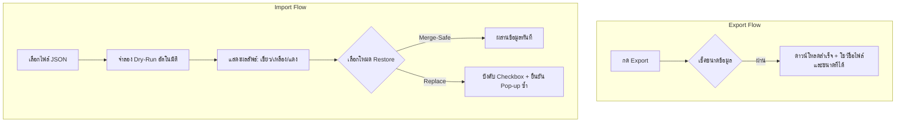

# ASTRO-REAL-APP-DEV-049 — Export / Import UX Polish Plan

แผนพัฒนาและปรับปรุงประสบการณ์ผู้ใช้งาน (UX Polish Plan) สำหรับเครื่องมือการส่งออก (Export) นำเข้า (Import) และกู้คืนข้อมูล (Restore) ของระบบ Astro Real App

---

## 1. Goal (เป้าหมาย)

วางแผนโครงร่างและแผนปรับปรุงการแสดงผลและประสบการณ์ผู้ใช้งาน (UX/UI Refinements) สำหรับเครื่องมือจัดการข้อมูลพรีวิว ได้แก่ เครื่องมือการส่งออกไฟล์สำรองข้อมูล การจำลองอ่านค่าข้อมูล (Dry Run Preview) และระบบกู้คืนไฟล์ เพื่อปรับปรุงความชัดเจน ป้องกันความคลาดเคลื่อนและการทำรายการผิดพลาดของผู้ใช้งาน (Reduce User Errors) และสร้างระบบความปลอดภัยในการนำเข้าข้อมูลที่ผู้ใช้สามารถวางใจได้สูงสุด โดยไม่ต้องแก้ไขโค้ดการประมวลผลและการจัดเก็บเบื้องหลัง (Documentation-only)

---

## 2. Scope & Non-Scope (ขอบเขตและขอบเขตนอกเหนืองาน)

### ขอบเขตงาน (Scope)
1. วิเคราะห์สถานะปัจจุบันของ UX ในระบบ Export / Import / Restore
2. ระบุจุดเสี่ยงและจุดเปราะบางสำหรับผู้ใช้งาน (User Risk Points)
3. วางกรอบและแผนงานปรับปรุง UX ในแต่ละส่วน:
   - ส่วนการส่งออกข้อมูล (Export UX)
   - ส่วนการพรีวิวก่อนนำเข้าจริง (Import Dry-Run UX)
   - ส่วนระบบนำเข้าแบบผสานปลอดภัย (Merge-Safe Mode UX)
   - ส่วนระบบนำเข้าแบบเขียนทับทั้งหมด (Replace Mode Confirmation UX)
4. กำหนดแนวทางคำเตือนความเป็นส่วนตัว (Privacy Warnings) และระบบจัดการชื่อไฟล์สำรอง (File Naming Guidance)
5. ปรับปรุงระดับข้อความแจ้งสถานะความผิดพลาด (Error Messages) และสถานะสำเร็จ (Success Messages)
6. วิเคราะห์ความจำเป็นของการจัดวางเครื่องมือเฉพาะหน้า Preview (Preview-only placement rationale) และข้อพิจารณาเพื่อความปลอดภัยเมื่อย้ายสู่หน้าจริงในอนาคต (Future production-safe access considerations)
7. กำหนดแผนทดสอบสำหรับโครงการปรับปรุง UX ในเฟสถัดไป (Manual QA Plan)

### นอกเหนืองาน (Non-Scope)
- **ห้ามทำการแก้ไขโค้ดที่รันจริงในโปรเจกต์ (Do NOT change runtime code)**
- ไม่สร้างคอมโพเนนต์จริง หรือจัดทำไฟล์ CSS/JS ใหม่ใน Workspace ณ รอบงานปัจจุบัน
- ไม่ปรับเปลี่ยนคีย์จัดเก็บ (`localStorage` keys) หรือตรรกะในตัวอัปเดตข้อมูลเบื้องหลัง
- ไม่เปลี่ยนแปลงโครงสร้าง Schema บันทึกสะท้อนคิดเดิม

---

## 3. Current Export / Import UX Status (สถานะประสบการณ์ผู้ใช้ปัจจุบัน)

ปัจจุบันเครื่องมือส่งออกและกู้คืนถูกจัดวางอยู่ภายใต้คอมโพเนนต์ [AstroPreviewDataToolsPanel.tsx](file:///Users/tamz/projects/workos-lite/src/components/workspaces/astro-strategy/real-app/components/AstroPreviewDataToolsPanel.tsx) ในส่วนล่างสุดของเครื่องมือทดสอบ:
1. **การส่งออก (Export):** กดปุ่มเพื่อทริกเกอร์ฟังก์ชันและดาวน์โหลดไฟล์ JSON ทันที โดยมีกล่องแสดงข้อความเตือนความปลอดภัยและความเป็นส่วนตัวใต้หัวข้อ
2. **การนำเข้าและจำลองผล (Dry Run Preview):** ผู้ใช้เลือกไฟล์ JSON ระบบจะรัน Dry-run ทันทีเพื่อแสดงรายงานโครงสร้างสกีมา รายการเวอร์ชัน และเปรียบเทียบคีย์จัดเก็บปัจจุบันในเครื่อง
3. **การกู้คืนข้อมูล (Restore):** แบ่งเป็นสองโหมดคือ `merge-safe` (ผสานข้อมูลโดยไม่เขียนทับรายการที่ชนกัน) และ `replace` (ล้างเครื่องเขียนทับทั้งหมด) ซึ่งโหมด Replace จะบังคับให้ผู้ใช้ติ๊กกล่อง checkbox ยินยอมรับความเสี่ยงก่อนจึงจะปลดล็อกปุ่มกู้คืนข้อมูล

---

## 4. User Risk Points (จุดเสี่ยงต่อการทำรายการผิดพลาดของผู้ใช้งาน)

1. **การกดกู้คืนโดยไม่ยอมสำรองข้อมูลเดิม (Overwrite without Backup):** ผู้ใช้อาจเผลอกดโหมด Replace เพื่อกู้คืนข้อมูล โดยไม่ได้สำรองข้อมูลที่มีอยู่เดิมในเครื่องปัจจุบัน ส่งผลให้ประวัติข้อมูลสะสมและโปรไฟล์ที่เคยเขียนสูญหายอย่างถาวร
2. **ความสับสนในผลลัพธ์ของโหมดกู้คืน (Mode Confusion):** ผู้ใช้ส่วนใหญ่ยากที่จะเข้าใจความแตกต่างระหว่าง "โหมดผสานปลอดภัย (Merge-Safe)" และ "โหมดเขียนทับทั้งหมด (Replace)" ในทันที ส่งผลให้เลือกโหมดผิดวัตถุประสงค์
3. **ความไม่เข้าใจในสถานะการ Dry Run (Dry-run Complexity):** หน้าจอผลลัพธ์การ Dry-run แสดงผลตารางคีย์จัดเก็บและระดับ Bytes ที่มีความเป็นเทคนิคอลสูง (เช่น คีย์ `astro-real-app:reflection-history:v1`) ซึ่งอาจสร้างความสับสนให้แก่ผู้ใช้งานทั่วไปที่ไม่คุ้นเคยกับคำเฉพาะทางเทคนิค
4. **ความไม่รอบคอบเรื่องความเป็นส่วนตัว (Privacy Oversight):** ข้อมูลส่วนบุคคลในไฟล์สำรอง (วันเวลาเกิด บันทึกสะท้อนคิด) เป็นข้อมูลอ่อนไหวสูง ผู้ใช้อาจนำไฟล์ไปอัปโหลดหรือแชร์ในที่สาธารณะหากไม่มีคำเตือนที่ชัดเจนเพียงพอ

---

## 5. Proposed UX Improvements (แผนการปรับปรุงเพื่อยกระดับประสบการณ์ผู้ใช้)

### 5.1 Export UX Improvements (การส่งออกข้อมูล)
- **ปรับปรุงกระบวนการดาวน์โหลด:** เพิ่มความโปร่งใสในข้อมูลดาวน์โหลด เช่น แสดงชื่อไฟล์ที่เจเนอเรตและขนาดไฟล์สำเร็จ (เป็นหน่วย Bytes / KB) อย่างชัดเจน
- **ป้ายแจ้งเตือนความเป็นส่วนตัว:** ยกระดับการ์ดเตือนความเป็นส่วนตัว (Privacy Card) ให้ใช้โทนสีเด่นชัดขึ้น พร้อมระบุว่า *"ไฟล์สำรองนี้มีวันเกิดและบันทึกส่วนตัวของคุณ ห้ามแชร์ผ่านช่องทางสาธารณะ"*

### 5.2 Import Dry-run UX Improvements (การจำลองผลนำเข้า)
- **เพิ่ม Metadata Visibility:** การจำลองวิเคราะห์ไฟล์ Dry Run จะต้องแสดงผลชื่อเจ้าของข้อมูลต้นทาง (DisplayName) วันเวลาที่ส่งออก และชื่อเพจต้นทางให้ชัดเจนเหนือตารางคีย์
- **ปรับปรุงการแสดงตารางสเตตัสคีย์ (Storage Key Comparison):**
  - เปลี่ยนการแสดงผลคีย์จากชื่อเทคนิคอลสตริง (เช่น `astro-real-app:reflection-history:v1`) เป็นป้ายภาษาไทยกำกับที่เด่นชัด (เช่น *"ประวัติบันทึกรายวัน"*, *"โปรไฟล์ข้อมูลวันเกิด"*) ควบคู่กับตัวอักษรโมโนขนาดเล็ก
  - ใช้สัญลักษณ์รหัสสีแสดงสถานะชัดเจน: สีเขียว (ข้อมูลเหมือนเดิม หรือข้อมูลใหม่พร้อมนำเข้า), สีเหลือง (ข้อมูลแตกต่างไปจากในเครื่อง มีความขัดแย้งของข้อมูล), สีแดง (โครงสร้างผิดสกีมา ห้ามนำเข้า)

### 5.3 Merge-safe Mode UX Improvements (โหมดผสานปลอดภัย)
- **การให้คำแนะนำเชิงตรรกะ:** เพิ่มคำอธิบายภาษาไทยในระบบ UI ชี้แจงขั้นตอนการทำงานของโหมดนี้ให้แจ่มแจ้งว่า:
  - รายการประวัติรายวันที่มีการบันทึกไว้แล้วในเครื่อง (รหัส ID หรือวันที่ซ้ำกัน) จะถูกคงไว้และ **ไม่โดนเขียนทับ**
  - ข้อมูลร่างพิมพ์สะท้อนคิด (`draft`) หรือข้อมูลวันเกิด (`birth-profile`) จะไม่ถูกทดแทนหากระบบปัจจุบันมีค่าอยู่แล้ว เพื่อป้องกันการเปลี่ยนค่าโดยไม่ได้ตั้งใจ

### 5.4 Replace Mode Confirmation UX Improvements (โหมดเขียนทับทั้งหมด)
- **ยกระดับคำเตือนความเสี่ยงสูงสุด:**
  - เมื่อคลิกเลือกโหมด "Replace" ให้เปลี่ยนสีกรอบของการ์ดอธิบายโหมดและการ์ดยืนยัน checkbox เป็น **สีแดงเข้ม (Rose/Red theme)** เพื่อแสดงถึงอันตราย
  - บังคับการ Checkbox ยืนยันความเสี่ยงพร้อมแสดงป้ายเตือน: *"ฉันรับทราบและยอมรับว่าการกระทำนี้จะลบข้อมูลประวัติในเครื่องปัจจุบันออกไปทั้งหมด และแทนที่ด้วยข้อมูลจากไฟล์สำรองนี้"*
  - เมื่อกดปุ่มกู้คืน ให้ทริกเกอร์ Pop-up ยืนยันซ้ำอีกหนึ่งครั้ง (Double-confirm dialog)

### 5.5 Privacy & Security Warning UX (การตระหนักรู้สิทธิ์และความเป็นส่วนตัว)
- เพิ่มแถบสถานะแสดงข้อความความโปร่งใสของข้อมูล: **"ข้อมูลทั้งหมดจะถูกประมวลผลภายในอุปกรณ์นี้เท่านั้น ปราศจากการอัปโหลดไปยังเซิร์ฟเวอร์ใด ๆ ทั้งสิ้น"** เพื่อรักษาความมั่นใจสูงสุดด้านความเป็นส่วนตัวของผู้ใช้ (Client-Side Privacy Priority)

### 5.6 File Naming Guidance (โครงสร้างชื่อไฟล์สำรองที่เป็นระบบ)
- ควบคุมรูปแบบการตั้งชื่อไฟล์สำรองอัตโนมัติให้สอดคล้องกันทั่วทั้งระบบ:
  - โครงสร้าง: `astro-strategy-backup-[YYYY-MM-DD]-[displayName].json`
  - เช่น `astro-strategy-backup-2026-06-13-tum.json`
  - หากไม่มีการระบุชื่อผู้ใช้ ให้ตั้งค่าเป็น `astro-strategy-backup-[YYYY-MM-DD]-user.json`

### 5.7 Error & Success Message Improvements (การปรับปรุงข้อความสถานะ)
- **ข้อความความล้มเหลว (Error UI):** จัดวางสไตล์กล่องข้อผิดพลาดแยกต่างหาก (Error Box) ไม่ใช้ข้อความตัวหนังสือธรรมดา เพื่อให้อ่านง่ายเมื่อเกิด JSON parsing error หรือโครงสร้างสกีมาผิดพลาด
- **ข้อความสถานะสำเร็จ (Success UI):** แสดงสถิติจำนวนรายการที่เขียนจริง ข้อมูลที่ข้ามไป และขนาดไฟล์สำรองเป็นกิโลไบต์ (KB) เพื่อสร้างความโปร่งใสในการทำรายการ

---

## 6. Placement Rationale & Future Access Considerations (การจัดวางตำแหน่งเครื่องมือ)

### ก. เหตุผลในการจัดวางเฉพาะในหน้าพรีวิวขณะนี้ (Preview-Only Placement Rationale)
- เครื่องมือการ Export/Import ในปัจจุบันมีผลกระทบโดยตรงต่อความมั่นคงของข้อมูลผู้ใช้ หากจัดวางในหน้าจอหลัก (Production Active Route) ทันที ผู้ใช้อาจเผลอกดปุ่มล้างข้อมูลพรีวิวทั้งหมด หรือกดเขียนทับไฟล์โดยไม่ระมัดระวัง
- การจำกัดพื้นที่เครื่องมือให้อยู่เฉพาะภายใต้ **Preview Data Tools Panel** ของหน้าจำลองการวิเคราะห์พัฒนา ช่วยให้นักพัฒนาและฝ่ายตรวจสอบสามารถทำสอบ Regression QA ได้อย่างมั่นใจ โดยไม่มีผลกระทบต่อพื้นที่หน่วยความจำในหน้าโปรโตไทป์หลัก

### ข. แผนการย้ายเข้าสู่โหมดใช้งานจริงในอนาคต (Future Production-Safe Access)
เมื่อนำระบบเข้าสู่เฟสใช้งานจริงในหน้าหลักในอนาคต แนะนำให้ควบคุมการเข้าถึงด้วยมาตรการดังนี้:
1. **การรวมระบบส่งออกเข้ากับประวัติหลัก (Export Integration):** รวมปุ่มส่งออกข้อมูลสำรอง (Export JSON) ไว้ในการ์ดของ `Reflection Export Pack` เพื่อให้ง่ายและเป็นธรรมชาติในการดาวน์โหลดเก็บรักษา
2. **การป้องกันหน้ากู้คืนข้อมูล (Import / Restore Guarding):** หน้าต่างสำหรับการ Import / Restore ข้อมูลใหม่ทั้งหมดควรถูกจัดเก็บไว้ในเมนู **ข้อมูลความปลอดภัยและการตั้งค่าระบบ (Data Settings / Security Tab)** ท้ายสุดของระบบ และต้องแสดงคำแจ้งเตือนการสูญหายก่อนเริ่มคลิกทำธุรกรรมเขียนข้อมูลใด ๆ

---

## 7. Manual QA Plan for Future UX Polish (แผนการทดสอบเชิงคุณภาพสำหรับการทำ UX Polish ในอนาคต)

1. **ทดสอบความชัดเจนของคำเตือนความเสี่ยง (Warning Alert Visibility Test):** ตรวจเช็คว่าปุ่มยืนยันถูกปิดการใช้งาน (Disabled) จนกว่าจะติ๊กยืนยัน Checkbox และกรอบคำเตือนสลับสีเป็นสีแดงอย่างถูกต้องเมื่อเลือกโหมด Replace
2. **ทดสอบผลลัพธ์คำเตือนความต้องการระบบ (Screen Reader and Localization Check):** ทดสอบการWrapของข้อความภาษาไทยในตารางเปรียบเทียบขนาดคีย์จัดเก็บ เพื่อไม่ให้เกิดปัญหาสระลอยหรือฟิลด์ตารางล้นจอ (Responsive breakdown) ในทุกขนาดอุปกรณ์
3. **ทดสอบการแจ้งข้อมูลครบถ้วนของชื่อไฟล์ (Export Filename Verification):** ทดสอบป้อนชื่อภาษาไทยที่มีตัวอักษรพิเศษในการลงทะเบียน และดาวน์โหลดไฟล์เพื่อตรวจสอบว่าชื่อไฟล์ถูกทำความสะอาดอักขระพิเศษ (Sanitized) และเรียงเป็นโครงสร้าง `astro-strategy-backup-YYYY-MM-DD-[sanitized_name].json` ได้ถูกต้อง

---

## 8. Recommended Next Task (ขั้นตอนที่แนะนำถัดไป)

- **ASTRO-REAL-APP-DEV-050 — Final MVP-v3 Transition & Code Checklist Cleanups:**
  ดำเนินการทำความสะอาดและตรวจสอบความพร้อมของซอร์สโค้ดภาพรวมทั้งหมดอย่างเป็นระบบ ยืนยันการเคลียร์ Workspace และลงประวัติการพัฒนาของแอปเวอร์ชันจริงในระบบเอกสารสรุปให้พร้อมใช้งานสูงสุดใน ArborDesk
