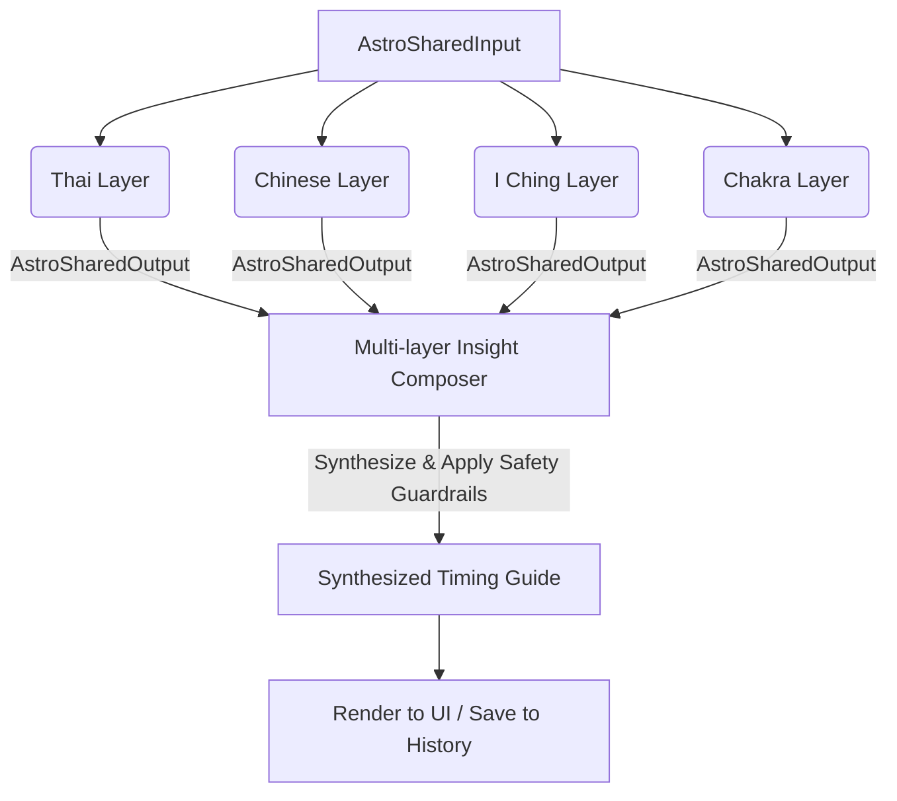

# ASTRO-REAL-APP-DEV-052 — Astro Knowledge Architecture Design

## Goal
จัดทำเอกสารและออกแบบสถาปัตยกรรมความรู้ (Knowledge Architecture Design) สำหรับเฟส **MVP-v4 — Advanced Astro Strategy Layer** ในระบบ Astro Strategy Lab ของ ArborDesk เพื่อกำหนดขอบเขต สัญญาการรับส่งข้อมูล (Data Contracts) ของศาสตร์โหราศาสตร์ไทย เมตาฟิสิกส์จีน อี้จิง และระบบฟื้นฟูจักระ/สมาธิ รวมถึงตรรกะการประมวลผลร่วมเชิงจิตวิทยาเพื่อป้องกันข้อมูลบิดเบือนและการทำนายงมงายก่อนเข้าสู่กระบวนการเขียนโปรแกรมจริง

---

## Scope
- การวิเคราะห์ความจำเป็นและทิศทางของสถาปัตยกรรมความรู้ร่วม
- ข้อกำหนดสัญญาข้อมูลนำเข้าร่วม (Shared Input Model) และสัญญาข้อมูลส่งออกร่วม (Shared Output Model)
- สถาปัตยกรรมเฉพาะของเลเยอร์ทั้ง 4 แขนง (ขอบเขตคำถาม ข้อมูลนำเข้า รูปแบบผลลัพธ์ และขอบเขตความปลอดภัย)
- ตัวเชื่อมโยงและกลไกสกัดคำแนะนำร่วม (Multi-layer Insight Composer Model)
- กฎการจัดการข้อขัดแย้งของพลังงานและความสอดคล้องเชิงสติ (Conflict Handling & Priority Rules)
- แนวคิด Copy-safety & Ethics Guardrails เชิงวิศวกรรมคำแนะนำ
- ผลกระทบต่อสถาปัตยกรรมระบบเดิม (Data Model, Storage, Export/Import, UI Layout)
- โครงสร้างและแนวทางสถาปัตยกรรม Adapter ในอนาคต
- ลำดับสายงานพัฒนาเชิงปฏิบัติและความเสี่ยง

## Non-scope
- การเขียนโปรแกรมหรือปรับปรุงรันไทม์โค้ดใน `src/` (Documentation-only)
- การทดสอบการคำนวณดวงดาวจริงด้วยโค้ดรันไทม์

---

## Why a Knowledge Architecture is Required Before Implementation

1. **ป้องกันความซับซ้อนและการทับซ้อนของข้อมูล (Information Overload & Spaghettification)**:
   เนื่องจากระบบวางแผนที่จะรวมศาสตร์แบบพหุวัฒนธรรม (Multi-tradition) ทั้ง 4 แขนงที่มีฐานความเชื่อและรูปแบบคำนวณต่างกัน หากเราเริ่มเขียนโค้ดแยกแต่ละส่วนโดยไม่มีตัวควบคุมสัญญาข้อมูลระดับสถาปัตยกรรม (Architecture Contract) โค้ดของระบบ Today, Weekly และ Monthly จะกระจัดกระจายและยากต่อการแก้ไข รวมถึงจะสร้างปัญหาความขัดแย้งเชิงตรรกะทำนายบน UI เดียวกัน
2. **รักษาเสถียรภาพและความสอดคล้องของระบบจัดเก็บข้อมูลเดิม**:
   ระบบสะสมประวัติ (Reflection History) และข้อมูลนำเข้า/ส่งออก (Export/Import) ที่เพิ่งเสร็จสมบูรณ์ในเฟส MVP-v3 เป็นหัวใจสำคัญของ Data Portability หากไม่มีการวางแผนสเปกของคีย์ที่ขยายเพิ่มเติมอย่างเป็นระเบียบ อาจนำไปสู่ปัญหาระบบพัง ข้อมูลสูญหาย หรือประวัติเดิมถูกเขียนทับอย่างไม่สอดคล้องย้อนหลัง (Backward Compatibility)
3. **การควบคุมจริยธรรมข้อมูลและการปฏิเสธภาษาความเชื่อเชิงเด็ดขาด (Non-Deterministic Copy Enforcement)**:
   โหราศาสตร์ในแอปพลิเคชันส่วนบุคคลเสี่ยงต่อการสร้าง "ความหวาดกลัวหรือความลุ่มหลงงมงาย" หากไม่มีการวางข้อกำหนดจำกัดถ้อยคำ (Copy Limits) และระบุขอบเขตความปลอดภัย (Safety Boundaries) ของแต่ละเลเยอร์ตั้งแต่ระดับการออกแบบ จะทำให้โค้ดที่พัฒนาภายหลังมีความเสี่ยงต่อสภาพจิตใจของผู้ใช้งานและหลุดจากกรอบของ ArborDesk ที่เน้นประสิทธิภาพและสมาธิส่วนบุคคล

---

## Current MVP-v4 Baseline
- **ระบบปัจจุบัน**: ยึดโยงอยู่กับฐานความสำเร็จของ MVP-v3 Data Portability (ข้อมูลถูกตรวจสอบ, นำออก, นำเข้า และจัดเก็บอย่างมีประสิทธิภาพด้วย Schema Versioning ใน LocalStorage ภายใต้ Namespace `astro-real-app:*`)
- **Adapter ปัจจุบัน**: `astroRealAppAstrologyEngineAdapter.ts` รองรับการคำนวณเบื้องต้นเชิงเงื่อนไข (Rule-based) จากข้อมูล `birthWeekday` ในโปรไฟล์ดวงเกิดร่วมกับวันในสัปดาห์ปัจจุบันเพื่อแบ่งโหมดการทำสมาธิและการโฟกัสงาน (Focus & Deliver, Stabilize & Structure, Pause & Calibrate)

---

## Shared Input Model
สัญญาข้อมูลนำเข้า (Data Input Contract) ที่ทุกเลเยอร์ความรู้ใช้งานร่วมกันในการประมวลผล ประกอบด้วย:

```typescript
export interface AstroSharedInput {
  /** ข้อมูลประวัติดวงเกิดของผู้ใช้งาน */
  readonly birthProfile: AstroBirthProfile;
  /** วันที่เป้าหมายที่ต้องการประเมินในฟอร์แมต YYYY-MM-DD */
  readonly targetDate: string;
  /** เวลาปัจจุบันหรือเวลาเป้าหมายที่ต้องการตรวจสอบ (ใช้เฉพาะยามอุบากองและ Chakra Anchor) */
  readonly targetTime?: string;
  /** ประวัติสะสมการเช็คอินและการสะท้อนคิดของผู้ใช้ เพื่อใช้ประเมินสภาวะล้าสะสม */
  readonly reflectionHistory?: readonly ReflectionHistoryItem[];
  /** บันทึกแผนงานและเป้าหมายส่วนบุคคลปัจจุบันของผู้ใช้ */
  readonly planningNotes?: AstroPlanningNotes;
  /** คำถามหรือความตั้งใจหลักของผู้ใช้สำหรับการสะท้อนคิด (เช่น ถามอี้จิง หรือจักระโฟกัส) */
  readonly userIntention?: {
    readonly questionText?: string;
    readonly focusArea?: "work" | "energy" | "focus" | "relationship";
  };
}
```

---

## Shared Output Model
สัญญาข้อมูลส่งออก (Data Output Contract) ที่ทุกเลเยอร์ส่งกลับมายังตัวผสาน (Composer) เพื่อรวบรวมและแสดงผล:

```typescript
export interface AstroSharedOutput {
  /** ชื่อเลเยอร์ความรู้ เช่น "Thai Astrology", "Chinese Metaphysics", "I Ching" */
  readonly layerName: string;
  /** รหัสสัญลักษณ์ย่อเพื่อประหยัดพื้นที่จัดเก็บประวัติ */
  readonly layerId: "thai" | "chinese" | "iching" | "chakra";
  /** สัญญาณเตือนเชิงสัญลักษณ์สั้นๆ เช่น "ยามเดินทางปลอดโปร่ง", "วันธาตุน้ำหล่อเลี้ยงไม้" */
  readonly signal: string;
  /** บทวิเคราะห์ความหมายพื้นฐานเชิงปรัชญาธรรมชาติ */
  readonly interpretation: string;
  /** ข้อแนะนำเชิงกลยุทธ์และการจัดการความคิดการทำงาน */
  readonly strategyImplication: string;
  /** กิจกรรมที่แนะนำให้ลงมือปฏิบัติเพื่อฟื้นสติและประสิทธิภาพ */
  readonly suggestedAction: string;
  /** คำถามกระตุ้นความคิดสำหรับการเช็คอินสะท้อนคิดลงประวัติ */
  readonly reflectionPrompt: string;
  /** ความสอดคล้องเชิงสัญลักษณ์หรือคะแนนความมั่นใจ (0.0 ถึง 1.0) */
  readonly confidenceScore: number;
  /** ข้อปฏิเสธความรับผิดชอบและจริยธรรมข้อมูลส่วนบุคคลเฉพาะของเลเยอร์ */
  readonly safetyDisclaimer: string;
}
```

---

## Layer-by-Layer Architecture

### Layer 1: Thai Astrology Strategy Layer (โหราศาสตร์และยามท้องถิ่นไทย)
* **Supported Questions**:
  - "วันนี้มีนัดประชุมเจรจาจังหวะเวลาใดเหมาะสมที่สุด?"
  - "รอบวันธาตุไทยแนะนำให้รับมือการประสานงานประเภทใด?"
* **Input Needs**: วันเกิดประจำสัปดาห์ (Birth Weekday), วันที่ปัจจุบัน (Target Date), เวลาที่ประเมิน (Target Time)
* **Output Boundaries**:
  - ยามอุบากอง (ยามเดินทาง/ทำงาน) แบ่งเป็น 5 ระดับเกณฑ์: ดีเยี่ยม (ปลอดโปร่ง), ปานกลาง (พึ่งพาได้), ปลอดภัย (เป็นกลาง), ควรสังเกต (ห้ามริเริ่มใหญ่), และระมัดระวังรอบคอบสูงสุด
  - ธาตุประจำวันทางตำราไทย (ดิน น้ำ ลม ไฟ) สัมพันธ์กับธาตุเกิด
* **Safety Limits (ข้อห้ามเคลม)**:
  - **ห้าม** ทำนายเรื่องอุบัติเหตุทางร่างกาย เคราะห์กรรมร้ายแรง โรคภัย หรือความวิบัติสูญสิ้น
  - ประเมินผลลัพธ์ในลักษณะ "ความเหมาะสมทางจังหวะความตึงตัวของเวลา (Timing Tension)" เพื่อเตือนให้เตรียมตัวรอบคอบเท่านั้น

### Layer 2: Chinese Metaphysics Strategy Layer (พลังงานธาตุและจังหวะธรรมชาติจีน)
* **Supported Questions**:
  - "พลังงานธาตุในฤดูกาลนี้ส่งเสริมหรือกระตุ้นการโฟกัสเรื่องใดสำหรับธาตุประจำตัวฉัน?"
* **Input Needs**: วันเดือนปีเกิดและเวลาเกิด (เพื่อคำนวณ Day Master), ฤดูกาลปัจจุบันตามปฏิทินจีน (Solar Terms)
* **Output Boundaries**:
  - ระบุความสัมพันธ์ของพลังงานธาตุปัจจุบันกับธาตุเกิด เช่น พลังสนับสนุน (Resource), พลังแสดงออก (Output), พลังควบคุม (Wealth)
  - แนะนำรูปแบบสไตล์การทำงาน เช่น "รอบพลังงานธาตุทอง: เหมาะแก่การตัดทอนความยุ่งเหยิงและสรุปผลงานเอกสาร"
* **Safety Limits (ข้อห้ามเคลม)**:
  - **ห้าม** ฟันธงเรื่องความร่ำรวย โชคลาภเงินทอง การประสบความสำเร็จแบบรวยทางลัด หรือการแก้ชงเพื่อปัดเป่าเคราะห์ร้าย
  - แนะนำในมิติของ "สมดุลธาตุและการพักผ่อนเชิงพลังงาน (Energy Equilibrium)"

### Layer 3: I Ching Decision Support Layer (อี้จิงและตรรกะสะท้อนสติรายสัปดาห์)
* **Supported Questions**:
  - "ฉันควรพิจารณาทางเลือกเชิงกลยุทธ์ต่อโครงการนี้ในแง่มุมใดเพิ่มเติมเพื่อหาทางออกที่สงบและยั่งยืน?"
* **Input Needs**: คำถามเชิงกลยุทธ์หรือเป้าหมายที่เจาะจงของผู้ใช้, ค่าจำลองการสุ่มทอยเหรียญ 6 ครั้ง (Hexagram lines 0-1)
* **Output Boundaries**:
  - ชื่อ Hexagram (1 ถึง 64), ภาพสัญลักษณ์เส้นขีดหยิน-หยาง
  - บทแปลดั้งเดิมเชิงปรัชญาธรรมชาติ (เช่น ลมพัดเหนือผืนน้ำ)
  - คำถามชวนคิดเพื่อกระตุ้นจิตวิทยาและการแก้ปัญหา (Strategic Reflection Prompt)
* **Safety Limits (ข้อห้ามเคลม)**:
  - **ห้าม** ตอบฟันธงว่า Yes/No หรือสั่งให้ทำ/ห้ามทำกิจกรรมการเงินหรือชีวิตอย่างเบ็ดเสร็จเด็ดขาด
  - ผลลัพธ์ต้องทำหน้าที่เป็นเพียง "แนวคิดเชิงสะท้อนตัวตน (Strategic Contemplation Anchor)" เพื่อเปิดมุมมองใหม่ๆ เท่านั้น

### Layer 4: Meditation / Chakra Support Layer (สติประคองพลังงานจักระ)
* **Supported Questions**:
  - "ระดับความล้าและการบันทึกสเตตัสในเช็คอินรอบนี้ต้องการสมอเสียงแบบใดเพื่อฟื้นฟูสมาธิเชิงลึก?"
* **Input Needs**: ดัชนีระดับพลังงานสะสม ความชัดเจนของความคิด และความกดดันจาก Daily Checkin Snapshot ย้อนหลัง 7 วัน
* **Output Boundaries**:
  - แนะนำกิจกรรมฝึกสติ 1-3 นาที (เช่น การนับลมหายใจแบบ 4-7-8)
  - การระบุจักระเป้าหมายเพื่อเป็นจุดพักความจดจ่อ (เช่นจักระที่ 3 สำหรับกระตุ้นความมั่นใจ หรือจักระที่ 6 สำหรับปลดปล่อยความคิดตื้อตัน)
  - สมอเสียงที่เหมาะสม (Solfeggio Frequencies ในเบราว์เซอร์ เช่น 528Hz, 639Hz)
* **Safety Limits (ข้อห้ามเคลม)**:
  - **ห้าม** กล่าวอ้างการรักษาโรคภัยไข้เจ็บทางกายภาพ หรือใช้แทนยารักษาโรคจิตเวช
  - **ห้าม** อ้างอิงถึงความมหัศจรรย์หรือเรื่องเหนือธรรมชาติระดับอภินิหาร

---

## Multi-layer Insight Composer Model
ตัวเชื่อมประสานและคัดกรองข้อมูล (Composer) ทำหน้าที่รับเอาข้อมูลส่งออกจากทุกเลเยอร์ความรู้มาผสานกันเป็นภาพรวมรายวัน (Synthesized Timing Guide) เพื่อลดความล้นเกินของข้อมูลบน UI:



---

## Conflict Handling & Priority Rules (กฎการจัดการข้อขัดแย้งเชิงจริยธรรม)

ยามที่คำชี้แนะจากแต่ละเลเยอร์มีความขัดแย้งกันอย่างเห็นได้ชัด (เช่น ยามไทยส่งเสริมให้ทำงานหนักและเดินทางอย่างคึกคัก แต่อี้จิงแนะนำให้หลีกเลี่ยงการเปิดศึกและสงบนิ่งอยู่กับที่) ให้บังคับใช้กฎดังต่อไปนี้:

1. **หลักความปลอดภัยเพื่อการป้องกันสภาวะหมดไฟเป็นอันดับแรก (Safety-first & Low-burnout Priority)**:
   หากมีความขัดแย้งกันระหว่างคำแนะนำให้ลุยเชิงรุก (Focus & Deliver) และคำแนะนำเชิงพักผ่อน/ประคองตัว (Pause & Calibrate หรือ Stabilize & Structure) **ระบบจะดึงผลแนะนำในโหมดประคองและพักผ่อนขึ้นมานำเสนอก่อนเสมอ** เพื่อปกป้องสภาพจิตใจของผู้ใช้งานและป้องกันความล้าสะสม
2. **การนำเสนอสัญญาณกึ่งกลางเมื่อขัดแย้งสูสี (Mixed Signals Resolution)**:
   หากเลเยอร์ที่สนับสนุนและคัดค้านมีความสอดคล้องเชิงความมั่นใจ (Confidence Score) สูสีกัน ระบบจะไม่พยายามปิดบังหรือบังคับให้แสดงศาสตร์ใดศาสตร์หนึ่งชนะ แต่จะแสดงสถานะเป็น **"Mixed Signals (ความสอดคล้องทางพลังงานแสดงสัญญาณผสมผสาน)"**
   - ในหน้าจอ UI จะแสดงคำแนะนำหลักให้ผู้ใช้งานยึดการสำรวจความล้าของตนเองเป็นหลัก (Self-evaluation) และแนะนำให้ทำสมาธิผ่อนคลาย (Layer 4) เป็นข้อปฏิบัติหลัก
3. **การคัดแยกประเภทตามเป้าหมายภารกิจ**:
   - เรื่องการจัดเวลาประจำวันนัดหมาย -> ยึดถือ **Thai Astrology Layer (ยามอุบากอง)** เป็นปัจจัยหลัก
   - เรื่องวิถีการแก้ไขสถานการณ์ทางตันเชิงสมาธิ -> ยึดถือ **I Ching Layer** เป็นหลัก
   - เรื่องการปรับเปลี่ยนทัศนคติประจำฤดูกาล -> ยึดถือ **Chinese Metaphysics Layer** เป็นหลัก

---

## Copy-Safety & Ethics Guardrails
ข้อกำหนดเชิงวิศวกรรมการนำเสนอเพื่อความมั่นคงทางจิตใจของผู้ใช้:

* **หลักการ Non-Deterministic Copy**: การแปลความหมายและการนำเสนอคำแนะนำต้องใช้ถ้อยคำที่ระบุถึง "แนวโน้มเชิงสติปัญญา", "โอกาสในการประเมินตนเอง", "จังหวะธรรมชาติเพื่อทบทวนแผนงาน" และหลีกเลี่ยงการใช้คำยืนยันผลเด็ดขาดอย่างไม่มีเงื่อนไข (Fate-based claims)
* **ตารางคำศัพท์และขอบเขตความปลอดภัยเชิงวิศวกรรม**:

| คำต้องห้าม (Forbidden Words) | แนวทางการนำเสนอเชิงจริยธรรมทดแทน (Allowed Framing) |
| :--- | :--- |
| **หายนะ / วิบัติ / เคราะห์ร้าย** | "จุดเฝ้าสังเกตเพื่อหลีกเลี่ยงความเหนื่อยล้าสะสม", "ควรทบทวนความเรียบร้อยของโครงการ" |
| **ฟันธง / แน่นอน / 100%** | "แนวโน้มจังหวะเวลาส่งเสริม...", "โอกาสดีในการ..." |
| **ความโชคร้ายไม่มีทางแก้** | "การตั้งรับด้วยความรอบคอบและปิดช่องโหว่ทางเอกสาร" |
| **รักษาโรคซึมเศร้า / รักษาโรคกาย** | "สนับสนุนกิจกรรมผ่อนคลายสมาธิชั่วคราวเพื่อลดความตึงเครียด" |

---

## Architectural Implications

### 1. Data Model Implications
- โครงสร้าง `ReflectionHistoryItem` ใน [astroRealAppTypes.ts](file:///Users/tamz/projects/workos-lite/src/components/workspaces/astro-strategy/real-app/data/astroRealAppTypes.ts) จะต้องขยายฟิลด์เสริม Optional เพื่อเก็บรหัสอ้างอิงของ Advanced Layers ในอนาคต โดยไม่ส่งผลกระทบให้ข้อมูลประวัติสะสมเดิมเสียหาย:
  ```typescript
  export interface AdvancedAstroStrategySnapshot {
    thaiUbakongId?: string; // e.g. "ubakong-red-2"
    chineseElementId?: string; // e.g. "metal-day-wood-master"
    ichingHexagramId?: number; // e.g. 4
    activeChakraAnchor?: string; // e.g. "ajna-528"
  }
  ```

### 2. Storage Implications
- เพื่อป้องกันข้อจำกัดด้านพื้นที่ LocalStorage เต็มอย่างรวดเร็ว (อ้างอิงจากรีวิวความสามารถในการปรับขนาด DEV-048) ข้อมูลจะไม่มีการจัดเก็บบทแปลยาวๆ ของอี้จิงหรือยามอุบากองลงในไฟล์ประวัติ แต่จะบันทึกเฉพาะ รหัสสัญลักษณ์ย่อ (IDs) และความตั้งใจสั้นๆ ส่วนบทแปลยาวๆ จะถูกเก็บในไฟล์สถิติคลังความรู้ (Astro Knowledge Registry) ภายในระบบ

### 3. Export / Import Implications
- โฟลว์การกู้คืนข้อมูล (Restore Logic) ต้องนำโครงสร้างข้อมูลเสริมของ Advanced Astro Strategy มาตรวจสอบร่วมใน Validator JSON Schema เพื่อรองรับการนำเข้าระหว่างรุ่นแอปพลิเคชันอย่างราบรื่น

### 4. UI Implications
- สัดส่วนหน้าจอตามเกณฑ์ของ AGENTS.md จะมีหน้าตาที่สามารถปรับเปลี่ยนได้ตามความต้องการของผู้ใช้งาน:
  - มีสวิตช์ปิด/เปิดเลเยอร์บนแผงควบคุมซ้ายมือ (Left panel: 280px)
  - แผงการเรนเดอร์ขวา (Right panel: 360px) จะหดตัวหรือซ่อนเลเยอร์ที่ไม่ต้องการแสดงผลได้ เพื่อหลีกเลี่ยง Information Overload และยังคงความกะทัดรัด (Cognitive Calmness UI)

---

## Future Adapter Architecture
เพื่อความสะดวกในการขยายและเขียนเทสในอนาคต ข้อมูลจะถูกดึงผ่านสถาปัตยกรรม Adapter Interface ดังนี้:

```typescript
export interface AstroKnowledgeLayerAdapter {
  readonly layerId: "thai" | "chinese" | "iching" | "chakra";
  calculate(input: AstroSharedInput): Promise<AstroSharedOutput>;
}

export interface AstroKnowledgeRegistry {
  getUbakongTranslation(id: string): string;
  getChineseElementTranslation(id: string): string;
  getIChingHexagram(id: number): {
    name: string;
    natureSymbol: string;
    reflectionPrompts: string[];
  };
}
```

---

## Recommended Implementation Sequence
เพื่อให้โครงการดำเนินการอย่างเป็นขั้นตอนโดยไม่ฟุ่มเฟือย ให้รักษาสายการพัฒนาดังนี้:
1. **ออกแบบและล็อกข้อกำหนดด้านภาษาและขอบเขต**: (ทำเสร็จที่ DEV-051 และต่อด้วยการดีไซน์โครงสร้างข้อมูลใน DEV-052 นี้)
2. **พัฒนาระบบคลังความรู้แบบ Static (Astro Knowledge Registry)**: เก็บข้อมูลและคำแนะนำออฟไลน์ของทุกศาสตร์โดยไร้การต่อ API ภายนอก
3. **พัฒนาเลเยอร์แรก — Thai Astrology Layer (ยามอุบากอง)**: ลงมือเขียนระบบคำนวณยามและธาตุไทยเป็นชิ้นแรก เนื่องจากสอดคล้องกับพฤติกรรมและความต้องการดั้งเดิมของผู้ใช้งาน
4. **พัฒนาเลเยอร์ที่ 2 และ 3 (จีน และอี้จิง)**: โดยใช้การสุ่มหรือการวิเคราะห์ฤดูกาลอย่างง่ายอิงความสงบเป็นหลัก
5. **พัฒนาส่วนผสานคำแนะนำ (Insight Composer)**: เพื่อทำการกรองและขจัดข้อขัดแย้งของภาษา
6. **พัฒนาหน้าจอ UI Switcher**: เพื่อให้เปิดปิดและดูข้อมูลได้ตามความเหมาะสม

---

## Technical & UX Risks

| ความเสี่ยงเชิงเทคนิคและบทเรียน | ผลกระทบ | แผนการจัดการและควบคุม |
| :--- | :--- | :--- |
| **การคำนวณพิกัดเวลาอ้างอิงขัดแย้งกับเวลาในเครื่อง (Hydration Mismatch)** | ปานกลาง | ใช้การคำนวณและโหลดหลังเฟส Mount (Hydration) เสมอเพื่อความเสถียรของหน้าจอ Next.js |
| **ขนาดของสคริปต์คลังความรู้ Static โตเกินพิกัด** | ปานกลาง | จัดเก็บเป็นรูปแบบ JSON โครงสร้างกระชับ และดึงบทแปลออกมาด้วยรหัสอ้างอิงเมื่อจะเรนเดอร์เท่านั้น |
| **ภาษาคำแนะนำสุ่มเสี่ยงต่อจริยธรรมจิตวิทยา** | สูง | จัดทำสคริปต์ตรวจสอบภาษาคำศัพท์ต้องห้ามอัตโนมัติ (Copy Safety Scan) ก่อนนำโปรเจกต์เข้าสู่รันไทม์จริง |

---

## Recommended Next Task
* **ASTRO-REAL-APP-DEV-053 — Thai Astrology Layer Design**

---

## Final Architecture Verdict

```text
Astro Knowledge Architecture Approved: Contractual Input/Output models established, safety-first conflict resolution defined, and backward-compatible metadata tracking locked.
```
