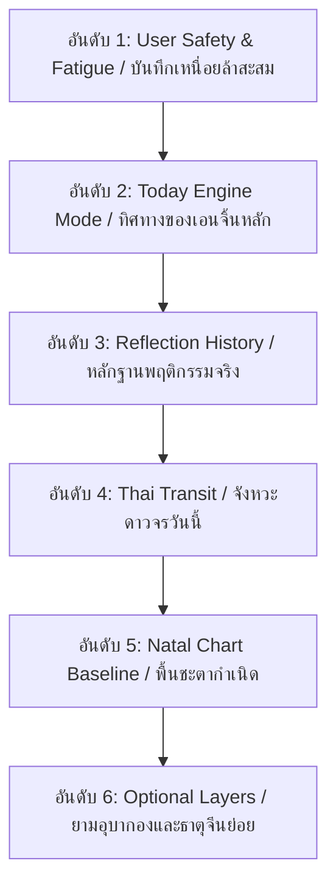

# ASTRO-REAL-APP-DEV-080 — Natal + Transit Strategy Composer Plan

แผนสถาปัตยกรรมระดับตัวกลางในการควบรวมสัญญาณดวงชะตากำเนิด ดวงดาวจร ประวัติการสะท้อนคิด และสเตตัสการทำงานปัจจุบันเข้าเป็นสัญญาณกลยุทธ์รวมอย่างมีเอกภาพ

---

## 1. Goal (เป้าหมาย)

วางแผนสถาปัตยกรรมและตรรกะของ **Strategy Composer** ซึ่งทำหน้าที่เป็นตัวประสาน (Orchestrator) ระดับกลางเพื่อ:
1. ผสานสัญญาณจากพื้นดวงกำเนิด (Natal Chart), ดวงจรไทย (Thai Transit), สรุปประวัติสะท้อนคิด (Reflection History), และโหมดเวลาหลักจากระบบ (Today Engine)
2. ลดความขัดแย้งของข้อมูลหรือคำแนะนำข้ามศาสตร์ (Conflict Resolution) เพื่อป้อนกลับเป็นคำแนะนำกลยุทธ์ที่เรียบง่าย ไม่สร้างความรู้สึกลายตา (UI Clutter)
3. ยืนยันสุขภาวะข้อมูลทางอารมณ์และจิตวิทยาของผู้ใช้งานเป็นที่ตั้งหลักสูงสุด

---

## 2. Core Formula (สูตรคำนวณแกนกลาง)

ระบบประมวลผล Composer จะคำนวณตามความสัมพันธ์ดังนี้:

$$\text{Natal Pattern} + \text{Transit Timing} + \text{Reflection Evidence} + \text{Current Today Mode} \longrightarrow \text{Strategy Recommendation}$$

* **Natal Pattern**: จุดแข็ง/จุดอ่อน baseline ส่วนตัวจากดวงกำเนิด
* **Transit Timing**: จังหวะพลังและจังหวะเวลาประกอบวันปัจจุบัน
* **Reflection Evidence**: สถิติระดับพลังงานสะสมและความเหนื่อยล้าจริง (Burnout priority)
* **Current Today Mode**: ตัวกำหนดโหมดการจดจ่อและการดำเนินกิจกรรมหลัก

---

## 3. Input Contract (พารามิเตอร์ขาเข้า)

Composer จะรับชุดข้อมูลนำเข้าดังนี้:
* `natalStrategyProfile`: โครงสร้างข้อมูลดวงเกิดของผู้ใช้ (รวมลัคนาและธาตุประจำตัว)
* `thaiTransitContext`: ผลลัพธ์ดวงจรจาก Thai Transit Adapter
* `todayTimingData`: สเตตัสและโหมดแนะนำหลักจาก Today Engine (Focus / Stabilize / Pause)
* `reflectionHistorySummary`: สรุปแนวโน้มพลังและความเหนื่อยล้าจากบันทึกสะท้อนคิด 5-7 ชิ้นหลังสุด
* `thaiAstroContext` (optional): เลเยอร์ยามอุบากองและกำลังวันประกอบ
* `chineseAstroContext` (optional): เลเยอร์ธาตุและฤดูกาลจีนประกอบ
* `userCurrentFocus` (optional): ข้อมูลเป้าหมาย Todo-list หรือโปรเจกต์หลักที่ผู้ใช้นำเข้า
* `userEnergyState` (optional): คะแนนพลังงานความล้าจากการเช็คอินประจำวัน

---

## 4. Output Contract (พารามิเตอร์ขาออก)

ผลลัพธ์ของ `NatalTransitStrategyComposerOutput` จะถูกจำกัดไว้เพื่อความกระชับ ดังนี้:
* `strategyMode`: โหมดหลักหลังประสานสัญญาณขัดแย้งแล้ว (Focus / Stabilize / Pause)
* `primaryRecommendation`: คำแนะนำยุทธศาสตร์ข้อเด่นสุดเพียง 1 ข้อ (1-2 บรรทัด)
* `secondaryRecommendation`: รายการคำแนะนำปฏิบัติย่อย 2-3 จุด
* `cautionLevel`: ระดับความเตือนสติการทำสมาธิ (Low / Medium / High)
* `focusWindow`: ช่วงเวลาที่สมาธิสมบูรณ์ที่สุดของวัน
* `workModePriority`: ลำดับความสำคัญของประเภทงาน (เช่น QA > Refactor > Delivery)
* `recoveryPriority`: สิ่งที่ควรปฏิบัติเพื่อฟื้นฟู (เช่น พักสายตา, ดื่มน้ำ, ยืดเส้นยืดสาย)
* `decisionGuidance`: คำเตือนสติเกี่ยวกับการอนุมัติงานชิ้นใหญ่
* `supportingSignals`: รายการ Signal IDs ที่หนุนส่งและมีผลในวันปัจจุบัน
* `suppressedSignals`: รายการ Signal IDs ที่ถูกปิดบังไม่ให้แสดงผลเนื่องจากตรรกะความขัดแย้ง
* `conflictResolutionNotes`: บันทึกเหตุผลตรรกะการประสานข้อขัดแย้งด้านข้อมูล (เช่น ปรับเป็นโหมดพักเนื่องจากความล้าสะสมในอดีตเด่นกว่าดวงจร)
* `reflectionPrompt`: คำถามชี้แนะประจำวันหลังผสานสัญญาณแล้ว
* `safetyDisclaimer`: คำชี้แจงความปลอดภัยของข้อมูลการตัดสินใจ
* `generatedAt`: วันเวลาที่ทำการประสานสัญญาณ

---

## 5. Priority Rules (ลำดับความสำคัญเชิงประมวลผล)

ในการคำนวณทิศทางกลยุทธ์ Composer จะประมวลผลน้ำหนักความสำคัญเรียงลำดับจากสูงไปต่ำ ดังนี้:

1. **User Safety & Fatigue (สำคัญสูงสุด)**: หากประวัติสะท้อนคิดระบุว่ามีระดับเหนื่อยล้าสูง หรือพลังงานต่ำ สัญญาณสั่งลุยงานหนักจากดวงดาวใดๆ จะถูกระงับ (Suppressed) ทันทีเพื่อความปลอดภัยของสมอง
2. **Today Engine Mode**: ยึดความเสถียรของแอปหลัก
3. **Reflection History**: ข้อมูลเชิงประจักษ์ในพฤติกรรมผู้ใช้
4. **Thai Transit**: สภาพแวดล้อมเวลาจรประจำวัน
5. **Natal Chart Baseline**: คุณลักษณะพื้นดวงเกิดส่วนบุคคล
6. **Optional Supporting Layers**: ยามอุบากองและธาตุจีนย่อย (มีสิทธิ์เพียงแนะแนวทางย่อย ห้ามแก้โหมดหลัก)

---

## 6. Conflict Handling Logic (การประสานสัญญาณขัดแย้ง)

* **กรณีที่ 1 (Transit สนับสนุนให้ลุยงานหนัก แต่ Reflection ระบุว่าล้าสะสม)**:
  * *การตัดสินใจ*: บังคับเปลี่ยน `strategyMode` เป็น **Pause** หรือ **Stabilize** เคลียร์งานเบา เลี่ยงงานใหม่ และปิดบังป้ายลุยงานสำคัญ
* **กรณีที่ 2 (Today Engine เตือนให้ชะลอชั่วคราว แต่ Transit ปรากฏดาวจรผลักดันงานใหญ่)**:
  * *การตัดสินใจ*: ปรับระดับกลยุทธ์เป็น **Stabilize** ยึดความรอบคอบในระดับประคับประคอง ให้ความสำคัญกับการดีบักระบบและ QA (Quality Assurance) มากกว่าการเปิดโครงสร้างระบบชิ้นใหม่
* **กรณีที่ 3 (ข้อมูล optional layers ขัดแย้งกันข้ามศาสตร์)**:
  * *การตัดสินใจ*: แยกคำแนะนำย่อยออกเป็น supporting notes แยกบรรทัดกันชัดเจน ไม่นำค่ามาหักลบเพื่อหักล้างสัญญาณตัวใดตัวหนึ่งจนเกิดความเข้าใจผิด
* **กรณีที่ 4 (ข้อมูลนำเข้าไม่เพียงพอ / ผิดพลาด)**:
  * *การตัดสินใจ*: ลดระดับความน่าเชื่อถือใน `confidenceNotes` ลง และเปลี่ยนโหมดกลับสู่ค่ามาตรฐาน (Standard Default Fallback) เพื่อประคองระบบไม่ให้หยุดทำงาน

---

## 7. Signal Suppression Design (การปิดบังความถี่สัญญาณรบกวน)

เพื่อลดภาระทางสมอง (Cognitive Load) ของผู้ใช้นอกเหนือการพับเปิดการ์ด สัญญาณใดๆ ที่ผ่านเกณฑ์ดังต่อไปนี้จะถูกบันทึกไว้ใน `suppressedSignals` และไม่นำมาเรนเดอร์ใน UI:
* สัญญาณที่มีความมั่นใจต่ำ (Low confidence < 0.60)
* สัญญาณประเภท "Deep Work / ลุยงานหนัก" ในวันที่ประวัติบันทึกความล้ามีน้ำหนัก `high`
* สัญญาณยามไทยหรือธาตุจีนเสริมที่ชี้บ่งขัดแย้งกับโหมดการจดจ่อหลักของ Today Engine
* โดยเก็บรหัส Signal ID และสาเหตุกำกับไว้ เช่น `{"TH_SIG_DEEP_WORK": "suppressed due to user high fatigue index"}`

---

## 8. UI Strategy (การออกแบบหน้าจอแสดงผล)

* **No Clutter Rule**: Composer จะไม่ทำการเพิ่มการ์ดกล่องข้อความใหม่ซ้อนลงไปในแผงวันนี้อีก แต่จะรับหน้าที่ประมวลผลอยู่เบื้องหลัง แล้วผสานสรุปคำแนะนำใน **Today Panel** เดิม
* **การจำกัดทัศนวิสัยบนหน้าจอ**:
  * 1 หัวข้อความทิศทางหลักยุทธศาสตร์ (1 main recommendation)
  * 1 ข้อควรพึงระวังหรือสังเกต (1 caution note)
  * 1 ข้อฟื้นคืนสติ (1 recovery note)
  * 1 คำถามชี้แนะประจำวัน (1 reflection prompt)

---

## 9. Copy Safety Guardrails (ความปลอดภัยของคำอธิบาย)

* **คำต้องห้ามเด็ดขาด**: ห้ามใช้คำว่า "เคราะห์", "ซวย", "อุบัติเหตุ", "เงินเสียแน่", "งานพัง", "ความรักพัง", "ห้ามทำเด็ดขาด", "จะเกิดแน่นอน", "กาลกิณี"
* **การใช้คำชี้นำที่สร้างสรรค์**:
  * *"วันนี้เหมาะกับ..."*
  * *"ควรชะลอการทำสัญญาใหญ่..."*
  * *"เหมาะแก่การตรวจทานและดีบักระบบเบื้องหลัง..."*
  * *"ใช้เป็นสัญญาณแวดล้อมเพื่อประกอบการไตร่ตรอง..."*
  * *"หากรู้สึกหน่วงล้าสะสม แนะนำให้แบ่งย่อยเป้าหมายงานประจำวันให้เล็กลง..."*

---

## 10. Storage & Persistence Policy (นโยบายการจัดเก็บข้อมูล)

* **ตรรกะประมวลผลเฉพาะบน RAM**: Composer ในเวอร์ชัน v0.1 จะทำงานแบบ Runtime computation เท่านั้น ไม่มีการจัดเก็บข้อมูลผลลัพธ์ลง LocalStorage
* **สถาปัตยกรรมเผื่ออนาคต (Future Persistence)**: หากจำเป็นต้องเซฟในอนาคต จะบันทึกเฉพาะรหัสคีย์สั้น (Signal IDs และ Metadata) เท่านั้น ห้ามบันทึกประโยคยาวเพื่อประหยัดเนื้อที่การเก็บข้อมูล
* **Import / Export Isolation**: การจัดสรรและสำรองข้อมูลระบบเดิมจะต้องไม่เกิดความเสียหายจากการประมวลผลของ Composer นี้

---

## 11. Future Implementation Sequence (แผนการดำเนินการถัดไป)

1. **DEV-081 — Composer Output Contract & Copy Safety Review**: จัดทำสัญญาข้อมูลเอาท์พุตของตัวComposer และสแกนความปลอดภัยของชุดคำศัพท์ล่วงหน้า
2. **DEV-082 — Composer Runtime Adapter v0.1 Implementation**: เขียนโค้ดประมวลผลสัญญาณหลัก Composer ด้วย TypeScript (Pure logic)
3. **DEV-083 — Composer QA & Regression Review**: ตรวจสอบความสมบูรณ์และทดสอบการขัดแย้งของตรรกะรันไทม์
4. **DEV-084 — Today Panel Composer Summary UI Plan**: วางผังการอัปเดตหน้า UI ของ Today Panel เพื่อนำข้อมูล Composer มาใช้อย่างเรียบง่าย
5. **DEV-085 — Today Panel Composer Summary UI Implementation**: ผสานหน้าจอจริงเข้ากับ Composer ตัวใหม่
