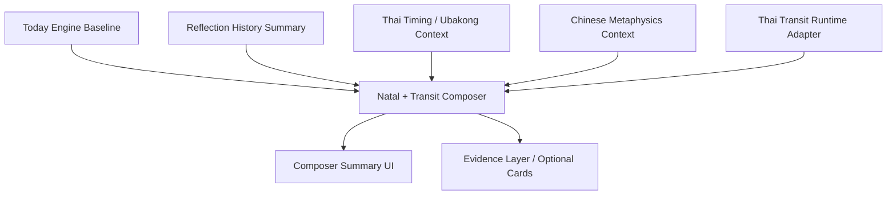
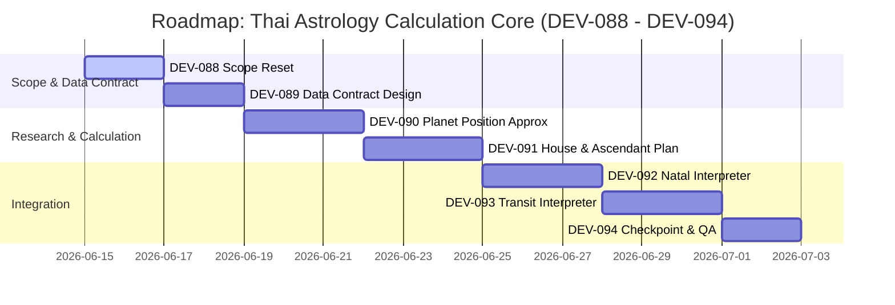

# ASTRO-REAL-APP-DEV-087 — MVP-v4 Strategy Layer Checkpoint Summary

เอกสารนี้สรุปสถานะความคืบหน้าภาพใหญ่ของแผงยุทธศาสตร์กลยุทธ์รวม (Astro Strategy Lab MVP-v4) หลังจากที่ระบบประมวลยุทธศาสตร์และ UI (Composer Summary Layer) ได้ผ่านการรวมระบบและทดสอบคุณภาพใน DEV-086 เสร็จสิ้นเป็นที่เรียบร้อย

---

## 1. Goal (เป้าหมายและภาพรวมสถานะ)

เป้าหมายของเอกสารฉบับนี้คือการทบทวนและทำเครื่องหมายหลักไมล์ (Checkpoint Summary) ของระบบ MVP-v4 Strategy Layer เพื่อประเมินระบบที่ถูกสร้างขึ้นจริง เทียบกับเป้าหมายระยะยาว และเป็นแนวทางในการกำหนดกรอบการพัฒนาส่วนคำนวณหลักของโหราศาสตร์ไทย (Thai Astrology Calculation Core) ในลำดับถัดไป

### สถานะความพร้อมปัจจุบัน (High-Level Status)
* **การออกแบบและการนำไปใช้จริง (Implemented & Verified)**: ระบบการจัดลำดับสัญญาณกลยุทธ์, การประนีประนอมความขัดแย้ง, การป้องกันความปลอดภัยของคำศัพท์จิตวิทยาเชิงบวก, การคำนวณภายหลังการ Hydration บนบราวเซอร์ และ Accordion Summary UI 
* **ส่วนที่ยังไม่ได้ทำหรือยังจำกัดอยู่ในระดับประมาณค่า (Under Approximation)**: อัลกอริทึมการคำนวณสมผุสตำแหน่งดาวไทยตามดาราศาสตร์จริง, การผูกดวงหาลัคนาพิกัดเส้นรุ้งเส้นแวง, และการตรวจสอบเกณฑ์ศักดิ์ดาว (Dignity) แบบเต็มรูปแบบ

---

## 2. Current System Layers (ชั้นการประมวลผลปัจจุบัน)

ปัจจุบันสถาปัตยกรรมภายใน Astro Strategy Lab ประกอบด้วยเลเยอร์ระบบหลัก 7 ส่วนที่ผสานรวมกันอย่างเป็นระเบียบ ดังนี้:

1. **Today Engine**: ประเมินจังหวะระดับพลังงานทั่วไป การจัดวางความสำคัญของภารกิจ และโหมดการทำสมาธิ/จดจ่อ (Focus Mode)
2. **Reflection History**: สรุปสถิติความหนาแน่นและพฤติกรรมสะสมล่าสุด (ความเหนื่อยล้าสะสม สภาพอารมณ์ และประวัติการบันทึก)
3. **Thai Timing / Ubakong Context**: ตัวแปลงเวลาและยามอุบากองของวันปัจจุบันสำหรับประเมินจังหวะการเจรจา
4. **Chinese Metaphysics Context**: ตัวประมวลผลความสัมพันธ์ของธาตุเกิดประธาน (Day Master) เทียบกับคู่ธาตุวันปัจจุบัน
5. **Thai Transit Runtime Adapter**: สเกลาร์ข้อมูลทางสัญญะของการโคจรของดวงดาวจำลอง เพื่อระบุจุดกระทบต่อจังหวะชีวิต
6. **Natal + Transit Strategy Composer**: อแดปเตอร์ประสานยุทธศาสตร์รวม ทำหน้าที่ยุบสัญญาณขัดแย้ง เลือกข้อเสนอแนะ และให้คะแนนความมั่นใจ (Confidence Score)
7. **Composer Summary UI**: เลเยอร์แสดงผลการ์ดสรุปเป้าหมายกลยุทธ์หลักบน Today Panel พร้อม Accordion พับเก็บรายละเอียด

---

## 3. What Is Working Now (สิ่งที่ทำงานได้จริงในปัจจุบัน)

* **Composer Summary Display**: แสดงแผนยุทธศาสตร์ประนีประนอมบน Today Panel อย่างประณีต ไม่รบกวน visual hierarchy เดิม
* **Hydration Safety**: หลีกเลี่ยง Hydration Mismatch 100% โดยการเรียกประมวลผลหลังคอมโพเนนต์ Mount สำเร็จบน Client เท่านั้น
* **Zero Storage Regression**: ปราศจากการเรียกใช้หรือเขียนทับข้อมูลลง LocalStorage เพิ่มเติมจากระบบประเมินผลกลยุทธ์
* **Copy Safety Guardrails**: ข้อความแนะนำผ่านข้อกำหนดความปลอดภัยของภาษา ไม่มีการฟันธงหรือใช้คำเชิงลบ
* **Build / ESLint Compile**: โค้ดผ่านการคอมไพล์ TypeScript และ ESLint ตรวจจับความถูกต้อง 0 warning และ 0 error
* **Optional Context Cards Render**: การ์ดยามไทมิ่ง การ์ดธาตุจีน และดาวจรไทยแสดงผลแยกและพับปิดอย่างสมบูรณ์แบบ

---

## 4. What Is Still Approximation (ส่วนที่ยังเป็นระบบประมาณค่าจำลอง)

> [!IMPORTANT]
> ระบบปัจจุบันเป็นด่านหน้า (Front-end Strategy Layer) ที่ทำงานร่วมกับข้อมูลจำลอง (Approximation Base) ไม่ใช่โปรแกรมผูกดวงชะตาโหราศาสตร์เต็มระบบ

ข้อจำกัดทางเทคนิคที่จะต้องได้รับการปรับปรุงในเฟสถัดไป:
* **Thai Transit Adapter (Approximation)**: สัญญะดาวจรปัจจุบันยังดึงค่าจาก mock mapping หรือการประมาณค่าเชิงวันเวลาทั่วไป ไม่ได้ดึงสมผุสพิกัดโคจรจริงของดวงดาวตามระบบปฏิทินดาราศาสตร์ (Ephemeris)
* **Natal Chart (No Calculation Core)**: ค่าตำแหน่งดวงเกิดของระบบยังใช้การป้อนข้อมูล Baseline พื้นฐานและข้อมูลประมาณค่าจำลอง ยังไม่มีแกนหลักในการผูกดวงเกิดของตนเอง
* **No Ascendant Calculation**: ขาดสมการคำนวณหาลัคนาพิกัดเฉพาะจากสถานที่เกิด (Latitude / Longitude) และทศนิยมเวลาระดับนาที
* **No Planet Dignity & Aspect**: ยังไม่มีการคำนวณศักดิ์ดาว (เกษตร, มหาอุจ, ราชาโชค ฯลฯ) และการโยกเกณฑ์/เล็งเกณฑ์ของดาวเคราะห์ต่างๆ ต่อกันอย่างเต็มระบบ
* **ไม่ใช่ระบบทำนายชะตากรรม**: ไม่มีความสามารถในการคำนวณทักษา ทศาจักร หรือดวงประเทียบเทียบเคียงกับระบบพยากรณ์เชิงกำหนดผล (Deterministic predictions) เช่น MyHora หรือโปรแกรมผูกดวงสำนักโหราศาสตร์

---

## 5. Product Core Clarification (การจำกัดความและจุดยืนผลิตภัณฑ์)

เพื่อป้องกันการเข้าใจผิดและรักษามาตรฐานความปลอดภัยในการนำเสนอภาษาเชิงระบบ ข้อกำหนดหลักของ MVP-v4 ได้ล็อกสมการคำนวณและข้อจำกัดการใช้งานไว้ดังนี้:

### สมการหลักของผลิตภัณฑ์ (Core Formula)
$$\text{Birth Pattern} + \text{Transit Timing} + \text{Reflection Evidence} + \text{Today Mode} \rightarrow \text{Work \& Life Strategy}$$

### จุดยืนทางจิตวิทยาของระบบ (Strategic Alignment)
| แอปพลิเคชันนี้คือ (What it IS) | แอปพลิเคชันนี้ไม่ใช่ (What it is NOT) |
| :--- | :--- |
| **Strategic reflection app** (แอปพลิเคชันสำหรับสะท้อนคิดเชิงกลยุทธ์) | **Fortune-telling app** (แอปพลิเคชันดูดวงโชคชะตาพยากรณ์รายวัน) |
| **Personal planning assistant** (ผู้ช่วยวางแผนและจัดระเบียบภารกิจชีวิต) | **Deterministic prediction system** (ระบบการพยากรณ์แบบฟันธงหรือกำหนดชะตาชีวิตล่วงหน้า) |
| **Astrology-informed strategy system** (ระบบกลยุทธ์การตัดสินใจที่มีดาราศาสตร์เป็นข้อมูลอ้างอิง) | **Health / Finance / Relationship predictor** (ระบบทำนายทายทักเรื่องการเจ็บป่วย โชคลาภ หรือความรักที่คาดเดาเจาะจง) |

---

## 6. Data Safety Status (สถานะการป้องกันความปลอดภัยของข้อมูล)

* **ไม่เปลี่ยน Schema ของ LocalStorage**: ไม่มีผลกระทบหรือการเปลี่ยนแปลงใดๆ ในโครงสร้างตัวสะท้อนคิดหรือประวัติบันทึกสะสม
* **ไม่มีการ Persist เอาท์พุต Composer**: เอาท์พุตที่ได้จาก Composer เกิดจากการคำนวณแบบ In-memory และ Re-evaluate ทุกครั้งที่มีการเมาท์หน้าระบบ เพื่อป้องกันการจัดเก็บข้อมูลสะสมที่ผิดพลาด
* **ความปลอดภัยของไฟล์สำรองข้อมูล (Export/Import/Restore)**: กระบวนการจัดเก็บไฟล์ JSON สำรองและการกู้คืนข้อมูลปลอดภัย ไร้ผลข้างเคียง
* **กรอบความเข้าใจการขยายระบบบันทึกในอนาคต**: หากมีความจำเป็นต้องบันทึกประวัติกลยุทธ์ลงฐานข้อมูลในอนาคต ให้จัดเก็บเฉพาะ **Signal IDs** หรือค่าตั้งต้นทางดาราศาสตร์เท่านั้น ห้ามเขียนข้อความประเมินผลดิบ (Raw generated text) ลงไปถาวร

---

## 7. UI Status & Density Control (การควบคุมหน้าตาแผงควบคุม)

* **Summary Layer (เลเยอร์หน้าสรุป)**: `Composer Summary` ทำหน้าที่เสมือนตัวรับและแปลงสารที่มีความกระชับสูงสุด ปรากฏเพียงบล็อกเดียว เพื่อเป็นข้อสรุปแบบ Actionable ให้กับยูสเซอร์
* **Evidence Layers (เลเยอร์พยานข้อมูล)**: การ์ดขยายความสัมพันธ์ย่อย (เช่น Thai Transit, Thai Timing และ Chinese Element) จะถูกมองเป็นข้อมูลสนับสนุนเบื้องหลังซึ่งจะปิดซ่อนพับเป็น Accordion เสมอเพื่อรักษาหน้าต่างที่โปร่งเบา
* **UI Density**: ความหนาแน่นของพิกเซลหน้าจอได้รับการทดสอบผ่านการแสดงผลใน Desktop/Mobile ขนาดมาตรฐาน
* **Manual Browser QA**: เสนอการตรวจสอบลักษณะสายตาและความไหลลื่นเพิ่มเติมในขั้นตอนการพัฒนาครั้งต่อๆ ไป

---

## 8. Technical Risks (ความเสี่ยงทางเทคนิคของระบบ)

* **Approximation Accuracy**: ข้อจำกัดในการประมาณค่าปัจจุบันอาจทำให้ยูสเซอร์ระดับสูงที่คุ้นเคยกับดาราศาสตร์เกิดข้อสงสัยหากนำระบบไปตรวจสอบเปรียบเทียบกับปฏิทินตำแหน่งจริง
* **Hydration Recalculation Overhead**: แม้จะป้องกัน mismatch ได้ แต่การรันคำนวณสดหลัง mount และเมื่อเปลี่ยนแท็บหน้าจอกลับมาอาจสร้างภาระงานขนาดย่อมบนเบราว์เซอร์เป้าหมายต่ำ
* **Stale Context**: หากโปรไฟล์ข้อมูลเกิดและข้อมูลประวัติสะสมเปลี่ยนแปลงอย่างกะทันหัน ต้องมั่นใจว่า Component จะทำปฏิกิริยา Trigger การอัปเดตอย่างสมบูรณ์แบบไม่เหลือ Stale context ค้างคา
* **Visual Overload**: การประดิษฐ์และเพิ่มเลเยอร์ข้อมูลศาสตร์ต่างๆ ในอนาคตมีความเสี่ยงสูงที่จะทำลายความสะอาดตาและการใช้งานที่เน้นความโปร่งใสของระบบ

---

## 9. Recommended Roadmap (แผนงานถัดไปของระบบประมวลผล)

เพื่อเปลี่ยนผ่านจากระบบจำลอง (Approximation Layer) สู่การประมวลผลตำแหน่งดาวเคราะห์ไทยจริงตามหลีกโหราศาสตร์และดาราศาสตร์ แผนงานถัดไปถูกวางแนวทางไว้ดังนี้:

* **DEV-088 — Thai Astrology Calculation Core Scope Reset**: ทบทวนและตั้งเป้าหมายขอบเขตของแกนคำนวณโหราศาสตร์ไทย
* **DEV-089 — Thai Natal Calculation Core Data Contract**: ร่างโครงสร้างข้อมูลเข้า-ออกของการคำนวณดวงชะตาเกิด
* **DEV-090 — Thai Planet Position Approximation Research / Decision**: ศึกษาวิธีการหาตำแหน่งดาวจรแบบสมจริง (เช่น วิธีสมผุสดาวแบบสุริยยาตร์ หรือการดึงค่าพิกัดปฏิทินดาราศาสตร์อ้างอิง)
* **DEV-091 — Thai House / Ascendant Calculation Plan**: จัดทำแผนคำนวณหาเส้นตนุลัคน์และภพเรือน
* **DEV-092 — Natal Strategy Interpreter Plan**: การออกแบบโปรแกรมถอดรหัสข้อความสำหรับข้อมูลผูกดวงเกิด
* **DEV-093 — Transit Strategy Interpreter Plan**: การออกแบบโปรแกรมถอดรหัสข้อความสำหรับข้อมูลดวงดาวจรปะทะดวงเกิด
* **DEV-094 — MVP-v4 Calculation Core Checkpoint**: สรุปประเมินคุณภาพและหลักไมล์ของการผสานแกนคำนวณโหราศาสตร์ไทยจริง
