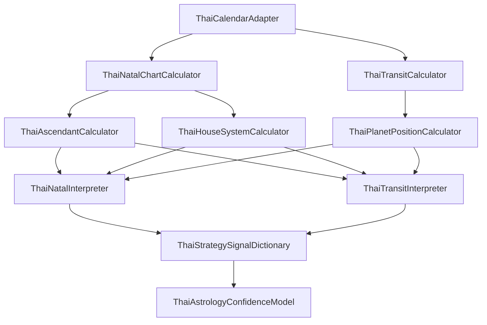

# ASTRO-REAL-APP-DEV-088 — Thai Astrology Calculation Core Scope Reset

เอกสารฉบับนี้จัดทำขึ้นเพื่อกำหนดขอบเขตและรีเซ็ตเป้าหมายทางเทคนิคของการพัฒนาแกนการคำนวณโหราศาสตร์ไทย (Thai Astrology Calculation Core) เพื่อให้การปรับแต่งกลยุทธ์ส่วนบุคคลในระดับสัญญะดวงดาวจริงสามารถดำเนินการได้อย่างมีคุณภาพ ปราศจากความซับซ้อนที่เกินจำเป็นสำหรับงานวางแผนชีวิตและการทำงาน

---

## 1. Goal (เป้าหมายและการปรับกรอบการพัฒนา)

เป้าหมายหลักคือการทบทวนและกำหนดเกณฑ์ความต้องการ (Scope Reset) ของแกนคำนวณโหราศาสตร์ไทย เพื่อนำระบบไปอ้างอิงตำแหน่งจริงของดาวเกิดและดาวจรมากขึ้นในขีดความสามารถที่เหมาะสม โดยแยกแยะอย่างชัดเจนระหว่าง:
* **Strategic Reflection App (แอปพลิเคชันสะท้อนคิดเชิงกลยุทธ์)**: เน้นการแปลสัญญาณดวงดาวเป็นกิจกรรมทำงาน การพักผ่อน และการประเมินระดับความล้าในการจัดลำดับความสำคัญของชีวิต
* **Full Astrology Calculation Engine (ระบบคำนวณโหราศาสตร์เต็มระบบ)**: การคำนวณพิกัดมุมเล็งและศักดิ์ดาวที่ซับซ้อนตามมาตรฐานสุริยยาตร์/นิรายนะ ซึ่งจะใช้เพื่อสร้างโรดแมปการบูรณาการดวงชะตาระยะยาว

---

## 2. Current State (สถานะทางเทคนิคในปัจจุบัน)

ปัจจุบันสถาปัตยกรรมด่านหน้าประกอบด้วย:
* **Birth Profile**: รับข้อมูลพื้นฐาน เช่น วัน เดือน ปีเกิด และช่วงเวลาเกิดแบบกว้างๆ
* **Thai Transit Adapter v0.1**: ใช้กระบวนการประมาณค่าจำลอง (Rule-based / Approximation) อ้างอิงจากจังหวะเวลาดาราศาสตร์เบื้องต้น
* **Thai Timing / Ubakong**: คำนวณช่วงจังหวะยามสามตาตามวันและช่วงชั่วโมงปัจจุบัน
* **Composer Strategy Summary & Reflection History**: รวบรวมน้ำหนักกลยุทธ์รวมและประเมินระดับความเหนื่อยล้าสะสมล่าสุด

แต่ระบบ**ยังไม่มี (Missing Elements)**:
* **Thai Natal Chart Calculation Core**: แกนประมวลผลดวงเกิดจริง
* **ลัคนาคำนวณละเอียด**: การระบุองศาและอันโตนาทีของจุดเกิดตามพิกัดเส้นรุ้งเส้นแวง (Latitude / Longitude) ที่เจาะจงระดับตำบล/จังหวัด
* **ตำแหน่งดวงดาวที่แท้จริง**: ข้อมูลสมผุสและเรือนชะตาตามจักรราศี 12 ภพเรือน
* **ดาวเจ้าเรือน / ดาวสัมพันธ์ / Aspect**: ตรรกะตรวจจับเกณฑ์การโยก/เกณฑ์การเล็ง และความเข้มแข็งของดาวเคราะห์ประธานดั้งเดิม

---

## 3. Required Calculation Core Modules (โมดูลหลักของแกนคำนวณที่ต้องมี)

เพื่อให้ระบบสามารถทำงานได้จริงในระยะยาว จำเป็นต้องแบ่งแยกสถาปัตยกรรมออกเป็นโมดูลเชิงฟังก์ชัน (Functional Modules) ดังนี้:

1. **ThaiCalendarAdapter**: แปลงวันที่สากล (สุริยคติ/จันทรคติ) เป็นวันที่และรอบจังหวะตามระบบปฏิทินไทย
2. **ThaiNatalChartCalculator**: ตัวประสานการคำนวณข้อมูลชะตาเกิดแบบดิบ
3. **ThaiAscendantCalculator**: คำนวณหาลัคนา (จุดสถิตลัคน์เกิด)
4. **ThaiPlanetPositionCalculator**: คำนวณหาตำแหน่งราศีและองศาของดาวเคราะห์ทั้ง 10 ดวง
5. **ThaiHouseSystemCalculator**: จัดการแบ่งภพเรือนชะตาทั้ง 12 ภพ (เช่น ตนุ, กฎุมพะ, สหัชชะ, ... ถึง วินาศ)
6. **ThaiNatalInterpreter**: ถอดรหัสเป้าหมายดวงเกิดเป็นสัญญาณพลังงานเชิงจิตวิทยา (Natal Strategy baseline)
7. **ThaiTransitCalculator**: คำนวณหาตำแหน่งปัจจุบันของดาวจรในรอบเวลาที่ผู้ใช้ตรวจสอบ
8. **ThaiTransitInterpreter**: เปรียบเทียบจังหวะดาวจรปะทะดาวเกิด (Transit-to-Natal conflicts / support)
9. **ThaiStrategySignalDictionary**: พจนานุกรมแปลงสัญญะดาวและภพชะตาเป็น Signal IDs (งาน, คุยคน, พัก, ตรวจทาน)
10. **ThaiAstrologyConfidenceModel**: ตัวคำนวณคะแนนความน่าเชื่อถือตามระดับความละเอียดของข้อมูลเข้า

---

## 4. v0.1 Scope (ขอบเขตระยะเริ่มต้น - ทันที)

> [!NOTE]
> เน้นที่การกำหนด Data Contract และการประมาณค่าอย่างง่าย (Approximation) บนบราวเซอร์ เพื่อให้สามารถผสานเข้ากับ UI ได้เร็วที่สุดโดยไม่ต้องพึ่งพา Ephemeris ขนาดใหญ่

* **Birth Profile Extension**: ขยายการรับข้อมูลเกิดให้รองรับ: วัน/ชั่วโมง/นาที และจังหวัดเกิดของยูสเซอร์
* **Natal Chart Data Contract**: ออกแบบโครงสร้าง Schema (Types/Interface) ของตำแหน่งดวงเกิด
* **Ascendant Approximation**: คำนวณลัคนาโดยประมาณตามช่วงเวลาดวงอาทิตย์ขึ้น (Sunrise-based approach) และคำนวณระดับความมั่นใจ (Confidence Model)
* **House Mapping Simplified**: กำหนดการจัดภพชะตาแบบราศีคงที่โดยประมาณ (Equal House System จากราศีลัคนา)
* **Strategy Signal IDs**: แปลงลักษณะดาวเด่นในดวงเกิดออกมาเป็น 4 กลุ่มหลัก:
  - `FOCUS_WORK` (งานสร้างสรรค์/ใช้แรงสมอง)
  - `PEOPLE_TALK` (การคุย/การนำเสนอ/เจรจา)
  - `SLOW_DOWN` (การชะลอแผน/ทบทวนความเสี่ยง)
  - `RECHARGE_SELF` (การพักผ่อน/การคืนพลัง)
* **No Ephemeris Database**: ยังไม่บรรทุกไฟล์พิกัดดาราศาสตร์ดาวขนาดใหญ่ โดยใช้สูตรลัดคำนวณหรือ Mapping ล่วงหน้า

---

## 5. v0.2 Scope (ขอบเขตระยะกลาง - เพิ่มเติม)

* **Refined Ascendant Calculator**: ปรับปรุงการคำนวณลัคนาให้เที่ยงตรงขึ้นโดยอ้างอิงพิกัด Latitude / Longitude ของจังหวัดเกิดในประเทศไทย
* **Planet Position Approximation**: เพิ่มสูตรประมาณวิถีโคจรเฉลี่ยของดาวใหญ่อย่างดาวพฤหัสบดี (๕), ดาวเสาร์ (๗) และดาวราหู (๘) เพื่อบ่งชี้จังหวะจำกัดความมั่นใจที่ดีขึ้น
* **Transit-to-House Mapping**: ประมวลผลจังหวะดาวจรย้ายเข้าราศีและตกลงในภพเรือนชะตาเฉพาะคน
* **Natal-to-Transit Relationship**: วิเคราะห์ความตึงเครียดของดาวคู่จรปะทะดาวเดิมอย่างง่าย (เช่น ดาว ๗ จร ทับลัคนาเดิม)
* **Confidence Notes Expansion**: แสดงหมายเหตุความไม่สมบูรณ์ของจุดคำนวณให้แก่ยูสเซอร์

---

## 6. v1.0 Scope (ขอบเขตสมบูรณ์ - ระยะยาว)

* **Ephemeris Integration**: บูรณาการระบบสูตรคณิตศาสตร์ดาราศาสตร์พิกัดดวงดาวแท้จริง (Swiss Ephemeris หรือตารางสมผุสสุริยยาตร์คำนวณละเอียด)
* **Sidereal Zodiac Handling**: รองรับการตั้งค่าความต่างของเวลาระบบดาราสาสตร์จักรราศี (Ayanamsa เช่น Lahiri หรือ Krishnamurti)
* **Planetary Longitude & House Cusps**: ความแม่นยำระดับองศา ลิปดา ของลัคนาและตำแหน่งดาวทุกดวง
* **Aspects & Dignity Analysis**: การจับคู่ความเข้มแข็งของดาว (เกษตร, ประ, มหาอุจ, มหาจักร) และเกณฑ์ความขัดแย้ง/สอดประสาน
* **Astrology Verification**: มีระบบตรวจสอบความเที่ยงตรงเทียบกับโปรแกรมคำนวณที่ได้รับการยอมรับในระดับสากล

---

## 7. Non-Scope (กรอบที่ไม่ดำเนินการเด็ดขาด)

> [!CAUTION]
> ขอบเขตการทำงานต้องหลีกเลี่ยงกระบวนการดูดวงตามโชคชะตาและความงมงายอย่างสิ้นเชิง

* **ไม่ฟันธงโชคชะตา (No Deterministic Fortune-Telling)**: ไม่ระบุว่าชีวิตจะประสบปัญหาใดอย่างถาวร
* **ไม่ทายทักเรื่องอ่อนไหว**: ไม่ทายเรื่องความสูญเสียทางกฎหมาย, การเจ็บป่วยหรืออุบัติเหตุ, โชคลาภเงินทองแบบไร้สาเหตุ หรือความสมหวัง/ล้มเหลวด้านความรักคู่ครอง
* **ห้ามใช้ภาษาข่มขู่หรือสร้างความกลัว**: หลีกเลี่ยงประโยคเชิงลบเด็ดขาด (เช่น "ช่วงนี้ซวยสุดขีด", "ห้ามทำเด็ดขาด")
* **ไม่สร้างความคาดหวังเกินจริง**: ชี้แจงชัดเจนถึงสถานะการจำลองของซอฟต์แวร์
* **ไม่มีการเชื่อมต่อ API โหราศาสตร์ภายนอก**: ระบบแกนคำนวณทั้งหมดจะทำงานแบบ Client-side/Pure TypeScript เท่านั้นในรอบนี้เพื่อความปลอดภัย
* **ไม่มีการแก้ไข Runtime Code**: ไม่มีผลข้างเคียงใดๆ ต่อไฟล์ซอร์สโค้ดในเทิร์นนี้

---

## 8. Accuracy & Confidence Policy (นโยบายความเที่ยงตรงและระดับความมั่นใจ)

เพื่อปกป้องสิทธิ์ในการวิเคราะห์ข้อมูลของผู้ใช้ ระบบจะประเมินระดับความน่าเชื่อถือทุกครั้ง (Confidence Score & Metadata):
1. **Confidence Score**: ค่อยๆ ปรับลดระดับความมั่นใจลงเมื่อขาดพิกัดข้อมูลเกิดที่สำคัญ
   - ไม่มีเวลาเกิดที่แน่นอน: ลดความเชื่อมั่นของลัคนาลง 50%
   - ไม่ระบุสถานที่เกิด (จังหวัดเกิด): ลดความเชื่อมั่นของลัคนาลง 20%
2. **Day-Boundary Risk**: ระบุข้อควรระวังกรณีช่วงคาบเกี่ยวของวันเกิด (เช่น เกิดเวลา 00:00 - 06:00 น.) ตามคตินิยมสุริยคติเทียบจันทรคติไทย
3. **Astrology-Informed Strategy Warning**: แจ้งเตือนประกอบว่าคำแนะนำนี้เป็นมุมมองการสะท้อนเป้าหมายทางกลยุทธ์ ไม่ใช่การกำหนดทิศทางชีวิต

---

## 9. Product Interpretation Policy (นโยบายการแปลความหมายเป็นกลยุทธ์)

การถอดรหัสความหมายของดวงดาวจะต้องแปลงออกเป็น **พฤติกรรมเป้าหมายของการทำงาน** เท่านั้น:

* **ดาว ๔ (พุธ) / ๖ (ศุกร์) จรถึงลัคนา**:
  - *การแปลความหมาย*: แปลงเป็น `PEOPLE_TALK` (เหมาะกับแผนงานสื่อสาร เจรจา จัดการประชุม หรือออกแบบเนื้อหาเชิงสร้างสรรค์)
* **ดาว ๗ (เสาร์) / ๘ (ราหู) จรเบียดลัคนา**:
  - *การแปลความหมาย*: แปลงเป็น `SLOW_DOWN` & `RECHARGE_SELF` (เหมาะกับการลดภาระงานหนัก การประเมินจุดเสี่ยงทางบัญชี-กฎหมาย หรือการเข้าโหมดสมาธิฟื้นคืนกำลัง)
* **ดาว ๑ (อาทิตย์) / ๓ (อังคาร) จรหนุนลัคนา**:
  - *การแปลความหมาย*: แปลงเป็น `FOCUS_WORK` (เหมาะกับภารกิจที่ใช้แรงพลังสมองสูง หรือความท้าทายที่ต้องแก้ไขอย่างเร่งด่วน)

---

## 10. Data Safety (นโยบายความปลอดภัยข้อมูลส่วนบุคคล)

* **Birth Profile Privacy**: ข้อมูลเกิด วัน/เวลา/จังหวัด เป็นข้อมูลอ่อนไหวระดับบุคคลสูงสุด ระบบต้องประมวลผล In-memory เท่านั้น หรือเก็บไว้อยู่ภายในบราวเซอร์ของผู้ใช้ส่วนตัว (Privacy-first)
* **No Schema Breaking Change**: หากมีการบันทึกในภายหลัง จะเก็บเพียง Signal ID (เช่น รหัสโหมดกลยุทธ์) และตัวแปรทางสัญญะอย่างสั้น ไม่จดจำข้อความประเมินขนาดยาว หรือเนื้อหาที่เป็นข้อควรระวังเชิงลึก

---

## 11. Recommended Roadmap (แผนงานถัดไปใน Calculation Core)

แผนการดำเนินการพัฒนาแกนคำนวณขั้นถัดไป:
* **DEV-089 — Thai Natal Chart Data Contract v0.1**: ออกแบบสเปคและข้อมูลอินเตอร์เฟสขาเข้าและออกของตำแหน่งดวงเกิด
* **DEV-090 — Thai Ascendant Approximation Plan**: วางแผนกระบวนการคำนวณหาลัคนาแบบจำลองโดยประมาณ
* **DEV-091 — Thai House Mapping Plan**: ออกแบบสเปคพิกัดและโมดูลการถอดรหัสภพชะตารายบุคคล
* **DEV-092 — Thai Natal Strategy Signal Dictionary**: สร้างคลังคำศัพท์และ Signal IDs จากการตีความดาวเกิด
* **DEV-093 — Thai Transit Relationship Plan**: วางแผนการหาจุดสัมผัสความสอดคล้องระหว่างดาวจรประปะทะดาวเดิม
* **DEV-094 — Calculation Core QA / Reference Review**: ขั้นตอนการรีวิวและสอบเทียบคุณภาพตำแหน่งดาวเพื่อสิ้นสุดไมล์สโตน
