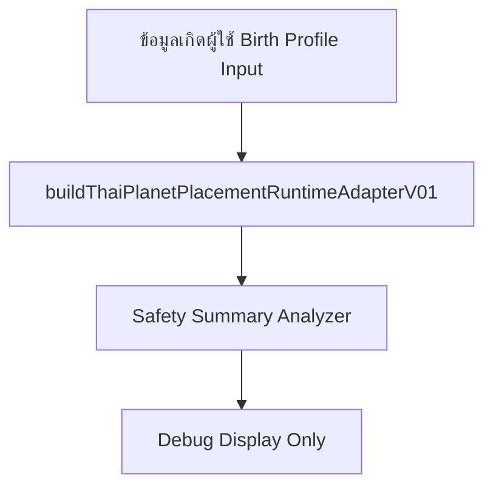

# Thai Planet Placement Debug Preview Integration Plan (DEV-107)

เอกสารแผนการเชื่อมโยงระบบตำแหน่งดาวเคราะห์ไทยเข้าสู่ส่วนติดต่อผู้ใช้ทดสอบการวินิจฉัย (Debug Preview Integration Plan) เพื่อกำหนดการแสดงผล โครงสร้าง Layout, สัญญาระบายข้อมูล (Data Flow) และนโยบายควบคุมความปลอดภัยก่อนเริ่มการพัฒนาอินเตอร์เฟสจริง

---

## 1. Purpose (วัตถุประสงค์)

แผนฉบับ DEV-107 นี้จัดทำขึ้นเพื่อร่างเค้าโครงและขอบข่ายการแสดงผลตำแหน่งดาวเคราะห์จำลองไทยรุ่นรันไทม์ (Stub & Safety Harness) สำหรับทดสอบบนแผงควบคุมระบบวินิจฉัยแบบปิดเฉพาะกลุ่มนักพัฒนาซอฟต์แวร์ (Debug-only UI Surface) ในอนาคต โดยยังไม่มีการผูกโค้ดเข้าสู่แผงประมวลผลหลัก

---

## 2. Scope and Non-goals (ขอบเขตและข้อกำหนด)

* **ขอบเขตแผนการทำ (Scope)**:
  * การเปรียบเทียบหาพื้นที่แสดงผลที่เหมาะสมเชิงวินิจฉัย (Debug Surface Options)
  * การกำหนดโครงร่างจัดเรียงองค์ประกอบหนาจอ (Proposed Future UI Layout)
  * การกำหนดทิศทางการรับส่งข้อมูลและขอบเขต (Data Flow Plan)
  * มาตรการสลับสวิตช์ปิด/เปิดการมองเห็น (Feature Flag & Visibility Plan)
* **ขอบเขตที่ยกเว้น (Non-goals)**:
  * **ห้ามเขียนโค้ด UI จริง**: จะไม่มีการอัปเดตไฟล์ `.tsx` ในรอบการวางแผนนี้
  * **ห้ามประมวลผลจัดเก็บข้อมูล**: ปราศจากการเขียนข้อมูลลง LocalStorage
  * **ห้ามใช้ค่าดาราศาสตร์จริง**: ไม่มีลองจิจูด ราศี หรือองศาทางดาราศาสตร์จริงนำเสนอในระบบ
  * **ห้ามใช้ระบบทำนายดวงชะตา**: ไม่สร้างกลไกการแปลความหมายดวงหรือคำนำทางวิถีชีวิตผู้ใช้

---

## 3. Recommended Debug Surface (การเปรียบเทียบพื้นที่แสดงผล)

ในการพิจารณาเลือกพื้นที่วางคอมโพเนนต์ย่อยสำหรับการวินิจฉัย มีตัวเลือกดังนี้:

| พื้นที่แสดงผล | ข้อดี | ข้อเสีย / ความเสี่ยง | คะแนนประเมิน |
|---|---|---|---|
| **Preview Route Debug Section** | เป็นเอกเทศสูง ค้นหาข้อมูลได้สะดวกรันเฉพาะกลุ่มพัฒนา | ไม่สะดวกต่อการสลับโหมดใช้งานด่วน | ปานกลาง |
| **Data Tools Tab** | เหมาะสำหรับนักพัฒนาในการวิเคราะห์ข้อมูลเข้า/ออกของ Adapter | ต้องสร้างโครงร่างแท็บย่อยใหม่ | สูง (แนะนำ) |
| **Birth Profile Diagnostic Sub** | ผูกรวมกับฟอร์มเกิดเพื่อแสดงข้อมูลโดยตรง | อาจทำให้ผู้ใช้สับสน นึกว่าข้อมูลเกิดจริงผ่านการคำนวณแล้ว | ปานกลาง |
| **Hidden Developer Accordion** | ซ่อนอยู่ด้านหลังแอปพลิเคชันหลัก ปลอดภัยจากการเข้าถึงทั่วไป | หน้าจอแอปพลิเคชันหลักอาจบวมขึ้น (UI Bloat) | ต่ำ |

* **ข้อสรุปพื้นที่แนะนำ**: ควรจัดวางชุดทดสอบนี้ไว้ในพื้นที่ **Data Tools หรือส่วน Diagnostics เฉพาะของนักพัฒนา (Debug-only Surface)** เพื่อป้องกันการเข้าถึงของบุคคลทั่วไปและการสับสนข้อมูลปะปน

---

## 4. Proposed Future UI Layout (โครงร่างการจัดวางหน้าจอที่นำเสนอ)

หน้าจอทดสอบการวินิจฉัยในอนาคตจะถูกจัดแบ่งออกเป็น 4 บล็อกหลัก ดังนี้:

```text
+-----------------------------------------------------------------------+
|  [Header] Thai Planet Placement Diagnostics                           |
|  [Status Badge] Stub-only / Not validated                             |
+-----------------------------------------------------------------------+
|  [Safety Summary Block]                                               |
|  - Total Planets: 10          - Pending Reference Count: 10          |
|  - Comparable Count: 0        - Not-comparable Count: 10              |
|  - Issues: 0                                                          |
+-----------------------------------------------------------------------+
|  [Planet ID Table]                                                    |
|  +-----------+-------------------------------+----------+------------+ |
|  | Planet ID | signRasi                      | degree   | confidence | |
|  +-----------+-------------------------------+----------+------------+ |
|  | 0         | pending-reference-validation  | ...      | pending    | |
|  | 1         | pending-reference-validation  | ...      | pending    | |
|  | ...       | ...                           | ...      | ...        | |
|  +-----------+-------------------------------+----------+------------+ |
+-----------------------------------------------------------------------+
|  [Warning & Copy Safety Note]                                         |
|  "Diagnostic only. Not used for interpretation.                       |
|   Pending reference validation. No real Thai placement is displayed." |
+-----------------------------------------------------------------------+
```

---

## 5. Data Flow Plan (แผนการรับส่งข้อมูล)

ลำดับการรับส่งข้อมูลจะดำเนินแบบ In-memory ล้วน ปราศจากการเขียนทับข้อมูลดิบ:


* **ขอบเขตการกักกันข้อมูล**:
  * ข้อมูลผลลัพธ์ประมาณการตำแหน่งดาวไทยจำลอง *ต้องไม่ถูกบันทึกลงใน LocalStorage*
  * ข้อมูลนี้ *ต้องไม่เข้าสู่ระบบ Natal & Transit Composer ของแอปพลิเคชัน*
  * ข้อความแนะแนวทางชีวิต (Interpretation Copy) ใน Today / Weekly / Monthly *ต้องไม่ดึงคีย์ข้อมูลดาวไทยไปใช้งาน*

---

## 6. Feature Flag / Visibility Plan (แผนเปิด/ปิดการแสดงผล)

เพื่อรับประกันความปลอดภัย ข้อมูลนี้จะเข้าถึงได้ผ่านเกณฑ์ทางเลือกอย่างใดอย่างหนึ่งดังนี้:
* **debug-only conditional**: กำหนดขอบเขตการแสดงผลโดยอ้างอิง `process.env.NODE_ENV === 'development'`
* **collapsible developer section**: ซ่อนกล่องคอมโพเนนต์การวิเคราะห์นี้ไว้ภายในกล่องพับสำหรับผู้พัฒนาที่มีการใส่รหัสเฉพาะ

---

## 7. Copy Safety Rules (กฎความปลอดภัยทางภาษา)

* **ถ้อยคำที่ระบุใช้แสดงผลบน UI ได้**:
  * `"diagnostic only"` / `"สำหรับวินิจฉัยทดสอบระบบเท่านั้น"`
  * `"stub-only"` / `"โครงร่างจำลองรันไทม์"`
  * `"not validated"` / `"ยังไม่ได้รับการสอบเทียบ"`
  * `"pending reference validation"` / `"รอการตรวจสอบสัญญาอ้างอิง"`
  * `"not used for interpretation"` / `"ไม่ถูกนำไปใช้ประมวลวิเคราะห์ร่วมกับวิถีชีวิต"`
* **ถ้อยคำต้องห้ามเด็ดขาดบน UI**:
  * `"ตำแหน่งดาวแม่นยำ (accurate placement)"`
  * `"ดาวสถิตราศี..."` (ห้ามแสดงชื่อราศีจริงร่วมกับตัวเลขดาวเคราะห์)
  * `"ผลดวงจริง"` หรือ `"ใช้ทำนายชีวิต"`

---

## 8. Risk Review (การประเมินความเสี่ยง)

* **ความสับสนเชิงการอ่านค่า**: ผู้ใช้อาจมองข้ามข้อความเตือนความปลอดภัยแล้วเข้าใจผิดว่าข้อมูลตารางคือองศาดาวจริง (ลดความเสี่ยงโดยการปิดซ่อนค่าองศาและใส่ขอบกรอบคำเตือนสีส้มสะดุดตา)
* **การ persist ข้อมูลจำลองโดยอุบัติเหตุ**: ระบบบันทึกอัตโนมัติอาจบันทึกสถานะพิกัดดาราศาสตร์ผิดเพี้ยนลงฐานข้อมูลถาวร (ลดความเสี่ยงโดยแยกโมเดล State ใน UI คอนโซลออกต่างหาก)
* **การใช้ metadata ผิดวัตถุประสงค์**: ค่าประทับเวลา `generatedAt` อาจถูกแปลความหมายผิดว่าเป็นเวลาประมวลผลดวงชะตาจริง (ลดความเสี่ยงโดยเปลี่ยนคำบรรยายฟิลด์เป็น `Stub Creation Time`)

---

## 9. DEV-108 Handoff Recommendation (คำแนะนำสำหรับ DEV-108)

* **ชื่อใบงานถัดไป**: `DEV-108 — Thai Planet Placement Debug Preview UI Scaffold Plan`
* **ขอบข่าย**: ใบงานถัดไปควรดำเนินการเขียนโค้ดและวางโครงร่างจำลอง UI Scaffold (Scaffold UI) ที่มีคุณสมบัติดังนี้:
  * แสดงข้อมูลเป็นคอมโพเนนต์ย่อยในลักษณะตารางจำลอง (Mock Table)
  * ปิดซ่อนฟังก์ชันการเชื่อมต่อไม่ให้อ่านเขียนลง LocalStorage
  * แสดงคุณสมบัติ `safetySummary` และ `adapterStatus` เด่นชัดบนแผงควบคุมหน้าจอ
