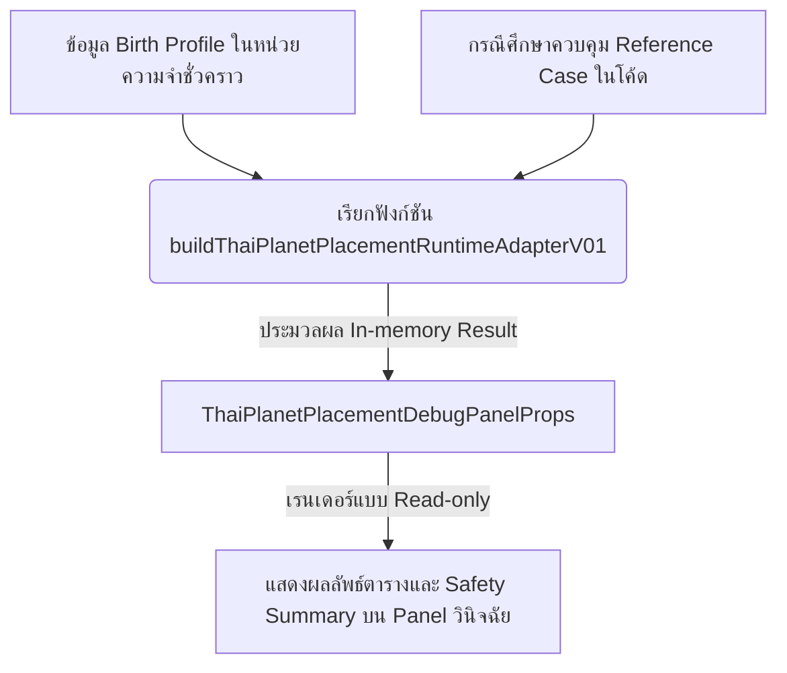

# Thai Planet Placement Debug Panel Preview Wiring Plan (v0.1)

**Document ID**: `docs/astro-strategy/astro-real-app-112-thai-planet-placement-debug-panel-preview-wiring-plan.md`
**Ticket**: ASTRO-REAL-APP-DEV-112
**Date**: 2026-06-22

---

## 1. Purpose (วัตถุประสงค์)

เอกสารฉบับนี้จัดทำขึ้นเพื่อกำหนดโครงสร้างแผนการเชื่อมโยงระบบ (Wiring Plan) สำหรับนำคอมโพเนนต์วินิจฉัยย่อยแบบปิด `ThaiPlanetPlacementDebugPanel` เข้าไปจัดแสดงผลบนหน้าจอทดสอบ/วินิจฉัยเป็นการภายใน (Preview/Debug-only Surface) โดยจัดทำขึ้นในลักษณะของแผนงานเท่านั้น (Documentation-only) โดยไม่มีการแก้ไขโค้ดใดๆ ในส่วนระบบจริง เพื่อปูทางให้เกิดระบบตรวจสอบสัญญาที่มีความมั่นคง ปลอดภัย และไม่ปะปนกับกลไกประมวลผลดวงจริง (Production Engine)

---

## 2. Scope and Non-goals (ขอบเขตและข้อกำหนดภายนอก)

### Goals (ขอบเขตการทำงาน)
* กำหนดตำแหน่งการเชื่อมต่อ UI ที่รัดกุม เฉพาะเจาะจงกับสภาพแวดล้อมจำลอง (Preview/Debug)
* กำหนดทิศทางการไหลของข้อมูล (Data Flow) แบบ In-memory และขอบเขตการกักกันข้อมูล
* ออกแบบ Visibility Gate (การปิดบัง-เปิดเผย) และเงื่อนไขการใช้งานของปุ่มควบคุมวินิจฉัย
* กำหนดแนวทางการตรวจสอบคุณภาพ (QA Checklist) สำหรับการเขียนโค้ดผสานระบบในอนาคต

### Non-goals (ข้อกำหนดภายนอก)
* **ไม่มีการแก้ไขซอร์สโค้ดใน `src/`**: ใบงานนี้กำหนดทิศทางเชิงวิศวกรรมเท่านั้น
* **ไม่มีการเชื่อมต่อหน้าจอ UI ในรอบนี้**: ห้ามแก้ไขหรือนำเข้าคอมโพเนนต์เข้าหน้าจอจริง
* **ไม่มีการแก้ไข LocalStorage**: ห้ามเปลี่ยนแปลงพฤติกรรมหรือสร้างคีย์ใหม่ใน storage
* **ไม่มีลอจิกการคำนวณตำแหน่งองศาดาวเคราะห์**: ห้ามเขียนฟังก์ชันคำนวณหรือใช้ข้อมูลดวงชะตาจริง
* **ไม่มีการให้ข้อมูล stub ไหลเข้าระบบหลัก**: สกัดกั้นข้อมูลไม่ให้ไหลไปที่กลไกวิเคราะห์ความเห็นกลยุทธ์วันนี้/สัปดาห์นี้/รายเดือน หรือ Composer
* **ไม่มีการขูดรีดคำแปลโหราศาสตร์**: ป้องกันการนำเข้าชุดแปลสัญลักษณ์หรือคำทำนาย

---

## 3. Recommended Wiring Surface (การเปรียบเทียบและจุดติดตั้งหน้าจอที่แนะนำ)

การนำคอมโพเนนต์วินิจฉัยนี้ไปวางบนหน้าจอในอนาคต ได้รับการวิเคราะห์เปรียบเทียบตำแหน่งดังนี้:

| จุดที่อาจจะติดตั้งหน้าจอ | ข้อดี | ข้อเสีย / ความเสี่ยง | ระดับความแนะนำ |
|---|---|---|---|
| **หน้าจอวันนี้ / รายสัปดาห์ / รายเดือน** | - | ข้อมูล stub จะสร้างความตื่นตระหนกและทำให้เกิดความเข้าใจผิดแก่ผู้ใช้จริง | **ห้ามติดตั้งเด็ดขาด (NOT RECOMMENDED)** |
| **ส่วนข้อมูลลัคนา / Profile ดวงเกิดหลัก** | - | อาจเหนี่ยวนำให้ผู้ใช้เข้าใจว่ามีการคำนวณตำแหน่งดาวจริงเชื่อมกับข้อมูลเกิดของตนแล้ว | **ห้ามติดตั้งเด็ดขาด (NOT RECOMMENDED)** |
| **แท็บเครื่องมือจัดการข้อมูล (Data Tools)** ในหน้าทดลอง Preview | - อยู่ในขอบเขตการกักพื้นที่ระบบจำลอง - เป็นจุดแยกขาดทางโครงสร้างจากหน้านำเสนอผลลัพธ์หลัก | - เข้าถึงได้ยากเล็กน้อย แต่เหมาะสมสำหรับผู้พัฒนาและ QA | **แนะนำระดับสูง (HIGHLY RECOMMENDED)** |
| **แท็บหน้าจอ Diagnostics** ในหน้าทดลอง Preview | - เป็นจุดปิดสำหรับตรวจสอบโครงสร้างรันไทม์โดยตรง - สื่อความหมายของ Debug อย่างเด่นชัด | - เหมาะสมตามขอบเขตงานวินิจฉัยสัญญารุ่น v0.1 | **แนะนำระดับสูง (HIGHLY RECOMMENDED)** |
| **กล่องพับ Accordion เฉพาะผู้พัฒนาแบบซ่อน** | - สามารถเข้าถึงได้เร็วในโหมด debug | - หากตั้งเงื่อนไขหลวมเกินไป อาจหลุดรอดไปแสดงผลบนโปรดักชันได้ | **แนะนำระดับปานกลาง (CONDITIONAL)** |

### ผลสรุปการวางตำแหน่ง:
ให้ผสานเชื่อมต่อเฉพาะภายในหน้าจอ **Preview Route (เช่น `/workspaces/astro-strategy/real-app-preview`) โดยวางตัวอยู่ภายใต้หมวด Diagnostics หรือ Data Tools** เท่านั้น

---

## 4. Proposed Data Flow (แบบจำลองการไหลของข้อมูลในอนาคต)

การเชื่อมต่อในอนาคตจะต้องส่งผ่านข้อมูลในลักษณะ **In-memory Props Flow** เท่านั้น:

### ข้อบังคับการส่งต่อข้อมูลแบบกักพื้นที่ (Isolation Rules):
* **No LocalStorage Write**: ห้ามเขียนหรือบันทึกค่า `runtimeResult` ของดวงดาวลงใน LocalStorage
* **No Strategy Composer Dependency**: ห้ามดึงข้อมูลประมาณการดาวไปเชื่อมโยงใน `NatalTransitStrategyComposer`
* **No Guidance Dependency**: ห้ามป้อนตำแหน่งดวงดาวจำลองนี้เข้ากับระบบแสดงผลแนะนำงานของวันนี้ (AstroTodayPanel)
* **No Copy Generation**: ห้ามมีกลไกนำค่า `signRasi` หรือ `degree` ที่เป็น placeholder ไปจับคู่แปลคำทำนายหรือกลยุทธ์
* **No Validated Claim**: ห้ามสื่อความหมายว่าตำแหน่งดาวจำลองนี้เป็นตำแหน่งพิกัดจริง

---

## 5. Proposed Visibility Gate (เกณฑ์การเปิดแสดงผลของหน้าจอ)

ในขั้นตอนการ Wiring ในอนาคต จะต้องติดตั้งปราการคัดกรองความปลอดภัย (Security Gate) อย่างน้อย 2 ชั้น:
1. **Gate ชั้นที่ 1 (Route-level Isolation)**: การอิมพอร์ตและเรนเดอร์คอมโพเนนต์วินิจฉัยนี้จะทำได้เฉพาะภายในหน้าระบายพฤติกรรมจำลองของนักพัฒนา (Preview Route) เท่านั้น ห้ามเขียนในไฟล์หน้าโปรดักชันหลัก
2. **Gate ชั้นที่ 2 (State-level Flag)**: ใช้ตัวแปรควบคุมเชิงรันไทม์ เช่น:
   - ตรวจสอบ `variant === 'preview'`
   - ควบคุมผ่าน Toggle Switch: `showDiagnostics === true` (ถูกยุบพับหรือซ่อนไว้เริ่มต้นเสมอ เพื่อป้องกันการเห็นโดยไม่ตั้งใจ)
   - ระบุฉลากข้อความ `"Developer Diagnostics only"` และมีไอคอนระบุสถานะระมัดระวัง (⚠️) กำกับอย่างเด่นชัด

---

## 6. Proposed Parent Boundary (ขอบเขตคอมโพเนนต์ผู้ปกครอง)

เพื่อหลีกเลี่ยงการทำให้ไฟล์แสดงผลจำลองดั้งเดิม [AstroRealAppPreview.tsx](file:///Users/tamz/projects/workos-lite/src/components/workspaces/astro-strategy/real-app/AstroRealAppPreview.tsx) มีขนาดใหญ่เกินไป (Anti-Bloat Discipline) และรักษาความสะอาดทางโครงสร้าง:
* **การพิจารณาในอนาคต**: แนะนำให้สร้างคอมโพเนนต์ Wrapper ย่อยชื่อ `AstroDiagnosticsWrapper` หรือ `AstroDataToolsPanel` เพื่อแยกหน้าที่ดูแลวินิจฉัยดาวจำลองออกจากส่วนควบคุมพฤติกรรมหลัก
* **หน้าที่รับผิดชอบ**: ตัว Parent ใหม่นี้จะรับผิดชอบการเรียกใช้ Orchestrator และการส่งผ่าน Props เพื่อให้โค้ดของหน้าหลักยังคงความเป็นระเบียบและง่ายต่อการทำ QA

---

## 7. Runtime Fixture Strategy (กลยุทธ์ชุดข้อมูลสำหรับทดสอบ)

การรันระบบหน้าจอวินิจฉัยในการ Wiring เฟสถัดไปจะจำกัดการป้อนข้อมูลดังนี้:
* ใช้เฉพาะข้อมูลประวัตินำเข้าจำลองทางเทคนิค (`placeholder-only diagnostic input`)
* สถานะของอแดปเตอร์ที่ส่งเข้าไปจะต้องระบุ `adapterStatus: 'stub-only'` เสมอ
* แสดงข้อมูล Safety Summary และตารางอย่างตรงไปตรงมา
* ห้ามดึงข้อมูลกรณีศึกษาจริงของผู้ใช้มาจัดแสดง และไม่มีการดัดแปลงโปรไฟล์จริงที่บันทึกอยู่ในเครื่อง

---

## 8. Copy Safety & LocalStorage Rules (นโยบายคำบรรยายและความคงอยู่ข้อมูล)

### ข้อความแสดงผลทางเทคนิคที่ต้องระบุให้เห็นเด่นชัด (Required Labels):
* `Diagnostic only` (วินิจฉัยเท่านั้น)
* `Stub-only` (รหัสจำลองเท่านั้น)
* `Not validated` (ยังไม่ผ่านการตรวจสอบความเที่ยงตรง)
* `Pending reference validation` (รอการตรวจสอบกับกรณีศึกษาควบคุม)
* `Not used for interpretation` (ห้ามใช้ในการตีความพฤติกรรม)
* `No real Thai planet placement is displayed` (ไม่มีการจัดแสดงพิกัดดาวไทยดวงจริง)
* `Not persisted` (ไม่มีการบันทึกค่าลงฐานข้อมูล)

### คำบรรยายที่ถูกปฏิเสธและห้ามนำมาแสดงเด่นชัด (Disallowed Labels):
* ห้ามใช้คำระบุความแม่นยำ (*accurate placement*, *real chart*)
* ห้ามแสดงผลชื่อราศีสถิตที่ระบุว่าเป็นพิกัดแท้จริงของดวงดาวหรือคำอ้างความเชื่อ (*ดาวอยู่ราศี…*, *ผลดวงจริง*, *ใช้ทำนาย*)
* ห้ามแปลความหมายหรือฟันธงทิศทางชีวิตผู้ใช้จากค่าดวงดาวจำลอง

### นโยบายด้าน LocalStorage:
* ห้ามเขียนผลลัพธ์ลง LocalStorage
* ห้ามดัดแปลงแก้ไข Birth Profile schema เพื่อเก็บตำแหน่งดาวเคราะห์ของไทย
* ห้ามสร้างคีย์หน่วยความจำใหม่ และห้ามทำการแคชหรือบันทึกชั่วคราว
* **generatedAt** จะต้องเป็นค่า timestamp เพื่อบอกประวัติ metadata การทำงานในเบราว์เซอร์เท่านั้น และห้ามนำมาใช้คำนวณอายุ ข้อมูลเวลาดาราศาสตร์ หรือใช้ออกฤทธิ์ทางเวลาในการให้คะแนนความเชื่อมั่น

---

## 9. Strategy Engine Guardrails (เกราะป้องกันแกนประมวลผลดวง)

เพื่อความมั่นคงและจรรยาบรรณวิชาชีพ:
* ผลลัพธ์ประมาณตำแหน่งดาวเคราะห์ไทยรุ่น v0.1 **ห้ามไหลเข้าสู่** คลาสประเมินแผนงานประจำวันนี้/สัปดาห์นี้/รายเดือน หรือ Natal + Transit Strategy Composer
* ห้ามนำพิกัดดาวเคราะห์ไทย stub ไปสร้างข้อความแนะนำเชิงจิตวิทยาหรือแจ้งเตือน
* แผนกลยุทธ์หลักและคำแนะนำดั้งเดิมของผู้ใช้งานต้องไม่ได้รับผลกระทบใดๆ จากการเปิดหน้าจอวินิจฉัยนี้

---

## 10. QA Requirements for Future Wiring Code (ความต้องการในการทำ QA ของงานถัดไป)

ก่อนการ Commit รหัสโปรแกรมของการเชื่อมต่อ (Wiring Code) ในอนาคต ทีมพัฒนาจะต้องรันและตรวจสอบตามเกณฑ์ดังนี้:
1. **ESLint Check**: ต้องไม่มีข้อผิดพลาดหรือ warning ยกเว้นข้อความ ignore ตามปกติวิสัย
2. **Next.js Production Build**: ต้องผ่านการคอมไพล์สำเร็จสมบูรณ์
3. **Manual Check Script**: รัน `check-thai-planet-placement-contract.cjs` เพื่อยืนยันว่าสัญญายังคงตัว
4. **LocalStorage Audit**: ตรวจสอบกลไก DevTools ยืนยันว่าไม่มีการเขียนคีย์จำลองปฏิทินไทย
5. **Guidance Crosscheck**: ยืนยันว่าความเห็นกลยุทธ์และคำแนะนำบนหน้าจอวันนี้เป็นไปตามปกติ ไม่พบคำแจ้งเตือนที่มาจาก stub
6. **Visibility Logic**: ยืนยันว่าเมื่อปิดสวิตช์วินิจฉัย คอมโพเนนต์จะคืนค่า `null` และไม่กินพื้นที่ Layout

---

## 11. Risk Review (การประเมินความเสี่ยงและมาตรการป้องกัน)

| ลำดับความเสี่ยง | คำอธิบายความเสี่ยง | มาตรการควบคุมเชิงแผนงาน |
|---|---|---|
| 1 | กล่อง Diagnostics หลุดออกสู่หน้าจอแอปพลิเคชันส่วนตัวทั่วไป | ใช้ Gate ตรวจสอบสภาพแวดล้อม `variant === 'preview'` และซ่อนไว้ในหมวด Data Tools เท่านั้น |
| 2 | ข้อมูล `generatedAt` ในอแดปเตอร์ถูกนำไปใช้เป็นเวลาอ้างอิงตำแหน่งคำนวณดาวจริง | กำหนดชัดเจนว่าเป็น metadata ของการประมวลผล Component และห้ามใช้เป็นตัวแปรใน calculation logic |
| 3 | ข้อมูลจำลองไหลเข้าไปปะปนกับกลไกประมวลผลกลยุทธ์หลัก | กำหนดประเภท Props ของ `AstroTodayPanel` และระบบ Composer ให้ปิดช่องรับพารามิเตอร์นี้โดยสมบูรณ์ในระดับ TypeScript Types |

---

## 12. DEV-113 Handoff Recommendation (ข้อแนะนำใบงานถัดไป)

### ชื่อใบงานถัดไป
`ASTRO-REAL-APP-DEV-113 — Thai Planet Placement Debug Panel Preview Wiring Implementation Plan`

* ใบงาน DEV-113 จะต้องเป็นขั้นตอนการจัดทำ **แผนปฏิบัติการจัดทำโค้ด (Wiring Implementation Plan)** ก่อนลงมือสร้างฟังก์ชันจริง
* การเขียนโค้ดจริงจะเกิดขึ้นภายหลังแผนการผสานได้รับการรีวิวและอนุมัติจากผู้ใช้แล้วเท่านั้น
* รายละเอียดโค้ดในอนาคตจะเชื่อมโยงเข้า Data Tools หรือ Diagnostics Tab ภายใต้เงื่อนไข Read-only, No LocalStorage, และไม่มีการประเมินผลกลยุทธ์จริง
* ตรวจสอบ Lint, Build และจัดทำเอกสารรายงาน QA ทุกครั้งก่อนการทำ commit
