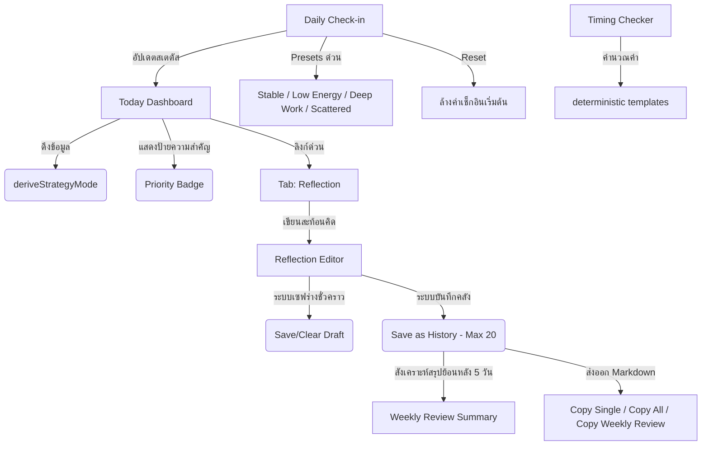

# ASTRO-APP-MVP-RECORD-001 — Final Local-first MVP Record

บันทึกสถานะของระบบวางแผนเชิงกลยุทธ์ส่วนบุคคล **Astro Strategy Lab (Local-first MVP)** ภายใต้โครงการ WorkOS-Lite / ArborDesk ประจำรุ่น MVP v2.0 ซึ่งทำงานแบบปิดและเน้นความเป็นส่วนตัวระดับโลคอลเบราว์เซอร์

---

## 1. Product Status (สถานะผลิตภัณฑ์)
*   **รุ่นปัจจุบัน:** MVP v2.0 (Today Dashboard Polish / Priority Badge v2.0)
*   **รูปแบบสถาปัตยกรรม:** Local-first / Client-side Only (ทำงานหลักในเบราว์เซอร์และเน้นความเป็นส่วนตัวสูง)
*   **สถานะการทำงาน:** ผ่านการทดสอบระดับความเสถียรและสรุปการถดถอย (Regression QA Passed) สมบูรณ์พร้อมนำไปทดลองใช้เป็นเครื่องมือช่วยบันทึก จัดจังหวะการทำงาน และสะท้อนคิดประจำวันโดยตรงบนเบราว์เซอร์

---

## 2. Current Route (เส้นทางแอปพลิเคชัน)
*   **URL Route:** `/workspaces/astro-strategy`
*   **ไฟล์คอมโพเนนต์หลัก:** `src/components/workspaces/astro-strategy/AstroStrategyPrototypeClient.tsx`

---

## 3. Core User Loops (ลูปหลักการใช้งาน)
1.  **Daily Check-in:** ผู้ใช้วิเคราะห์ประเมินสภาวะทางกาย พลังงาน และระดับสมาธิของวันด้วยฟอร์มเช็กอิน หรือใช้ตัวช่วยตั้งค่าด่วน (Quick Presets)
2.  **Today Dashboard Review:** สังเกตป้ายกำกับระดับความสำคัญ (Priority Badge) ใน 3 ระดับกลยุทธ์ และแนวทางการปฏิบัติ/จุดที่ควรระวังในแผงควบคุมหลักภายใน 10 วินาที
3.  **Activity Timing Checker:** ตรวจสอบช่วงเวลาที่เหมาะสมและระดับความราบรื่นในการทำกิจกรรมสำคัญ (การเงิน, การสื่อสารเจรจา, การเปิดตัวระบบ, การจัดโครงสร้างเอกสาร) เพื่อวางแผนหลีกเลี่ยงจังหวะเวลาที่มีความผันผวนสูง
4.  **Daily Reflection Log:** บันทึกข้อสังเกตและสะท้อนผลการดำเนินชีวิตประจำวัน พร้อมระบบบันทึกแบบร่างด้วยผู้ใช้ เพื่อช่วยลดความเสี่ยงจากการสูญหายของข้อมูลระหว่างทำงาน
5.  **Weekly Review Summary:** ประมวลผลและสร้างบททบทวนสังเคราะห์รายสัปดาห์อัตโนมัติจากข้อมูลประวัติการสะท้อนคิดย้อนหลัง พร้อมฟังก์ชันคัดลอกในรูปแบบ Markdown เพื่อนำไปใช้อ้างอิงหรือจัดทำรายงานประวัติ

---

## 4. Feature Map (แผนผังคุณสมบัติ)

*   **Today Dashboard:** แผงควบคุมแสดงโหมดวันนี้, โฟกัสวันนี้, เช็กอินสภาวะปัจจุบัน และจุดที่ควรระวังแบบเรียลไทม์ พร้อม Priority Badge ที่นิ่งสงบ สบายตา และรองรับ Responsive ปรับแถวได้ปลอดภัย
*   **Daily Check-in Form:** ระบบอินพุตประเมินระดับพลังงาน ความชัดเจน ความกดดัน สมาธิ และสัญญานทางกาย พร้อมระบบ presets และ reset ประจำวัน
*   **Timing Checker:** ตารางจำลองฤกษ์ยามจังหวะเวลาของกิจกรรมหลัก (การเงิน, เจรจา, เปิดตัวงาน, งานระบบเอกสาร) แยกตามวันและตรรกะกิจกรรม
*   **Reflection Editor:** หน้าเขียนบันทึกการสะท้อนคิดที่มีคำเตือนความปลอดภัย (Disclaimer) และคำถามนำกระตุ้นตามระบบกฎกลยุทธ์
*   **Weekly Review Summary Card:** การ์ดวิเคราะห์สังเคราะห์ความตั้งใจล่าสุด ข้อควรระวังย้อนหลัง และบันทึก 5 วันล่าสุด สำหรับสะสางจังหวะชีวิตประจำสัปดาห์

---

## 5. Technical Scope (ขอบเขตการเขียนสถาปัตยกรรมทางเทคนิค)
*   **Client-side Only:** การประมวลผลและการจัดรูปแบบทั้งหมดทำที่หน้าฝั่งผู้ใช้ (Client-side) ปราศจากการรอข้อมูลจากเซิร์ฟเวอร์
*   **No Database Call / No API Integration:** ไม่มีโมดูลเชื่อมต่อฐานข้อมูลภายนอกและไม่มีระบบ API Endpoint เพื่อความรวดเร็วและปลอดภัยระดับโลคอลสูงสุด
*   **No AI Engine / No Real Astrology Engine:** ข้อมูลฤกษ์ยามอ้างอิงจากแม่แบบกลยุทธ์จำลอง (Deterministic Template) ที่มีสมาธิการจัดการและคำเตือนเป็นแกนหลัก ยังไม่มีระบบคำนวณตำแหน่งดวงดาวทางคณิตศาสตร์และไม่มีการทำงานร่วมกับ AI นอกเหนือจากระบบกฎเกณฑ์ของโปรเจกต์
*   **Safety Wording Boundaries:** ใช้ภาษาที่ส่งเสริมพลังความคิดบวกและเชิงกลยุทธ์ส่วนบุคคล หลีกเลี่ยงภาษาเชิงการแพทย์หรือวินิจฉัยสุขภาพ มี Disclaimer แสดงผลอย่างสม่ำเสมอในจุดบันทึกและจุดคัดลอก

---

## 6. Data Flow (การไหลของข้อมูล)
1.  **การกรอกอินพุต (User Input):** ผู้ใช้กรอกเป้าหมายรอบวงจร, ประวัติตนเอง, เช็กอิน และข้อความบันทึกสะท้อนคิด
2.  **การจัดการสถานะภายใน (React State):** ข้อมูลจะจัดเก็บในสถานะชั่วคราวเพื่ออัปเดตแผง Today Dashboard และ Markdown Preview ในแบบเรียลไทม์
3.  **การจัดเก็บถาวร (Local Storage Sync):** ข้อมูลจะถูกเขียนลงเบราว์เซอร์แบบไม่ประสานเวลา (Asynchronous Local Persistence) เพื่อไม่ให้กระทบต่อความลื่นไหลของ UI
4.  **การประมวลตรรกะกลยุทธ์ (Strategy Logic):** ตรรกะ `deriveStrategyMode` จะนำประวัติการกรอกและสภาวะพลังงานมาคำนวณโหมดปัจจุบัน
5.  **การแปลงและดึงออก (Markdown Export & Copy):** แปลงเนื้อหาในประวัติประมวลผลเป็น String Markdown และส่งออกไปยัง Clipboard ของผู้ใช้ผ่าน Native API

---

## 7. localStorage Keys (ระบบคีย์จัดเก็บข้อมูลในระบบ)
| ลำดับ | คีย์การจัดเก็บ (localStorage Key) | หน้าที่การจัดเก็บและโครงสร้างข้อมูล |
| :--- | :--- | :--- |
| 1 | `astro-strategy:reflection-log:v1` | **[Draft]** บันทึกแบบร่างเนื้อหาการสะท้อนคิดปัจจุบัน (มี Version กำกับ) |
| 2 | `astro-strategy:reflection-history:v1` | **[History]** จัดเก็บประวัติบันทึกสะท้อนคิดย้อนหลังสูงสุด 20 รายการแรก |
| 3 | `astro.strategy.cycleGoal` | บันทึกเป้าหมายสูงสุดประจำรอบวงจรปัจจุบัน |
| 4 | `astro.strategy.cyclePeriod` | บันทึกช่วงเวลารอบวงจรปัจจุบัน (เช่น พฤษภาคม 2026) |
| 5 | `astro.strategy.birthDate` | ข้อมูลบันทึกวันเกิดของระบบชาร์ตจำลอง |
| 6 | `astro.strategy.birthTime` | ข้อมูลบันทึกเวลาเกิดของระบบชาร์ตจำลอง |
| 7 | `astro.strategy.birthPlace` | ข้อมูลบันทึกสถานที่เกิดของระบบชาร์ตจำลอง |
| 8 | `astro.strategy.reflections` | ข้อมูลบันทึกประวัติสะท้อนคิดทั่วไปของระบบดั้งเดิม |

---

## 8. QA Checkpoints Passed (ประวัติการทดสอบ QA ที่ผ่านแล้ว)
*   **ASTRO-APP-QA-002:** ตรวจสอบระบบนำทางและการตั้งเป้าหมายรอบวงจร (Cycle Goal UI Validation)
*   **ASTRO-APP-QA-003:** ตรวจสอบระบบการส่งออก Markdown และประวัติบันทึกแบบร่าง (Export & Log Draft Validation)
*   **ASTRO-APP-QA-004:** ตรวจสอบระบบสรุปผลรายสัปดาห์ (Weekly Review Summary Validation)
*   **ASTRO-APP-QA-005:** ตรวจสอบการเพิ่มกล่องแดชบอร์ด Today Dashboard Compact Summary (Today Summary Layout Validation)
*   **ASTRO-APP-QA-006:** ตรวจสอบป้ายกำกับความสำคัญ (Priority Badge v2.0) และความปลอดภัยของโครงสร้างป้ายกำกับภาษาไทยสั้นกระชับ (Today Dashboard Priority Regression QA)

---

## 9. Current Limitations (ข้อจำกัดในปัจจุบัน)
*   **Local Web Sandbox:** ข้อมูลทั้งหมดผูกขาดตามเบราว์เซอร์ของแต่ละเครื่องและแอปพลิเคชันไม่มีระบบล็อกอินเพื่อซิงค์ข้ามอุปกรณ์
*   **Manual Export Required:** ผู้ใช้จำเป็นต้องกด Copy Markdown เพื่อนำข้อมูลไปเผยแพร่หรือบันทึกเก็บไว้ภายนอกด้วยตนเอง (หากมีการเคลียร์ข้อมูลคุกกี้/แคชเบราว์เซอร์ ข้อมูลอาจสูญหายได้)
*   **Static Timing & Mock Readings:** รายงานวิเคราะห์ฤกษ์ยามจังหวะเวลายังคงเป็นรูปแบบชุดข้อมูลตัวเลือกเชิงสัญลักษณ์ (Mock) ไม่ใช่การคำนวณตามองศาดวงดาวเชิงดาราศาสตร์ที่เกิดขึ้นจริงบนท้องฟ้า ณ วินาทีนั้นๆ

---

## 10. Recommended v2 Directions (ทิศทางการพัฒนาต่อยอดในรุ่น v2)
1.  **Real Astronomy Calculation Core (WebAssembly/JS Core):** พัฒนาระบบคำนวณวิถีและองศาดวงดาวจริงตามเวลาจริง (Real-time planetary positions) เพื่อให้สอดคล้องกับเจตจำนงในการเลือกจังหวะเวลาอย่างแท้จริง
2.  **Database Integration & WorkOS Sync API:** วางโครงสร้างฐานข้อมูล (เช่น SQLite / Prisma DB Schema) และพัฒนา API Endpoints ในฝั่งเซิร์ฟเวอร์เพื่อซิงค์ข้อมูลบันทึกประวัติความก้าวหน้าและการเช็กอินเข้าสู่คลาวด์ WorkOS อย่างปลอดภัย
3.  **Planetary Alignment Visualizer:** พัฒนาระบบชาร์ตวงกลมดาราศาสตร์ (Planetary birth chart visualizer) ในแท็บ My Chart แบบตอบสนองสองทิศทาง
4.  **Bulk Zip Backup & Import Core:** เพิ่มปุ่มสำรองและนำเข้าข้อมูลประวัติความก้าวหน้าทั้งหมดในรูปแบบคลังไฟล์บีบอัด (.zip) เพื่อความสะดวกสบายของผู้ใช้ในการสำรองข้อมูลส่วนตัว
5.  **Weekly Pattern Hints:** เพิ่มการอ่านแนวโน้มซ้ำจาก Reflection History เช่น caution note หรือ intention ที่ปรากฏบ่อย โดยยังใช้ deterministic/local-only logic ก่อน
