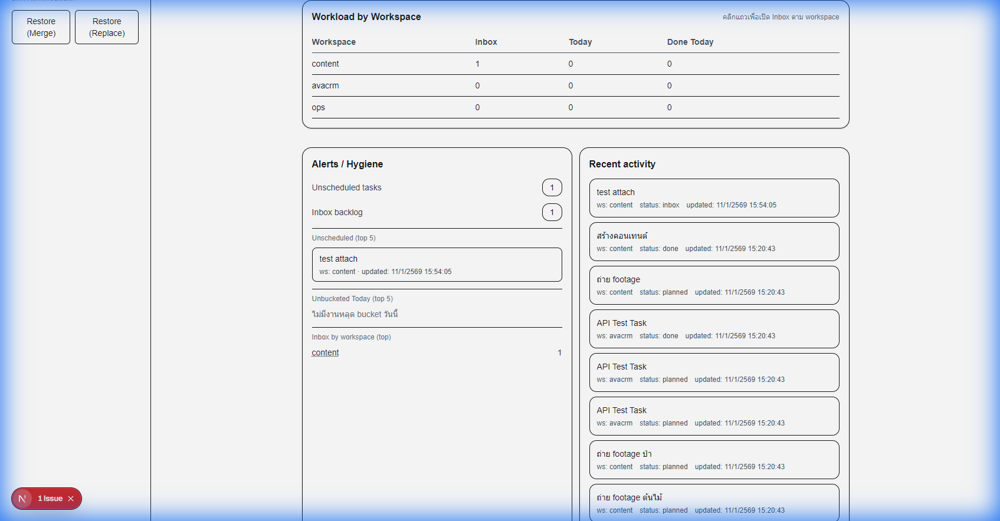

# WorkOS-Lite — Dashboard (ArborDesk)

เอกสารนี้สรุปสเปก, พารามิเตอร์, และผลการตรวจสอบ (visual verification) ของหน้า Dashboard รวมถึงการปรับปรุง API/UI ให้ตรงกับ schema ของ SQLite

## เป้าหมาย (10-second answers)
Dashboard ต้องตอบ 3 คำถามให้ได้ภายใน 10 วินาที:
1) วันนี้ต้องทำอะไร (Today by bucket)
2) มีงานหลุดระบบไหม (Unscheduled / Unbucketed)
3) งานค้างหนักอยู่ตรงไหน (Inbox backlog / by workspace)

---

## Data Contract

### API
- Endpoint: `GET /api/dashboard`
- Optional query:
  - `date=YYYY-MM-DD` (default = today in Asia/Bangkok)
  - > Note: Dashboard date defaults to Asia/Bangkok to avoid day-rollover issues when SQLite stores UTC.

### DashboardDTO (concept)
- today: total + by_bucket + unbucketed
- inbox: total + by_workspace
- done_today: total
- hygiene: unscheduled
- workspaces: summary per workspace (always include all defined workspaces)
- recent: latest updated tasks (limit 10)
- unscheduled_tasks: top 5 list (clickable)
- unbucketed_today_tasks: top 5 list (clickable)

---

## Schema Alignment (SQLite)

### tasks.status
- Allowed: `inbox | planned | done`

### Key rules
- Today metrics MUST count only `status = 'planned'` (not `status != 'done'`)
- Unbucketed Today:
  - `scheduled_date = today`
  - `status = 'planned'`
  - `schedule_bucket IS NULL OR schedule_bucket = 'none'`
- Unscheduled:
  - `scheduled_date IS NULL`
  - `status != 'done'`

---

## Acceptance Criteria (PR Checklist)

### Workload by Workspace
- [ ] Table must ALWAYS show 3 rows: `avacrm`, `ops`, `content` even if counts are 0
- [ ] Counts reflect:
  - Inbox: `status = 'inbox'`
  - Today: `scheduled_date = date AND status = 'planned'`
  - Done Today: `status = 'done' AND date(done_at) = date`

### Hygiene (Top 5)
- [ ] Unscheduled (Top 5) shows tasks where `scheduled_date IS NULL AND status != 'done'`
- [ ] Unbucketed Today (Top 5) shows tasks planned today with bucket `NULL/none`
- [ ] Empty state renders correctly:
  - "ไม่มีงานหลุดวัน" for unscheduled when 0
  - "ไม่มีงานหลุด bucket วันนี้" for unbucketed today when 0

### Navigation / Deep-links
- [ ] Unscheduled list items link to: `/inbox?scheduled_date=null`
- [ ] Unbucketed Today list items link to: `/today?schedule_bucket=none`
- [ ] Workspace row links to: `/inbox?workspace=<workspace>`
- [ ] KPI cards link to the intended view (Today/Inbox/Done) with proper query params

---

## Implementation Summary

### API: `/api/dashboard`
Key changes:
1) **Status Logic**
   - Updated Today queries to explicitly use `status = 'planned'`

2) **Schedule Bucket Simplification**
   - Unbucketed checks only: `schedule_bucket IS NULL OR schedule_bucket = 'none'`
   - Removed empty string checks (`''`) since schema does not allow it

3) **Workspace Enforcement**
   - Implemented a CTE `VALUES ('avacrm'), ('ops'), ('content')` with `LEFT JOIN` to ensure all workspaces appear even with 0 tasks

4) **Top 5 Lists**
   - Added:
     - `unscheduled_tasks` (limit 5)
     - `unbucketed_today_tasks` (limit 5)
   - Included in DTO response

### UI: `DashboardClient.tsx`
Key changes:
1) DTO type updated to include:
   - `unscheduled_tasks`
   - `unbucketed_today_tasks`

2) Alerts/Hygiene section updated to render:
   - Unscheduled (Top 5)
   - Unbucketed Today (Top 5)
   - Clickable items linking to filtered views

3) Labels/Hints refined:
   - Card helper text aligned with planned-only logic (e.g., “งาน planned วันนี้”)

---

## Verification Results (Visual)

### 1) Workload by Workspace
Requirement:
- Must display all three workspaces (`avacrm`, `ops`, `content`) even if they have 0 tasks

Observation:
- Table lists all three workspaces
- `avacrm` and `ops` remain visible with 0 counts where applicable (prevents disappearing rows)

### 2) Hygiene Tasks (Top 5)
Requirement:
- Show:
  - Unscheduled (Top 5): `scheduled_date IS NULL`
  - Unbucketed Today (Top 5): planned today but bucket NULL/none

Observation:
- Alerts/Hygiene includes both sections
- Unscheduled list displays tasks with workspace and updated time
- Unbucketed Today section shows correct empty-state message when no items
- Items are clickable to filtered Inbox/Today views

---

## Evidence (Screenshots)

---

## Regression Test Notes (Quick)
- Create a task in `ops` workspace → workspace table must still show 3 rows and update counts
- Move a planned task to `inbox` → Today total decreases; Inbox increases
- Mark a task as done today → Done Today increases
- Make a task `scheduled_date = null` → appears in Unscheduled Top 5
- Make a planned-today task with `schedule_bucket = none` → appears in Unbucketed Today Top 5
