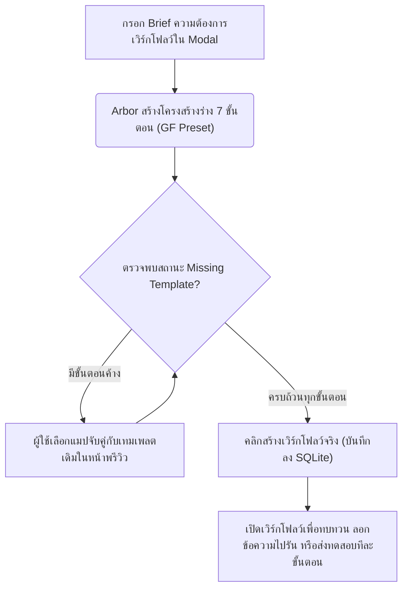

# Prompt Studio v2 Milestone Summary — AI-Assisted Draft System

เอกสารสรุปความคืบหน้าโครงการระบบจัดการและสร้างชุดคำสั่งอัจฉริยะสำหรับงานเขียนบทความวิชาการและการจัดการคอนเทนต์ (**Prompt Studio v2**) โดยสรุปความสำเร็จตั้งแต่โมดูล **PROMPT-STUDIO-001** ถึง **PROMPT-STUDIO-013** ข้อมูลบัญชีระบบเชิงเทคนิค แนวคิดการใช้งานที่ปลอดภัย และแผนการพัฒนาต่อยอด

---

## 1. Completed Modules Summary (สรุปความสำเร็จโมดูล 001 - 013)

ระบบ Prompt Studio ได้รับการพัฒนาจนมีขีดความสามารถสมบูรณ์แบบเสร็จสิ้นผ่านโมดูลต่าง ๆ ดังนี้:

* **PROMPT-STUDIO-001 — Prompt Template Studio MVP**
  * พัฒนาระบบหน้าต่างการจัดการข้อมูลเทมเพลต (System Prompt, Template Structure, Constraints) รองรับการบันทึกลงฐานข้อมูล SQLite
* **PROMPT-STUDIO-002 — Compiled Prompt with User Input**
  * คัดกรองตัวแปรวงเล็บปีกกา `{var}` จากโครงสร้างเทมเพลต เพื่อนำมาแปลงเป็นช่องกรอกอินพุต (Input fields) ฝั่งขวาแบบเรียลไทม์ และคอมไพล์สรุปรวมเป็น Prompt ทั้งตัวอย่างและระบบคลิกคัดลอก (Copy Prompt)
* **PROMPT-STUDIO-003 — Human-friendly Input Field Builder**
  * เพิ่มระบบ Builder เพื่อสร้างและแก้ไขโครงสร้างฟิลด์อินพุต รองรับชนิดข้อมูลหลากหลาย (Text, Textarea, Dropdown Select)
* **PROMPT-STUDIO-004 — Prompt Run Log / Test History**
  * พัฒนาระบบบันทึกผลการทดสอบการรันประเมินดาว 1-5 ดาว พร้อมจับภาพข้อมูล Snapshot (Inputs & Compiled Prompt) แบบ Immutable เพื่อการตรวจสอบประวัติอย่างแท้จริง
* **PROMPT-STUDIO-005 — Run Log UX Polish / Revision Workflow Lite**
  * ปรับปรุงหน้าประวัติการรันให้ฟิลเตอร์ข้อมูลได้ง่ายขึ้น รองรับระบบจัดเก็บเอกสารอย่างไม่ทำลาย (Soft Archive) และเพิ่มระบบคัดลอก Notes สำหรับการแก้ไขรุ่นถัดไป (Next Revision Notes)
* **PROMPT-STUDIO-006 — Green Fineness Guardrail Presets**
  * เชื่อมโยงระบบ Green Fineness Brand Safety Guardrail พรีเซ็ต 5 รายการ พร้อมคำเตือนการตรวจจับคำศัพท์มีความเสี่ยงด้านการเขียน (Word Bank Review)
* **PROMPT-STUDIO-012 — AI-Assisted Prompt Draft Generator**
  * เพิ่มปุ่ม **"ให้ Arbor ช่วยร่าง"** ในระบบจัดการเทมเพลตเพื่อประมวลผลดราฟท์ตามความต้องการ (Brief) ของแบรนด์และโทน โดยสอดแทรกกฎความปลอดภัยพรีเซ็ต และปรับแก้คำกล่าวอ้างเกี่ยวกับผลผลิต พืช ดิน ให้ระมัดระวังรอบคอบ
* **PROMPT-STUDIO-013 — AI-Assisted Workflow Draft Generator**
  * เพิ่มปุ่ม **"ให้ Arbor ช่วยร่าง Workflow"** ในแท็บ Workflows เพื่อร่างเวิร์กโฟลว์ 7 ขั้นตอนตามมาตรฐาน Green Fineness และจับคู่กับ Prompt Template ในเครื่องโดยอัตโนมัติ

---

## 2. Current Capabilities (ความสามารถหลักในปัจจุบัน)

1. **Structured Prompt Management:** การแยกรายละเอียด Prompt ออกเป็นระบบ (System Prompt, Main Structure, Constraints, Input Settings) 
2. **Dynamic Live Compiler:** ถอดรหัสโครงสร้างและเปลี่ยน `{variable}` เป็น Input Controls ในคลิกเดียว
3. **Immutable History Run Logger:** บันทึกประวัติการรันแบบ Snapshot ช่วยให้คงค่าอินพุตและคำสั่งจริงขณะบันทึกเพื่อการเปรียบเทียบในอนาคต
4. **Green Fineness Brand Guardrails:** บังคับใช้และผสานกฎ Voice/Tone เกษตรอินทรีย์และการตรวจสอบ Claims ความเสี่ยงสูงย้อนหลัง
5. **AI-Assisted Template Generator (Local Mock):** ร่างเทมเพลตคำสั่งอัจฉริยะตามความต้องการ คัดกรองคำเกินจริง และเปิดโหมดแก้ไขแบบแมนนวลใน Modal
6. **AI-Assisted Workflow Generator (Local Mock):** ออกแบบลำดับขั้นตอนการทวนสอบและผลิตบทความ โดยมีตัวช่วยจับคู่เทมเพลต (Conservative Template Matching) บล็อกการส่งบันทึกหากคู่แมปไม่ครบ

---

## 3. Technical Inventory (คลังรายการทรัพยากรทางเทคนิค)

### 3.1 Database Schema (SQLite)

ตารางหลักที่ทำงานบน SQLite ประกอบด้วย:
- **`prompt_templates`**: เก็บข้อมูลหัวข้อ แม่แบบคำสั่ง และการตั้งค่าฟิลด์อินพุต
- **`guardrail_presets`**: เก็บพรีเซ็ตความปลอดภัย 5 ด้านของ Green Fineness และคลังคำที่ห้ามใช้
- **`prompt_run_logs`**: เก็บประวัติการทดสอบรัน, คะแนนประเมิน, บันทึกการแก้ไข และ Snapshot ของ Inputs กับข้อความ Prompt ทั้งหมด ณ วินาทีนั้น ๆ
- **`prompt_versions`**: ตารางบันทึกประวัติการเปลี่ยนแปลงรุ่นคำสั่ง (Version History)
- **`prompt_workflows`**: ตารางเก็บตัวโครงสร้างหลักของเวิร์กโฟลว์รันแผนงาน
- **`prompt_workflow_steps`**: ตารางเก็บขั้นตอนในเวิร์กโฟลว์ ทำหน้าที่เก็บคำสั่ง (Step instruction) และอ้างอิง `prompt_template_id` (เป็น `NOT NULL` และเชื่อมโยงแบบ Foreign Key)

### 3.2 Web Routes และ API Routes

- **UI Workspace URL:** `/workspaces/prompt-studio`
- **ซอร์สโค้ด React (Client-side):** [PromptStudioClient.tsx](file:///Users/tamz/projects/workos-lite/src/components/workspaces/prompt-studio/PromptStudioClient.tsx)
- **API Endpoints:**
  - `GET /api/prompt-templates` / `POST /api/prompt-templates`
  - `PATCH /api/prompt-templates/[id]` / `DELETE /api/prompt-templates/[id]`
  - `GET /api/prompt-guardrail-presets`
  - `GET /api/prompt-run-logs` / `POST /api/prompt-run-logs` / `PATCH /api/prompt-run-logs`
  - `GET /api/prompt-workflows` / `POST /api/prompt-workflows`
  - `GET /api/prompt-workflows/[id]` / `PATCH /api/prompt-workflows/[id]` / `DELETE /api/prompt-workflows/[id]`
  - `POST /api/prompt-workflows/[id]/steps` / `DELETE /api/prompt-workflows/[id]/steps/[stepId]`

### 3.3 โครงสร้าง UI (UI Components)
- **Left Sidebar**: แถบแท็บสลับแสดงคลังเทมเพลตคำสั่ง (Templates) และคลังแผนงานเวิร์กโฟลว์ (Workflows) พร้อมปุ่มสร้างและปุ่มเรียกผู้ช่วย Arbor ร่างข้อมูล
- **Center Area**: พื้นที่สำหรับแก้ไขโครงสร้างคำสั่งหรือการตั้งค่าคุณสมบัติ (Builder & Guardrails)
- **Right Area**: ฟอร์มรับค่าตัวแปรแบบเรียลไทม์ ปุ่ม Copy Prompt และกรอบพรีวิวผลลัพธ์
- **Bottom History Logger**: ฟอร์มรับฟีดแบคการรันประเมินคะแนน และรายการการ์ดประวัติรันย้อนหลัง (ขยายดู Snapshot ได้)

### 3.4 Local Rule-based Generators (ตรรกะระบบประมวลผลภายในเครื่อง)
> [!IMPORTANT]
> **ไม่ใช่การส่งข้อมูลไปประมวลผลผ่าน AI API ภายนอก:**
> ระบบร่างดราฟท์ Prompt (ในโมดูล 012) และร่างดราฟท์ Workflow (ในโมดูล 013) ทำงานอยู่บน **Client-side Logic (ตรรกะการรันตามเงื่อนไขภายในเครื่อง)** โดยใช้ข้อมูลจากการประเมินคำสำคัญ (Keyword Detection) และ Rule Presets ทั้งนี้ยังไม่ได้มีการติดตั้งหรือเรียกใช้ API ปลายทางของ AI (เช่น OpenAI, Claude หรือ Gemini API)
> 
> **ไม่ใช่ระบบรันส่งอัตโนมัติ (Not an Autonomous AI Runner):**
> หน้าเว็บ Prompt Studio ทำหน้าที่เป็นห้องปฏิบัติการและสร้างร่างแผนงานคำสั่ง ระบบ v2 นี้ไม่ได้ทำหน้าที่ส่งคำสั่งหรือรันขั้นตอนงานในเวิร์กโฟลว์กับโมเดลภาษาโดยอัตโนมัติ การทำงานทั้งหมดต้องผ่านการคัดลอกและการกดรันทดสอบของมนุษย์เท่านั้น

---

## 4. Safe Usage Model (โมเดลการใช้งานและสิทธิ์ความปลอดภัย)

เพื่อให้ข้อมูลระบบเกิดความถูกต้องและลดความผิดพลาดสูงสุด ระบบจะบังคับใช้กฎดังต่อไปนี้:
1. **Draft-First & Human-Approved:** ระบบประมวลผลจะช่วยจัดทำเป็นร่างพรีวิวบน Modal ก่อนเสมอ เพื่อให้ผู้ใช้สามารถตรวจสอบความถูกต้องก่อน
2. **No Auto-Save:** การกด "Use this Draft" หรือร่างข้อมูลเวิร์กโฟลว์ จะเป็นเพียงการนำค่าไปใส่ใน React State (หน้าแก้ไข) เท่านั้น จะไม่มีการเขียนลงฐานข้อมูล SQLite แบบอัตโนมัติ
3. **Explicit User Saves:** ข้อมูลจะเข้าสู่ฐานข้อมูล SQLite ก็ต่อเมื่อผู้ใช้กดยืนยันด้วยตนเอง (คลิกปุ่ม "บันทึก" ด้านขวาบนสำหรับเทมเพลต หรือคลิกปุ่ม "สร้าง Workflow จากร่างนี้" บนขั้นตอนพรีวิวกดยืนยัน Confirm สำหรับเวิร์กโฟลว์)
4. **No Auto-create Prompt Templates:** ระบบผู้ช่วยร่างแผนงานจะไม่มีวันสร้างเทมเพลตขึ้นใหม่เอง หากไม่พบเทมเพลตที่เชื่อมโยงจะเตือนเป็นสถานะ `⚠️ Missing Template`
5. **No Active Version Changes:** จะไม่มีการตั้งเวอร์ชันใช้งานจริงใหม่โดยอัตโนมัติ ทุกการกระทำต้องขึ้นอยู่กับการเปลี่ยนเวอร์ชันโดยตรงจากผู้ใช้ในแท็บเวอร์ชัน

---

## 5. Green Fineness Safety Layer (การป้องกันความปลอดภัย Green Fineness)

การควบคุมความปลอดภัยเพื่อการันตีคุณภาพของบทความและการกล่าวอ้างทางวิทยาศาสตร์ ประกอบด้วย:

### 5.1 การเปิดใช้งานพรีเซ็ตอัตโนมัติ (Guardrail Presets)
เมื่อตรวจพบคำว่า "Green Fineness" หรือ "GF" ในเป้าหมาย ระบบจะเปิดใช้งานพรีเซ็ตควบคุม 5 ด้านครบถ้วน:
- Core Tone
- Scientific Claims
- Soil/Microbe/Fertilizer Guardrail
- Non-salesy Edu
- Review Checklist

### 5.2 การคัดกรองและปรับปรุงคำสำคัญอย่างระมัดระวัง (Cautious Wording Logic)
ระบบจะทำการจับคู่และกรองคำศัพท์ที่มีความเสี่ยงสูง (Overclaims) หรือมีการกล่าวอ้างดิน พืช จุลินทรีย์ ปุ๋ย ธาตุอาหาร ผลผลิต คาร์บอน และสิ่งแวดล้อมเกินจริงเพื่อปรับให้สุภาพและปลอดภัยยิ่งขึ้น:
- หลีกเลี่ยงถ้อยคำรับประกันผลแน่นอน เช่น *เห็นผลแน่นอน, ดีที่สุด, ปลอดภัย 100%, ฟื้นฟูดินทันที, รักษาโรค*
- แปลงเป็นคำแนะนำเชิงสนับสนุน เช่น *"อาจช่วยสนับสนุนความสมบูรณ์ของดินภายใต้เงื่อนไขและการจัดการที่เหมาะสม"*, *"มีส่วนเกี่ยวข้องกับความสมบูรณ์และช่วยสนับสนุนโอกาสในการเพิ่มผลผลิต"*

---

## 6. Recommended Operating Workflows (ขั้นตอนการใช้งานที่แนะนำ)

---

## 7. Known Limitations (ข้อจำกัดที่ควรทราบใน v2)

1. **Local Logic Only:** การสร้างร่างทั้งหมดอิงตาม Presets ภายในเครื่อง ทำให้หากกรอก Brief ภาษาแปลกหรือเป้าหมายที่แหวกแนวออกไป ตัวคำแนะนำอาจจะไม่ตรงตามเป้าหมายแบบเรียลไทม์
2. **Workflow DB Binding Limitation:** เนื่องจากโครงสร้างฐานข้อมูลจำกัดให้ฟิลด์ `prompt_template_id` เป็น `NOT NULL` ทำให้หากมีขั้นตอนใหม่ที่คิดขึ้นมาแต่ยังไม่มีแม่แบบคำสั่งเดิมรองรับในระบบ จะต้องไปสร้างเทมเพลตคำสั่งนั้นแยกไว้ในแท็บหลักก่อน จึงจะสามารถกลับมาร่างและจับคู่ในเวิร์กโฟลว์ต่อได้

---

## 8. Regression QA Checklist (แบบทดสอบเพื่อป้องกันข้อผิดพลาดการถดถอย)

กรุณาตรวจสอบความสมบูรณ์ตามรายการด้านล่างนี้เมื่อมีการอัปเดตระบบในอนาคต:

| ID | Flow | ลำดับการทดสอบ | ผลลัพธ์ที่คาดหวัง |
|---|---|---|---|
| **01** | **Wf Gen Modal Open** | คลิกปุ่ม "ให้ Arbor ช่วยร่าง Workflow" ในแถบซ้าย | หน้าต่างช่วยเหลือเปิดลอยขึ้นมาอย่างถูกต้อง มี Overlay เบลอพื้นหลัง |
| **02** | **Green Fineness Detection** | กรอกความต้องการที่มีคำว่า "Green Fineness" หรือเลือกหมวดประเภท Green Fineness | ระบบจะแสดงขั้นตอนร่างครบ 7 ขั้นตาม Wording มาตรฐานของ Green Fineness |
| **03** | **Missing Template Warning** | ปล่อยให้ฟิลด์เลือกเทมเพลตเวิร์กโฟลว์ว่างไว้หนึ่งหรือหลายฟิลด์ | ระบบจะขึ้นสัญลักษณ์สถานะสีแดง `⚠️ Missing Template` และแสดงข้อความเตือนให้จับคู่ให้ครบถ้วน |
| **04** | **Create Workflow Block** | กดยืนยันสร้างเวิร์กโฟลว์ขณะที่ยังมีขั้นตอนแสดง Missing Template | ระบบจะแสดง Alert เตือนข้อความบล็อกการสร้าง และไม่อนุญาตให้ผ่านเข้าไปหน้าสร้างข้อมูลจริง |
| **05** | **Draft Manual Editing** | กดปุ่ม "แก้ไขรายละเอียดในร่าง (Edit manually)" ใน Modal | ช่องแสดงผลพรีวิวเวิร์กโฟลว์และขั้นตอนย่อยจะต้องเปลี่ยนเป็นฟิลด์รับค่าที่สามารถแก้ไขชื่อและข้อความคำสั่งได้ |
| **06** | **Final Database Creation** | กดยืนยันสร้างเวิร์กโฟลว์ที่มีข้อมูลแมปปิ้งครบถ้วนสมบูรณ์ | ระบบทำการปิด Modal นำเอาข้อมูลไปโหลดขึ้นในแท็บ Workflows และทำการเพิ่มเข้า SQLite สำเร็จในลำดับจัดเรียงที่ถูกต้อง |

---

## 9. Future Backlog (แผนการพัฒนาต่อยอดที่แนะนำ)

* **Green Fineness Starter Prompt Pack**
  * พัฒนาฐานข้อมูล Seed เริ่มต้นสำหรับ Prompt Templates ทั้ง 7 ตัวเพื่อความพร้อมในการเรียกจับคู่เวิร์กโฟลว์ผลิตบทความทันที
* **Workflow Starter Templates**
  * เพิ่มโครงร่างของสายงานการตลาด (Marketing) และงานวิจัยสรุปผลเชิงวิชาการอื่น ๆ เป็นพรีเซ็ตเพิ่มเติมในเครื่อง
* **Prompt Evaluation Criteria / Scorecards**
  * ปรับปรุงหน้าประเมิน Test Run ให้สามารถกำหนดเกณฑ์การพิจารณาเชิงเทคนิค (เช่น โทนภาษาถูกต้อง, ระบุ Claims ตรงหลักการวิทยาศาสตร์) เป็นข้อ ๆ เพื่อสร้างผลลัพธ์ประเมินเฉลี่ยเป็นตัวเลขสถิติอย่างเป็นระบบ
* **Manual Workflow Run Checklist**
  * เพิ่มตารางให้ผู้ใช้เช็คลิสต์ตรวจสอบผลการทำงานทีละขั้นแบบเป็นระบบในหน้าจอของเวิร์กโฟลว์นั้น ๆ
* **AI API Integration Planning**
  * ทำแผนการออกแบบโครงสร้างการเชื่อมต่อเครือข่ายความปลอดภัยเพื่อเชื่อมต่อกับ AI API (Gemini/Claude)
* **AI Runner Prototype**
  * ทำการสร้างแผงต้นแบบทดสอบส่งคำถาม-รับคำตอบจาก AI API ภายนอกเพื่อขจัดขั้นตอนการสลับหน้าต่างคัดลอกคำสั่ง
