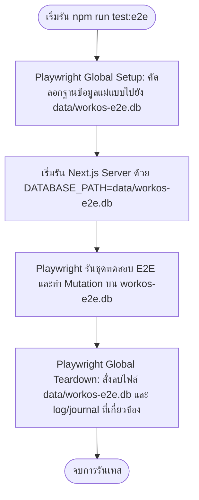

# ยุทธศาสตร์การแยกฐานข้อมูลทดสอบ (Test Database Strategy) — WORKOS-QA-004

เอกสารนี้ระบุยุทธศาสตร์การแยกฐานข้อมูลทดสอบสำหรับการเขียน E2E Mutation Tests (เช่น การเพิ่ม แก้ไข และลบข้อมูล) ในระบบ WorkOS-Lite / ArborDesk เพื่อให้สามารถทดสอบได้อย่างเสถียร โดยไม่ส่งผลกระทบหรือสร้างความเสียหายต่อข้อมูลจริงในสภาพแวดล้อมใช้งานทั่วไป

> [!NOTE]
> เอกสารนี้เป็นเพียงเอกสารข้อเสนอยุทธศาสตร์เชิงโครงสร้าง (Strategy Document) เท่านั้น ในรอบงาน QA-004 นี้จะยังไม่มีการปรับปรุงโครงสร้างโค้ดหรือฐานข้อมูลจริงในระบบ

---

## 1. สิ่งที่พบในโครงสร้างปัจจุบัน (Current DB Setup Findings)

* **ความเกี่ยวโยงของฐานข้อมูล:**
  * ฐานข้อมูล SQLite ของโปรเจกต์ตั้งอยู่ที่ `data/workos.db`
  * ไฟล์ฐานข้อมูลนี้ประกอบด้วยตารางข้อมูลหลัก ได้แก่ `tasks`, `projects`, `lists`, `docs`, และ `events` รวมถึงประวัติตารางงานด้านคอนเทนต์และคู่คำสั่งต่างๆ ของ Agent
* **การระบุที่อยู่ฐานข้อมูล (Hardcoded Path):**
  * ในโค้ดแกนกลาง [src/db/db.ts](file:///Users/tamz/projects/workos-lite/src/db/db.ts) การโหลดฐานข้อมูลมีการฮาร์ดโค้ดพาธไว้ที่:
    `const dbPath = path.resolve(process.cwd(), "data/workos.db");`
  * สคริปต์ทำความสะอาดและย้ายข้อมูลอื่นๆ ในโฟลเดอร์ `scripts/` เช่น `repair_tasks_timestamps.js` หรือ `clean-start.js` ก็ใช้การระบุพาธแบบฮาร์ดโค้ดชี้ตรงไปยัง `data/workos.db` เช่นกัน
  * ปัจจุบันระบบ Next.js ยังไม่มีการรองรับการปรับเปลี่ยนพาธฐานข้อมูลทดสอบผ่านตัวแปรสภาพแวดล้อม (Environment Variables) เช่น `process.env.DATABASE_PATH`

---

## 2. ความเสี่ยงจากการรันเทสแบบเขียนข้อมูลบนฐานข้อมูลจริง (Risks of Mutation Tests on Live DB)

1. **ความเสียหายต่อข้อมูลจริง (Data Loss/Corruption):** การรัน E2E เทสประเภท เพิ่ม/แก้ไข/ลบ บนฐานข้อมูลเดียวกันกับที่ผู้ใช้เก็บข้อมูลจริง อาจทำให้งาน เอกสาร หรือประวัติโครงการที่ผู้ใช้งานบันทึกไว้ถูกลบหรือแก้ไขโดยไม่ได้ตั้งใจ
2. **การทดสอบที่ไม่เป็นอิสระต่อกัน (Non-Idempotent Test Runs):** หากการรันเทสสร้างข้อมูลค้างไว้ในระบบ การรันเทสรอบถัดไปอาจล้มเหลวเนื่องจากมีข้อมูลซ้ำซ้อนหรือติดเงื่อนไข Unique Constraint ทำให้ผลการทดสอบขาดความเสถียร (Flaky Tests)
3. **การชนกันของทรัพยากร (Resource Locking/Conflicts):** SQLite เป็นฐานข้อมูลแบบไฟล์เดียว หากโปรเซสของ E2E Test และ Dev Server ที่รันคู่กันพยายามเขียนไฟล์ `data/workos.db` พร้อมกัน อาจเกิดปัญหา Database Locked (`SQLITE_BUSY`)

---

## 3. ยุทธศาสตร์การแยกฐานข้อมูลทดสอบ E2E (Recommended Test DB Strategy)

เพื่อแก้ไขความเสี่ยงข้างต้น เราขอนำเสนอแนวทางการแยกฐานข้อมูลทดสอบผ่านกลไก **DATABASE_PATH Isolation** และวงจรชีวิตแบบ **Copy-on-Run** ดังนี้:



### 3.1 การกำหนดพาธฐานข้อมูลผ่าน Env Var (DATABASE_PATH Approach)
ในรอบถัดไป เราจะปรับปรุง `src/db/db.ts` ให้รองรับการอ่านพาธผ่านตัวแปรสภาพแวดล้อม:
```typescript
const dbPath = process.env.DATABASE_PATH 
    ? path.resolve(process.cwd(), process.env.DATABASE_PATH)
    : path.resolve(process.cwd(), "data/workos.db");
```

### 3.2 ฐานข้อมูลทดสอบชั่วคราว (E2E DB File)
* กำหนดใช้ฐานข้อมูลชื่อ `data/workos-e2e.db` สำหรับการทดสอบ
* เพิ่มไฟล์ในระบบ `.gitignore` เพื่อป้องกันการ Commit ไฟล์ทดสอบชั่วคราวนี้:
  ```gitignore
  data/workos-e2e.db
  data/workos-e2e.db-wal
  data/workos-e2e.db-shm
  ```

### 3.3 วงจรชีวิตการสำรองและทำความสะอาด (Copy-on-Run Lifecycle)

* **ระดับเริ่มต้น (Short-term/Starting Path):** 
  ทำกลไกคัดลอกไฟล์ `data/workos.db` (ฐานข้อมูลพัฒนาปัจจุบัน) ไปยัง `data/workos-e2e.db` ก่อนรันเทส เพื่อให้ E2E เทสมีข้อมูลโครงการและงานที่สอดคล้องกับหน้าจริงในการทำ E2E Navigation
* **ระดับระยะยาว (Long-term Architecture):**
  เพื่อความเสถียรและหลีกเลี่ยงข้อมูลส่วนตัวของผู้ใช้หลุดเข้าไปในการทดสอบ ควรเปลี่ยนไปใช้ฐานข้อมูลแม่แบบจำลองเฉพาะสำหรับการทดสอบ เช่น `data/fixtures/workos-e2e-template.db` ที่บรรจุเฉพาะข้อมูลจำลอง (Deterministic Mock/Seed Data) ที่ถูกควบคุมคุณภาพไว้แล้ว และคัดลอกไฟล์แม่แบบนี้แทน

---

## 4. แผนการนำไปใช้งาน (Proposed Implementation Configuration)

### 4.1 ข้อเสนอสคริปต์ Playwright Global Setup / Teardown

เราจะสร้างสคริปต์เพื่อควบคุมวงจรการเปิดและปิดทดสอบใน `tests/e2e/global-setup.ts` และ `tests/e2e/global-teardown.ts`:

```typescript
// tests/e2e/global-setup.ts
import fs from 'fs';
import path from 'path';

async function globalSetup() {
  const sourceDb = path.join(process.cwd(), 'data/workos.db'); // หรือใช้ template ในระยะยาว
  const targetDb = path.join(process.cwd(), 'data/workos-e2e.db');
  
  // ตรวจสอบความปลอดภัยและคัดลอก
  if (fs.existsSync(sourceDb)) {
    fs.copyFileSync(sourceDb, targetDb);
    console.log(`\n⚙️ [E2E Setup] Copied database to: ${targetDb}`);
  }
}
export default globalSetup;
```

```typescript
// tests/e2e/global-teardown.ts
import fs from 'fs';
import path from 'path';

async function globalTeardown() {
  const targetFiles = [
    path.join(process.cwd(), 'data/workos-e2e.db'),
    path.join(process.cwd(), 'data/workos-e2e.db-wal'),
    path.join(process.cwd(), 'data/workos-e2e.db-shm')
  ];

  targetFiles.forEach(file => {
    if (fs.existsSync(file)) {
      try {
        fs.unlinkSync(file);
        console.log(`⚙️ [E2E Teardown] Deleted: ${path.basename(file)}`);
      } catch (e: any) {
        console.warn(`⚙️ [E2E Teardown] Warning: Could not delete ${path.basename(file)}: ${e.message}`);
      }
    }
  });
}
export default globalTeardown;
```

### 4.2 การตั้งค่าสคริปต์การรันใน package.json
ปรับปรุงคำสั่งรัน E2E ใน `package.json` เพื่อบังคับทิศทางพาธฐานข้อมูลทดสอบ:
```json
"test:e2e": "cross-env DATABASE_PATH=data/workos-e2e.db node node_modules/@playwright/test/cli.js test"
```

---

## 5. การวิเคราะห์ความเสี่ยงและแนวทางบรรเทา (Risks & Mitigations)

| ลำดับ | รายการความเสี่ยง | แนวทางบรรเทา (Mitigations) |
| :--- | :--- | :--- |
| 1 | ลืมส่งค่า Env Var ทำให้การทดสอบแอบไปเขียนฐานข้อมูลจริง | ตัวระบบ Playwright configuration จะตั้งค่าให้ `DATABASE_PATH` เป็น `data/workos-e2e.db` โดยอัตโนมัติในสคริปต์ `webServer.env` และในสคริปต์สั่งรันหลัก |
| 2 | ไฟล์ค้างหลังเกิดข้อผิดพลาดรุนแรงในการเทส (Crash) | Playwright Teardown จะถูกเรียกทำงานแม้ว่าการรันเทสจะล้มเหลว (Failed) นอกจากนี้ใน Setup จะทำการล้างไฟล์เก่าก่อนคัดลอกเสมอเพื่อป้องกันข้อมูลตกค้าง |
| 3 | ข้อมูลจริงหลุดรั่วเข้าไปใน E2E สเปกและโค้ดเทส | ในระยะยาวจะนำระบบ `data/fixtures/workos-e2e-template.db` เข้ามาแทนการก๊อปปี้ฐานข้อมูลทำงานจริง เพื่อให้การทดสอบเป็นอิสระและมีความปลอดภัยของข้อมูลส่วนตัวสูงสุด |

---

## 6. ขอบเขตงานในอนาคต (Proposed Next Task - WORKOS-QA-005)

ในรอบถัดไป (QA-005) จะเป็นขั้นตอนการเปลี่ยนผ่านสู่ยุทธศาสตร์นี้จริง โดยจะมีขอบเขตงานดังนี้:
* **Code Modification**:
  * แก้ไข `src/db/db.ts` เพื่อรองรับ `process.env.DATABASE_PATH`
  * อัปเดต `package.json` สคริปต์ `test:e2e` และ `playwright.config.ts` ให้กำหนดค่า `DATABASE_PATH` และลงทะเบียน `globalSetup`/`globalTeardown`
* **E2E Mutation Testing**:
  * เขียน E2E Mutation Test เคสตัวอย่าง เช่น **การสร้างงานย่อย (Create Task)**, **การสลับสถานะเสร็จสิ้นงาน (Toggle Task)** และ **การลบงาน (Delete Task)**
  * เขียน E2E Test สำหรับการ **สร้างโครงการย่อย (Create Project)** และลบโครงการ เพื่อทดสอบความเสถียร

---

## 7. ประเด็นที่อยู่นอกเหนือขอบเขต (Out-of-Scope Items)

เพื่อรักษาเสถียรภาพและความปลอดภัยสูงสุด การทดสอบดังต่อไปนี้จะ**ไม่รวมอยู่ในชุดทดสอบ E2E** ของโครงการ:
* **E2E สำหรับ Backup/Restore:** เนื่องจากฟังก์ชันการสำรองข้อมูลเกี่ยวข้องกับไฟล์สำรองระบบส่วนบุคคล หากทำงานผิดพลาดอาจไปเขียนทับไฟล์สำรองทำงานจริงภายนอก
* **E2E สำหรับ Reset Demo Data:** การเรียก API `/api/admin/reset-demo-data` มีความเสี่ยงในการล้างข้อมูลสูงมาก หากมีการระบุตัวแปรสภาพแวดล้อมผิดพลาดจะส่งผลกระทบต่อข้อมูลนักพัฒนา จึงละเว้นจากการรันเทสระดับ E2E
